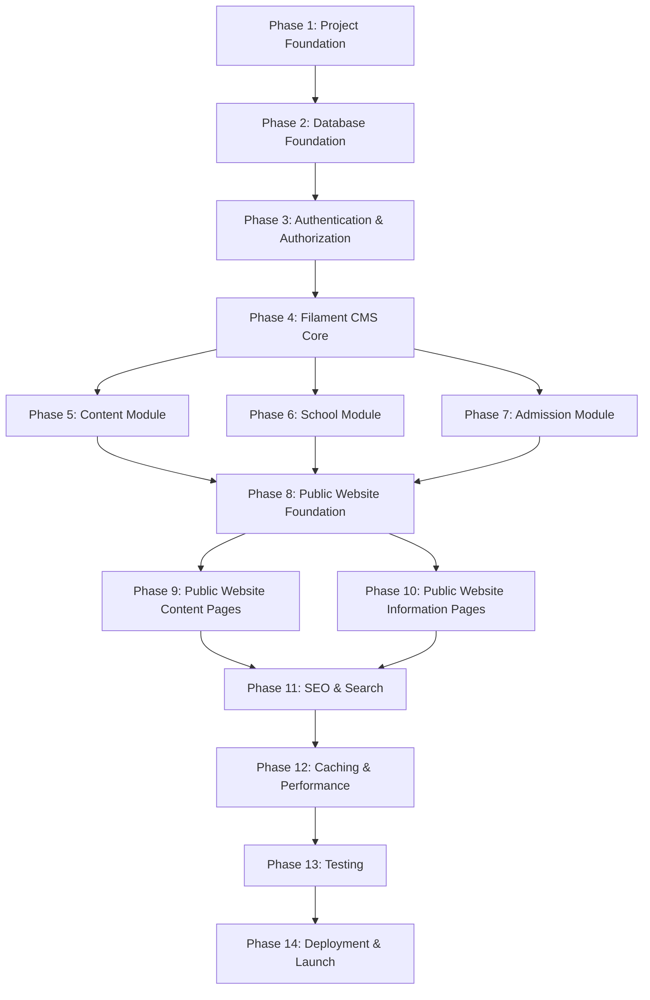

# PROJECT_PHASES.md

**School Website CMS — Development Roadmap**

> Version 1.0
> Classification: Master Development Plan
> Prepared by: Technical Lead

---

## Document Purpose

This document is the single source of truth for the development roadmap of the School Website CMS. Every future development task must map to a phase in this document. No phase may be skipped. No feature from a future phase may be implemented before its phase begins.

If a future request conflicts with this roadmap, the Technical Lead must explain the conflict and recommend the correct approach before proceeding.

**Reference Documents:**
- `frontend_design.md` — Frontend architecture and design system
- `backend_architecture.md` — Backend architecture and Laravel structure
- `about-project.md` — Project scope and feature overview

---

## Phase Dependency Graph



**Critical Path:** Phase 1 → 2 → 3 → 4 → 5/6/7 → 8 → 9/10 → 11 → 12 → 13 → 14

**Parallelizable:** Phases 5, 6, and 7 can be developed in parallel once Phase 4 is complete. Phases 9 and 10 can be developed in parallel once Phase 8 is complete.

---

## Phase 1: Project Foundation

### Goal

Initialize the Laravel project, configure the build toolchain, establish the folder structure, and create the shared Blade layout that every public page will extend.

### Description

This phase sets up everything that every subsequent phase depends on. It includes creating the Laravel project, configuring Tailwind CSS v4 with the custom theme from `frontend_design.md`, setting up Alpine.js, creating the public Blade layout (header, footer, breadcrumbs), and establishing the base folder structure for the application layers defined in `backend_architecture.md`.

### Expected Deliverables

| # | Deliverable | Verified By |
|---|------------|-------------|
| 1.1 | Laravel 12 project initialized with PHP 8.3 | `php artisan --version` returns version |
| 1.2 | Tailwind CSS v4 configured with custom theme tokens from `frontend_design.md` (colors, spacing, typography, radii) | Theme tokens applied in CSS |
| 1.3 | Alpine.js loaded via CDN in the base layout | `x-data` works in a test Blade view |
| 1.4 | Inter font loaded with `font-display: swap` | Google Fonts link in head, font renders correctly |
| 1.5 | Base public layout (`resources/views/layouts/public.blade.php`) with header, footer, breadcrumbs, mobile nav skeleton | Layout renders a blank page with header and footer |
| 1.6 | Header component (`resources/views/components/layout/header.blade.php`) — sticky, 72px, logo placeholder, nav placeholder, CTA button placeholder | Header renders and sticks on scroll |
| 1.7 | Footer component (`resources/views/components/layout/footer.blade.php`) — 3-column layout, copyright, social links | Footer renders with correct layout |
| 1.8 | Breadcrumbs component (`resources/views/components/layout/breadcrumbs.blade.php`) | Breadcrumbs render with correct styling |
| 1.9 | Mobile nav component (`resources/views/components/layout/mobile-nav.blade.php`) | Hamburger opens full-screen overlay |
| 1.10 | Application folder structure created per `backend_architecture.md` (Actions/, Enums/, Events/, Services/, Traits/, etc.) | Directory listing matches architecture document |
| 1.11 | `helpers.php` with `school_setting()` and `format_file_size()` functions autoloaded | Helper functions callable in Tinker |
| 1.12 | Route groups defined in `routes/web.php` for public pages | Routes return test views |
| 1.13 | Laravel Pint configured (PSR-12) | `./vendor/bin/pint --test` passes |

### Dependencies

None. This is the first phase.

### Estimated Complexity

**Medium** — The volume of work is moderate, but precision is critical because this phase establishes patterns for the entire project.

### Completion Criteria

- [ ] All 13 deliverables implemented and verified
- [ ] `npm run build` completes without errors
- [ ] `php artisan route:list` shows all defined routes
- [ ] Public layout renders a complete page shell (header + empty content area + footer)
- [ ] Tailwind utility classes from the custom theme apply correctly
- [ ] Mobile nav opens and closes via Alpine.js
- [ ] No `dd()`, `dump()`, or debug code in committed files

### Testing Requirements

- Manual visual verification of layout at mobile (375px), tablet (768px), desktop (1280px), large desktop (1440px)
- Alpine.js mobile nav toggles correctly
- Sticky header behavior verified on scroll
- Font loads correctly (check Network tab for font requests)

---

## Phase 2: Database Foundation

### Goal

Create every database migration, model, enum, trait, and relationship defined in `backend_architecture.md`. This phase produces a fully functional data layer that every subsequent phase consumes.

### Description

This phase implements the complete data foundation. All 18+ migrations are created and run. All models are created with their relationships, traits (`HasSlug`, `HasStatus`, `SoftDeletes`), enums, casts, and fillable attributes. Seeders populate the database with realistic sample data. Factories enable test data generation.

This phase does NOT create any admin panel resources or public controllers. It strictly produces the data layer.

### Expected Deliverables

| # | Deliverable | Verified By |
|---|------------|-------------|
| 2.1 | All PHP Enums created (`NoticeStatus`, `NewsStatus`, `EventStatus`, `AdmissionStatus`, `DownloadCategory`, `FacilityType`, `UserRole`) | Enum classes exist with `label()` and `color()` methods |
| 2.2 | All traits created (`HasSlug`, `HasStatus`, `Cacheable`) | Traits are usable in models |
| 2.3 | `SlugService` created | Unique slugs generated correctly |
| 2.4 | All migrations created per `backend_architecture.md` schema | `php artisan migrate:status` shows all migrated |
| 2.5 | All models created: `Notice`, `NoticeCategory`, `News`, `NewsCategory`, `Event`, `Page`, `Teacher`, `Staff`, `Facility`, `AcademicProgram`, `Download`, `Gallery`, `GalleryItem`, `AdmissionInquiry`, `Faq`, `Testimonial`, `Setting`, `Slider`, `Menu`, `MenuItem` | Each model has `$fillable`, `$casts`, relationships |
| 2.6 | All relationships defined (BelongsTo, HasMany, self-referencing MenuItem) | `tinker` can traverse all relationships |
| 2.7 | Media collections defined on models per `backend_architecture.md` media table | Spatie Media Library registers collections |
| 2.8 | `Setting` model with `school_setting()` helper working | Helper retrieves cached setting values |
| 2.9 | Database seeders: `RoleSeeder`, `SettingSeeder`, `PageSeeder`, `NoticeCategorySeeder`, `FaqSeeder` | `php artisan db:seed` populates tables |
| 2.10 | Model factories: `NoticeFactory`, `NewsFactory`, `EventFactory`, `TeacherFactory`, `AdmissionInquiryFactory` | Factories produce valid model instances |
| 2.11 | `composer.json` autoloads `helpers.php` | Helper functions available globally |

### Dependencies

- Phase 1 (project initialized, folder structure exists)

### Estimated Complexity

**High** — Large number of migrations and models. Each must match the architecture document precisely. Errors here cascade into every subsequent phase.

### Completion Criteria

- [ ] `php artisan migrate:fresh --seed` completes without errors
- [ ] Every model in `app/Models/` can be instantiated in Tinker
- [ ] Every relationship can be traversed without errors
- [ ] `HasSlug` trait auto-generates slugs on create
- [ ] `HasStatus` trait provides `scopePublished()` and `scopeDraft()`
- [ ] `school_setting('school_name')` returns the seeded value
- [ ] All factories produce valid model instances
- [ ] No migration warnings or deprecation notices

### Testing Requirements

- `php artisan migrate:fresh --seed` runs cleanly
- Model count verification: each seeded table has expected record count
- Relationship traversal: `Notice::first()->category` returns a `NoticeCategory`
- Slug uniqueness: creating two notices with the same title produces different slugs
- Factory output: `Notice::factory()->create()` produces a valid Notice

---

## Phase 3: Authentication & Authorization

### Goal

Implement admin user authentication, role-based authorization using Spatie Permission, and Filament Shield integration for automatic permission management.

### Description

This phase sets up the security layer. Users can log in to the admin panel. Three roles (super_admin, admin, content_editor) are created with appropriate permissions. Filament Shield auto-generates permissions for all resources that will be created in Phase 4-7. Policies define authorization rules for non-Filament contexts.

### Expected Deliverables

| # | Deliverable | Verified By |
|---|------------|-------------|
| 3.1 | Laravel Breeze or Fortify installed for session-based authentication | Login/logout works |
| 3.2 | Spatie Laravel Permission configured with correct migrations | `roles` and `permissions` tables exist |
| 3.3 | Filament Shield installed and configured | Shield plugin loads in Filament panel |
| 3.4 | `RoleSeeder` creates `super_admin`, `admin`, `content_editor` with correct permissions | Roles and permissions assigned correctly |
| 3.5 | At least one super_admin user seeded | Can log in at `/admin` |
| 3.6 | Filament `AdminPanelProvider` configured per `backend_architecture.md` | Admin panel accessible, shows login |
| 3.7 | Policies created: `NoticePolicy`, `NewsPolicy`, `EventPolicy`, `PagePolicy`, `TeacherPolicy`, `FacilityPolicy`, `AdmissionInquiryPolicy`, `SettingPolicy`, `UserPolicy`, `DownloadPolicy` | Authorization rules enforced |
| 3.8 | Rate limiting middleware on public forms | Repeated submissions are throttled |

### Dependencies

- Phase 1 (project structure), Phase 2 (models exist for policies)

### Estimated Complexity

**Medium** — Well-documented packages. The complexity is in correct configuration and permission mapping.

### Completion Criteria

- [ ] Can log in to `/admin` with seeded super_admin credentials
- [ ] Can log out from admin panel
- [ ] Three roles exist in the database with correct permissions
- [ ] `shield:generate --all` generates permissions for all resources
- [ ] Unauthorized users are redirected to login
- [ ] Policies block unauthorized operations
- [ ] Rate limiter returns 429 after threshold

### Testing Requirements

- Login with valid credentials succeeds
- Login with invalid credentials fails
- Unauthenticated access to `/admin` redirects to login
- Role-based access: content_editor cannot access user management
- Policy tests: user without role cannot create notices

---

## Phase 4: Filament CMS Core

### Goal

Build the Filament admin panel foundation: dashboard, widgets, core system resources (Pages, Settings, Sliders, Menus), and activity logging.

### Description

This phase builds the admin interface that content managers will use daily. It includes the dashboard with statistics widgets, system-level resource management (pages, settings, sliders, menus), and activity logging through Spatie Activity Log. Content-specific resources (notices, news, etc.) are built in Phases 5-7.

### Expected Deliverables

| # | Deliverable | Verified By |
|---|------------|-------------|
| 4.1 | Custom Filament Dashboard with stats widgets | Dashboard loads at `/admin` |
| 4.2 | `StatsOverview` widget (total notices, news, events, inquiries, gallery items) | Widget displays counts |
| 4.3 | `RecentActivity` widget (last 10 admin actions) | Activity log entries displayed |
| 4.4 | `AdmissionChart` widget (inquiries over time) | Chart renders with data |
| 4.5 | `QuickActions` widget (create notice, create news, etc.) | Action buttons work |
| 4.6 | `PageResource` — CRUD for static pages (About, Vision, etc.) | Create, edit, delete pages |
| 4.7 | `SettingResource` or custom Settings page — General, SEO, Social settings | Settings save and retrieve correctly |
| 4.8 | `SliderResource` — CRUD for hero sliders with media upload | Create sliders with images |
| 4.9 | `MenuResource` — CRUD for menus and menu items with drag-drop ordering | Menus render in public site |
| 4.10 | `UserResource` — Admin user management (create, edit, delete, activate/deactivate) | Users managed through admin |
| 4.11 | `RoleResource` — Role and permission management | Roles can be assigned to users |
| 4.12 | Spatie Activity Log integrated — all CRUD operations logged | Activity log page shows operations |
| 4.13 | Filament navigation groups configured per `backend_architecture.md` | Navigation organized correctly |
| 4.14 | `UpdateSettingAction` and `SyncMenuAction` created | Business logic extracted from resources |

### Dependencies

- Phase 3 (authentication, Filament panel, Shield configured)

### Estimated Complexity

**High** — Multiple Filament resources with forms, tables, media upload, and custom pages. Dashboard widgets require custom rendering.

### Completion Criteria

- [ ] Dashboard shows live statistics from database
- [ ] All 6 resources (Page, Setting, Slider, Menu, User, Role) fully functional
- [ ] Settings persist and are retrievable via `school_setting()`
- [ ] Menu items can be created with parent-child relationships
- [ ] Activity log records all CRUD operations
- [ ] Navigation groups match `backend_architecture.md` specification
- [ ] Media upload works for sliders (hero images)

### Testing Requirements

- Each resource: create, read, update, delete operations succeed
- Settings: save → retrieve → value matches
- Menu: create parent item → create child item → hierarchy correct
- Activity log: after creating a notice, log entry exists
- Unauthorized user cannot access any resource

---

## Phase 5: Content Module (CMS)

### Goal

Build Filament CRUD resources for all content types: Notices, Notice Categories, News, News Categories, Events, FAQs, and Testimonials.

### Description

This phase implements the admin-side content management for all content module entities defined in `backend_architecture.md`. Each resource includes forms, tables, filters, bulk actions, and media upload where applicable. Business logic is extracted into Actions.

### Expected Deliverables

| # | Deliverable | Verified By |
|---|------------|-------------|
| 5.1 | `NoticeCategoryResource` — CRUD for notice categories | Categories manage correctly |
| 5.2 | `NoticeResource` — Full CRUD with: title, slug (auto), category, content (rich editor), excerpt, status, is_pinned, published_at, SEO fields, attachments (PDF) | All form fields work |
| 5.3 | `NewsCategoryResource` — CRUD for news categories | Categories manage correctly |
| 5.4 | `NewsResource` — Full CRUD with: title, slug (auto), category, content, excerpt, status, featured image (media), SEO fields | All form fields work |
| 5.5 | `EventResource` — Full CRUD with: title, slug, description, venue, event_date, start/end time, status, gallery media | All form fields work |
| 5.6 | `FaqResource` — CRUD with: question, answer, category, sort_order, is_published | All form fields work |
| 5.7 | `TestimonialResource` — CRUD with: name, role, content, type (student/parent/alumni), is_published, sort_order | All form fields work |
| 5.8 | `CreateNoticeAction`, `PublishNewsAction`, `CreateEventAction` actions created | Business logic in actions, not resources |
| 5.9 | `InvalidatePageCache` listener wired to content events | Cache cleared on content changes |
| 5.10 | Filament resources added to "Content" navigation group | Navigation organized correctly |
| 5.11 | Shield permissions generated for all new resources | Permissions auto-generated |

### Dependencies

- Phase 4 (Filament CMS core, panel, dashboard)

### Estimated Complexity

**High** — 7 resources with complex forms, media integration, and event wiring. This is the largest single phase in terms of resource count.

### Completion Criteria

- [ ] All 7 resources fully functional (create, read, update, delete)
- [ ] Rich text editor works for Notice and News content
- [ ] Category relationships work (select category in Notice/News form)
- [ ] Media upload works for News featured images
- [ ] PDF upload works for Notice attachments
- [ ] Status toggle (draft/published) works on all content types
- [ ] Pinned notices display correctly in table
- [ ] FAQ sort ordering works
- [ ] Testimonial types filter correctly

### Testing Requirements

- Each resource: full CRUD cycle
- Notice with category: relationship persists correctly
- News with featured image: image uploaded, URL accessible
- Notice with PDF attachment: file downloadable
- Status change: draft → published → draft works
- Pinned notice: only one notice can be pinned (if enforced)
- Event with future date: saves correctly
- FAQ ordering: sort_order respected in listing

---

## Phase 6: School Module (CMS)

### Goal

Build Filament CRUD resources for all school-related entities: Teachers, Staff, Facilities, Academic Programs, Downloads, and Galleries.

### Description

This phase implements the admin-side content management for all school module entities. Each resource includes forms, tables, media integration (photos for teachers/staff, images for facilities, files for downloads), and proper filtering.

### Expected Deliverables

| # | Deliverable | Verified By |
|---|------------|-------------|
| 6.1 | `TeacherResource` — CRUD with: name, slug, position, department, qualification, experience, biography, email, phone, photo (media), sort_order, is_published | All fields work |
| 6.2 | `StaffResource` — CRUD with same structure as Teacher | All fields work |
| 6.3 | `FacilityResource` — CRUD with: name, slug, description (rich text), features (JSON), type (enum), images (multiple media), sort_order, is_published | All fields work |
| 6.4 | `AcademicProgramResource` — CRUD with: name, slug, description, level, duration, medium, features (JSON), sort_order, is_published | All fields work |
| 6.5 | `DownloadResource` — CRUD with: title, description, category (enum), file upload (private disk), file metadata, is_published | File upload to private disk |
| 6.6 | `GalleryResource` — CRUD with: title, slug, description, type (photo/video), event_date, gallery items (relation manager for images/videos) | Albums with items work |
| 6.7 | `UploadMediaAction` created for media handling logic | Action handles upload correctly |
| 6.8 | Filament resources added to "School" navigation group | Navigation organized |
| 6.9 | Shield permissions generated for all new resources | Permissions auto-generated |

### Dependencies

- Phase 4 (Filament CMS core)

### Estimated Complexity

**High** — 6 resources with complex media handling (multiple images for facilities, relation manager for gallery items, private file storage for downloads).

### Completion Criteria

- [ ] All 6 resources fully functional
- [ ] Teacher/Staff photo upload works (single image)
- [ ] Facility multi-image upload works
- [ ] Gallery items can be added/removed from albums
- [ ] Download files stored on private disk (not publicly accessible via URL)
- [ ] Download file metadata (size, type) captured automatically
- [ ] Facility type enum displays correctly in form and table
- [ ] Academic program features (JSON) editable as key-value pairs

### Testing Requirements

- Teacher with photo: image uploaded, URL accessible
- Facility with 3 images: all uploaded, all accessible
- Gallery with 10 items: items ordered correctly, sortable
- Download: file stored in private disk, accessible through controller
- Download count: increments on each download

---

## Phase 7: Admission Module

### Goal

Build the admission inquiry system: admin management in Filament and the public-facing inquiry form.

### Description

This phase implements the online admission inquiry feature. Administrators can view, filter, and manage inquiries through a Filament resource. The public inquiry form on the Admissions page collects prospective student information. Notifications are sent to admins on new submissions.

### Expected Deliverables

| # | Deliverable | Verified By |
|---|------------|-------------|
| 7.1 | `AdmissionInquiryResource` — CRUD with: student name, class, parent name, mobile, email, address, previous school, message, status, notes, created_at | All fields work |
| 7.2 | Status management: New → Contacted → Closed | Status changes correctly |
| 7.3 | Search and filter on inquiry list (by status, date range) | Filters work |
| 7.4 | `InquiryRequest` Form Request with validation rules per `backend_architecture.md` | Validation works |
| 7.5 | `ProcessInquiryAction` created | Business logic in action |
| 7.6 | `InquirySubmitted` event created | Event dispatches on submission |
| 7.7 | `NotifyAdminOfInquiry` listener → sends `InquiryNotification` | Admin receives database notification |
| 7.8 | `SendInquiryConfirmation` listener → sends confirmation email to applicant | Email sent (if email provided) |
| 7.9 | `ExportAdmissionsToCsv` job created | CSV export generates correct file |
| 7.10 | Public inquiry form blade component (`resources/views/components/forms/inquiry-form.blade.php`) | Form renders correctly |
| 7.11 | Rate limiting on public form (10 per IP per hour) | Throttling works |
| 7.12 | Filament resource added to "Admissions" navigation group | Navigation organized |

### Dependencies

- Phase 4 (Filament CMS core), Phase 2 (AdmissionInquiry model exists)

### Estimated Complexity

**Medium** — One Filament resource plus a public form with notification wiring.

### Completion Criteria

- [ ] Admin can view all inquiries in a table
- [ ] Admin can filter by status and date
- [ ] Status transitions work (new → contacted → closed)
- [ ] Public form validates all fields correctly
- [ ] Successful submission shows confirmation message
- [ ] Admin notification appears in Filament notification bell
- [ ] Confirmation email is sent (test with Mailtrap or similar)
- [ ] CSV export generates a downloadable file

### Testing Requirements

- Form submission with valid data: inquiry created
- Form submission with invalid data: validation errors shown
- Rate limiting: 11th submission from same IP returns 429
- Status update: status changes, admin log entry created
- Email notification: sent on inquiry submission
- CSV export: file contains correct data

---

## Phase 8: Public Website Foundation

### Goal

Build the shared frontend components, the homepage, static About pages, and error pages that every public page depends on.

### Description

This phase transitions from backend to frontend. It builds the reusable Blade components defined in `frontend_design.md` (buttons, cards, badges, section headings, skeletons, empty states, pagination, filter bars) and implements the homepage — the most complex single page on the site. It also builds the About section pages and error pages.

### Expected Deliverables

| # | Deliverable | Verified By |
|---|------------|-------------|
| 8.1 | UI components: `x-ui.button`, `x-ui.badge`, `x-ui.skeleton`, `x-ui.empty-state`, `x-ui.section-heading`, `x-ui.pagination`, `x-ui.accordion`, `x-ui.modal` | All components render correctly |
| 8.2 | Card components: `x-cards.notice`, `x-cards.news`, `x-cards.event`, `x-cards.member`, `x-cards.facility`, `x-cards.testimonial` | All cards render with sample data |
| 8.3 | `HomeController` and homepage view (`pages/home.blade.php`) with all 11 sections per `frontend_design.md` | Homepage renders complete |
| 8.4 | Hero section — full-width image, overlay, H1, tagline, two CTAs | Hero renders correctly |
| 8.5 | Quick Info Bar — 4 statistics from settings | Stats display from database |
| 8.6 | Principal's Message section — photo + quote | Section renders |
| 8.7 | Latest Notices section — 3 notice cards | Cards populated from DB |
| 8.8 | Latest News section — 3 news cards with images | Cards populated from DB |
| 8.9 | Academic Programs section — program cards | Cards populated from DB |
| 8.10 | Facilities Overview section — facility cards | Cards populated from DB |
| 8.11 | Gallery Preview section — horizontal scroll of recent photos | Photos loaded from media |
| 8.12 | Testimonials section — 2-3 testimonial cards | Testimonials from DB |
| 8.13 | Contact CTA section — blue background, phone, email | Settings data displayed |
| 8.14 | `AboutController` and About pages: index, history, vision-mission, committee | All pages render |
| 8.15 | Error pages: 404, 500 | Error pages render with correct styling |
| 8.16 | `ViewComposer` classes: `HeaderComposer`, `FooterComposer` | Navigation data loaded into views |
| 8.17 | Public controllers created per `backend_architecture.md` | All controllers return views |

### Dependencies

- Phases 5, 6, 7 (content exists in database to populate pages)

### Estimated Complexity

**High** — Homepage is complex with 11 sections. Many reusable components. About pages have diverse layouts.

### Completion Criteria

- [ ] Homepage renders all 11 sections with real data from database
- [ ] All UI components render correctly at all breakpoints
- [ ] Cards use correct styling (borders, radius, padding, shadows per design system)
- [ ] Responsive: homepage looks correct at 375px, 768px, 1280px, 1440px
- [ ] 404 page renders when visiting non-existent URL
- [ ] 500 page renders (test with intentional exception)
- [ ] Navigation shows correct menu items from database
- [ ] Footer shows school info from settings
- [ ] Sticky header works on all pages

### Testing Requirements

- Homepage loads without errors
- All 11 homepage sections display content (not empty states)
- Mobile nav opens/closes
- Responsive layouts: no horizontal scroll at any breakpoint
- Error pages: 404 shows for `/nonexistent-page`
- Breadcrumbs: correct on About sub-pages

---

## Phase 9: Public Website Content Pages

### Goal

Build the public-facing listing and detail pages for Notices, News, Events, and Gallery.

### Description

This phase implements the four main content listing pages and their corresponding detail views. Each listing page includes filtering, pagination, and proper responsive layouts. Detail pages include rich content rendering, related content, and SEO metadata.

### Expected Deliverables

| # | Deliverable | Verified By |
|---|------------|-------------|
| 9.1 | Notices listing page — filter bar (search + category), notice card list, pagination, pinned notices at top | Listing works with filters |
| 9.2 | Notice detail page — title, date, category, content, PDF download, related notices | Detail renders correctly |
| 9.3 | News listing page — featured news hero card, filter bar, news card grid, pagination | Listing works with filters |
| 9.4 | News detail page — featured image, title, meta, content, social share, related news | Detail renders correctly |
| 9.5 | Events listing page — tab switcher (upcoming/past), event card list | Tabs switch correctly |
| 9.6 | Event detail page — title, date/time/venue, description, event gallery | Detail renders correctly |
| 9.7 | Gallery index — tab switcher (photos/videos), album grid, video grid | Albums display correctly |
| 9.8 | Album detail page — photo grid, lightbox overlay | Lightbox opens/closes/navigates |
| 9.9 | `NoticesController`, `NewsController`, `EventsController`, `GalleryController` with proper queries | Controllers return correct data |
| 9.10 | Alpine.js components: `noticeFilter()`, `tabSwitcher()`, `photoLightbox()`, `videoModal()` | Alpine components function |

### Dependencies

- Phase 8 (layout, components, homepage), Phases 5-6 (content exists in DB)

### Estimated Complexity

**High** — 8 views with filtering, pagination, lightbox, and responsive layouts.

### Completion Criteria

- [ ] Notices listing: filter by category works, search works, pagination works
- [ ] Notice detail: content renders, PDF downloads, breadcrumbs correct
- [ ] News listing: featured hero card shows latest, grid shows rest
- [ ] News detail: featured image, content, share buttons, related news
- [ ] Events listing: upcoming tab shows future events, past tab shows past events
- [ ] Event detail: all meta info displayed, gallery if available
- [ ] Gallery: album grid shows cover images, photo count
- [ ] Album detail: lightbox opens, navigates with arrows, closes with Escape
- [ ] All pages responsive at all breakpoints
- [ ] Empty states show when no content exists

### Testing Requirements

- Filter by category: only matching items shown
- Search: results match query
- Pagination: page 2 shows different items than page 1
- Lightbox: keyboard navigation works (arrows, Escape)
- Event tabs: upcoming shows future dates, past shows past dates
- Empty state: "No notices found" when filter returns nothing
- Mobile: all pages scroll vertically, no horizontal overflow

---

## Phase 10: Public Website Information Pages

### Goal

Build the remaining static and semi-static pages: Academics, Admissions (with form), Teachers & Staff, Facilities, Downloads, Contact (with form), and FAQ.

### Description

This phase completes the public website by implementing all remaining pages defined in the Information Architecture. Several pages include interactive elements (forms, filters, accordions) that require Alpine.js integration.

### Expected Deliverables

| # | Deliverable | Verified By |
|---|------------|-------------|
| 10.1 | Academics page — program cards, curriculum details, class levels table, academic calendar | All sections render |
| 10.2 | Admissions page — overview, process steps, eligibility, documents checklist, fees, dates, inquiry form | Form submits correctly |
| 10.3 | Inquiry form Alpine.js component — handles submission, validation, confirmation | Form works without page reload |
| 10.4 | Teachers & Staff page — tab switcher, department filter, member grid, profile modal | Tabs and filter work |
| 10.5 | Facilities page — horizontal cards with alternating layout, feature lists | Alternating layout renders |
| 10.6 | Downloads page — category filter, download table, download buttons, file serving | Files download correctly |
| 10.7 | Download controller that serves files from private disk with access control | Files not publicly accessible |
| 10.8 | Contact page — info cards, contact form, Google Maps embed, social links | Form submits, map loads |
| 10.9 | `ContactRequest` Form Request with validation | Validation works |
| 10.10 | FAQ page — search bar, category filter, accordion list, CTA | Accordion opens/closes |
| 10.11 | Alpine.js components: `inquiryForm()`, `contactForm()`, `faqSearch()`, `accordion()`, `filterPills()`, `tabSwitcher()`, `memberFilter()` | All Alpine components function |

### Dependencies

- Phase 8 (layout, components), Phases 5-7 (content and inquiry system exist)

### Estimated Complexity

**High** — 7 pages with diverse layouts, two forms with async submission, file serving, and multiple Alpine.js components.

### Completion Criteria

- [ ] Academics page: all sections render with data from database
- [ ] Admissions page: form submits inquiry, confirmation shown, no page reload
- [ ] Teachers page: department filter works, tabs switch between teachers/staff
- [ ] Facilities page: alternating image layout renders correctly
- [ ] Downloads page: file downloads work, files served from private disk
- [ ] Contact page: form submits, map loads (or shows placeholder), social links work
- [ ] FAQ page: search filters questions in real-time, accordion works
- [ ] All forms validate server-side (Form Requests) and show inline errors
- [ ] All pages responsive at all breakpoints

### Testing Requirements

- Admission inquiry form: submit with valid data → confirmation shown
- Admission inquiry form: submit with missing required fields → errors shown inline
- Contact form: submit with valid data → confirmation shown
- Download: click download → file saves to device, not viewable in browser
- FAQ search: typing "admission" filters to admission-related questions only
- Accordion: only one item expanded at a time (or configurable)
- Mobile: forms are usable, no zoom on input focus (16px font size)

---

## Phase 11: SEO & Search

### Goal

Implement the SEO strategy (meta tags, structured data, sitemap) and site-wide search functionality.

### Description

This phase adds search engine optimization features and the site-wide search experience. Every public page gets proper meta tags. Structured data is embedded for relevant pages. An XML sitemap is generated and automatically updated. The site-wide search allows visitors to find content across all types.

### Expected Deliverables

| # | Deliverable | Verified By |
|---|------------|-------------|
| 11.1 | `SeoService` — generates meta title, description, handles auto-generation rules | Service returns correct values |
| 11.2 | Meta tags rendered in `<head>` for every public page | View source shows correct meta tags |
| 11.3 | Open Graph tags for pages with featured images | OG tags render for news articles |
| 11.4 | JSON-LD structured data: School (homepage), BreadcrumbList (all pages), Event (event pages), FAQ (FAQ page), Article (news articles) | Schema.org validator passes |
| 11.5 | XML Sitemap generated using `spatie/laravel-sitemap` | `/sitemap.xml` accessible and valid |
| 11.6 | `UpdateSitemapCache` listener rebuilds sitemap on content publish | Sitemap updates when content changes |
| 11.7 | `SearchController` and search results page | Search returns results |
| 11.8 | `SearchService` — queries across notices, news, events, pages, teachers, facilities, FAQs | All content types searchable |
| 11.9 | Search UI — header search icon, search input, results list with type badges, pagination | Search interface works |
| 11.10 | No-results state — "No results found for '[query]'" message | Empty state displays correctly |
| 11.11 | `robots.txt` configured | `/robots.txt` accessible |

### Dependencies

- Phases 9-10 (all public pages exist to receive meta tags and be included in sitemap)

### Estimated Complexity

**Medium** — SEO integration is methodical. Search requires careful query building across multiple models.

### Completion Criteria

- [ ] Every public page has a unique `<title>` tag
- [ ] Every public page has a `<meta name="description">` tag
- [ ] News articles have Open Graph tags
- [ ] FAQ page has FAQPage schema
- [ ] Event pages have Event schema
- [ ] `/sitemap.xml` includes all published content
- [ ] Sitemap updates when new content is published
- [ ] Search returns results across all content types
- [ ] Search results show correct type, title, excerpt, date, and URL
- [ ] Search with no results shows appropriate empty state
- [ ] `/robots.txt` allows crawling of all public pages

### Testing Requirements

- Meta tags: view source on 5 different pages, verify unique title and description
- Schema validation: test with Google Rich Results Test tool
- Sitemap: validate XML structure, verify all published URLs included
- Search: query "admission" returns results from notices, news, pages
- Search: query "xyznonexistent" returns no-results state
- Sitemap update: publish new notice, verify it appears in sitemap within cache TTL

---

## Phase 12: Caching & Performance

### Goal

Implement the caching strategy, optimize images, and verify performance targets.

### Description

This phase adds the caching layer defined in `backend_architecture.md`, implements the `Cacheable` trait on relevant models, configures image optimization through Spatie Media Library conversions, and verifies that the application meets all performance targets from `frontend_design.md`.

### Expected Deliverables

| # | Deliverable | Verified By |
|---|------------|-------------|
| 12.1 | `CacheService` — remember, forget, forgetByPrefix methods | Service functions correctly |
| 12.2 | Cache applied to: settings, published notices, published news, upcoming events, teachers, facilities, gallery albums, menus | Cached data served correctly |
| 12.3 | Cache invalidation wired through event-listener pairs | Cache cleared on content changes |
| 12.4 | `Cacheable` trait applied to relevant models | Trait auto-invalidates on save/delete |
| 12.5 | Image conversions configured: thumb (300x300), small (600x400), medium (1200x800), large (1920x1080) | Conversions generated on upload |
| 12.6 | Images served in WebP format with fallback | Browser receives WebP |
| 12.7 | Responsive images with `srcset` in Blade templates | Correct image sizes served per viewport |
| 12.8 | Lazy loading on below-fold images (`loading="lazy"`) | Images load on scroll |
| 12.9 | CSS purging verified (Tailwind removes unused classes) | CSS bundle under 20KB gzipped |
| 12.10 | JavaScript minimized (Alpine.js only, no custom JS bundles) | JS under 20KB gzipped |
| 12.11 | `app.js` and `app.css` compiled with Vite | Build completes, assets fingerprinted |

### Dependencies

- Phases 9-10 (all pages exist to test performance), Phase 4 (settings and models exist for caching)

### Estimated Complexity

**Medium** — Caching is configuration-heavy. Image optimization is handled by Spatie Media Library. Performance testing requires measurement tools.

### Completion Criteria

- [ ] First page load hits database; second page load hits cache
- [ ] Content update clears relevant cache within 1 second
- [ ] Images served as WebP (check Network tab)
- [ ] Responsive images: smaller screens load smaller images
- [ ] Lazy loading: below-fold images load on scroll
- [ ] CSS bundle under 20KB gzipped
- [ ] JS bundle under 20KB gzipped
- [ ] Lighthouse Performance score 90+
- [ ] First Contentful Paint under 1.5s

### Testing Requirements

- Cache hit: second page load is faster than first (measure TTFB)
- Cache invalidation: update a setting, verify next page load reflects change
- Image format: check response headers for WebP content type
- Lazy loading: scroll to bottom of homepage, verify images load
- Lighthouse audit: run on homepage, verify all metrics meet targets
- Bundle size: check build output for CSS and JS sizes

---

## Phase 13: Testing

### Goal

Write automated tests for the critical paths of the application: content CRUD, inquiry submission, search, and authorization.

### Description

This phase adds automated test coverage for the most important functionality. Tests ensure that existing features continue working correctly as the codebase evolves. The focus is on feature tests (HTTP tests) and critical unit tests.

### Expected Deliverables

| # | Deliverable | Verified By |
|---|------------|-------------|
| 13.1 | `NoticeTest` — create, read, update, delete notice via Filament | Tests pass |
| 13.2 | `NewsTest` — create, read, update, delete news via Filament | Tests pass |
| 13.3 | `EventTest` — create, read, update, delete event via Filament | Tests pass |
| 13.4 | `InquiryTest` — submit public form, verify inquiry created, notification sent | Tests pass |
| 13.5 | `AuthTest` — login, logout, unauthorized access redirects | Tests pass |
| 13.6 | `RoleTest` — role-based access to Filament resources | Tests pass |
| 13.7 | `SearchTest` — search returns results across content types | Tests pass |
| 13.8 | `PageTest` — all public pages load without errors | Tests pass |
| 13.9 | `SeoTest` — meta tags present on public pages | Tests pass |
| 13.10 | `SlugTest` — unique slugs generated, no duplicates | Tests pass |
| 13.11 | `CacheTest` — cache hit/invalidation works correctly | Tests pass |

### Dependencies

- Phases 11-12 (all features implemented and caching configured)

### Estimated Complexity

**Medium** — Writing tests is straightforward when the features are already implemented. The complexity is in covering enough scenarios without over-testing.

### Completion Criteria

- [ ] `php artisan test` passes with zero failures
- [ ] All 11 test files created and passing
- [ ] Critical path covered: content CRUD, inquiry flow, auth, search, SEO
- [ ] Test coverage for authorization (unauthorized access blocked)
- [ ] Test coverage for validation (invalid data rejected)

### Testing Requirements

- `php artisan test` — all tests green
- `php artisan test --coverage` — coverage above 60% for critical paths
- Tests use factories for data, not seeders
- Tests are isolated (each test starts with a clean database)

---

## Phase 14: Deployment & Launch

### Goal

Configure the production environment, create deployment scripts, perform final QA, and prepare for launch.

### Description

This phase covers everything needed to move from development to production. It includes environment configuration, deployment automation, performance verification, security audit, and final quality assurance.

### Expected Deliverables

| # | Deliverable | Verified By |
|---|------------|-------------|
| 14.1 | Production `.env.example` with all required variables documented | Variables documented |
| 14.2 | Nginx/Apache configuration for Laravel | Server serves the application |
| 14.3 | `deploy.sh` or deployment configuration | Deployment script exists |
| 14.4 | Post-deploy script: migrate, cache config, cache routes, cache views, filament:assets, shield:generate, storage:link | Script runs without errors |
| 14.5 | SSL/HTTPS configured and enforced | HTTPS redirect works |
| 14.6 | Queue worker configured for jobs | `ExportAdmissionsToCsv` job processes |
| 14.7 | Scheduled tasks configured (sitemap regeneration, backup) | Cron runs correctly |
| 14.8 | Final Lighthouse audit on production | All scores meet targets |
| 14.9 | Security review: no debug info exposed, no sensitive data in responses | Security checklist passed |
| 14.10 | Cross-browser testing: Chrome, Firefox, Safari, Edge | No visual regressions |
| 14.11 | Mobile device testing: iOS Safari, Android Chrome | No usability issues |
| 14.12 | Error page testing: 404, 500 render correctly in production | Error pages work |
| 14.13 | Content entry: initial school data entered through admin panel | Site is populated with real content |

### Dependencies

- Phase 13 (tests passing)

### Estimated Complexity

**Medium** — Mostly configuration and verification, not new feature development.

### Completion Criteria

- [ ] Application accessible via HTTPS on production domain
- [ ] Admin panel accessible at `/admin`
- [ ] Login works with production credentials
- [ ] All public pages load correctly
- [ ] Forms submit and process correctly
- [ ] File uploads work in production
- [ ] File downloads work from private disk
- [ ] Lighthouse Performance 90+, Accessibility 95+, SEO 100
- [ ] No `APP_DEBUG=true` in production
- [ ] Backups configured and running
- [ ] Error pages render correctly
- [ ] SSL certificate valid

### Testing Requirements

- Full manual QA walkthrough of every public page
- Full manual QA walkthrough of every admin resource
- Form submission testing on production
- File upload/download testing on production
- Mobile device testing on real devices
- Cross-browser testing on major browsers
- Load testing (optional but recommended)

---

## Milestones

| Milestone | Phases | Description | Checkpoint |
|-----------|--------|-------------|------------|
| **M1: Foundation Complete** | 1, 2 | Project bootstrapped, data layer functional | Can run `migrate:seed`, layout renders |
| **M2: Admin Panel Functional** | 3, 4, 5, 6, 7 | Complete CMS admin panel | Admin can manage all content types |
| **M3: Public Website Functional** | 8, 9, 10 | Complete public website | All pages render with real data |
| **M4: SEO & Performance** | 11, 12 | Search, SEO, caching optimized | Lighthouse scores meet targets |
| **M5: Launch Ready** | 13, 14 | Tested, deployed, production-ready | All tests pass, deployed to production |

---

## Risks

| Risk | Impact | Probability | Mitigation |
|------|--------|-------------|------------|
| Filament v4 API changes during development | High | Medium | Pin Filament version, check changelog before upgrading |
| Spatie Media Library large file uploads fail in production | Medium | Low | Test uploads with realistic file sizes, configure PHP limits |
| Alpine.js complexity exceeds simple enhancement model | Medium | Low | Keep Alpine components small and focused, avoid deep state |
| Tailwind CSS v4 build issues on Windows | Low | Medium | Use WSL2 if native Windows causes issues |
| Scope creep — requests for SMS features | High | High | Reference architecture boundary section, decline firmly |
| Database performance degrades with large datasets | Low | Low | Index strategy in place, pagination enforced |
| Accessibility compliance gaps discovered late | Medium | Medium | Test accessibility in Phase 8, not Phase 13 |

---

## Overall Definition of Done

The School Website CMS project is complete when ALL of the following are true:

1. Every phase (1-14) is marked as completed with all deliverables verified
2. `php artisan test` passes with zero failures
3. Lighthouse scores: Performance 90+, Accessibility 95+, SEO 100
4. All 13+ public pages render correctly at mobile, tablet, desktop, and large desktop breakpoints
5. All 19+ Filament resources are fully functional
6. Public forms (inquiry, contact) validate, submit, and notify correctly
7. File uploads and downloads work through Spatie Media Library
8. SEO meta tags present on every public page
9. XML sitemap generated and accessible
10. Site-wide search returns relevant results
11. Caching layer active with correct invalidation
12. Application deployed to production with HTTPS
13. No security vulnerabilities (no debug mode, no exposed secrets, CSRF protection active)
14. Error pages (404, 500) render correctly

---

## Coding Standards Reminder

These standards are defined in `backend_architecture.md` and apply to ALL phases:

- **PSR-12** for PHP code formatting
- **`declare(strict_types=1)`** in every PHP file
- **Type hints** on all method parameters and return types
- **No `dd()` or `dump()`** in committed code
- **No business logic in controllers** — delegate to Actions
- **No business logic in Blade** — use View Composers
- **Form Requests always** — no inline validation
- **Tailwind classes only** — no inline `style` attributes
- **Alpine.js for interactivity** — no inline JavaScript
- **Components over includes** — use `<x-component>` when data is passed
- **Conventional commits** — `feat:`, `fix:`, `refactor:`, `docs:`, `test:`, `chore:`

---

## Git Branch Strategy

| Branch | Purpose | Merges Into |
|--------|---------|-------------|
| `main` | Production-ready code | — |
| `develop` | Integration branch for ongoing work | `main` (via release) |
| `feature/phase-N-{description}` | Phase-specific development | `develop` |
| `fix/{description}` | Bug fixes | `develop` |
| `chore/{description}` | Maintenance, config, tooling | `develop` |

### Workflow

1. Create feature branch from `develop`
2. Implement phase deliverables
3. Run tests, verify completion criteria
4. Create pull request to `develop`
5. Review and merge
6. When all phases for a milestone are complete, merge `develop` to `main`

---

## Commit Message Convention

```
<type>(<scope>): <description>

[optional body]

[optional footer]
```

**Types:**
- `feat` — New feature
- `fix` — Bug fix
- `refactor` — Code restructuring without behavior change
- `docs` — Documentation only
- `test` — Adding or updating tests
- `chore` — Build, tooling, configuration
- `style` — Formatting, no logic change

**Scopes (by module):**
- `db` — Database migrations and models
- `filament` — Filament resources and panels
- `public` — Public website controllers and views
- `media` — Media handling and uploads
- `seo` — SEO and sitemap
- `cache` — Caching strategy
- `auth` — Authentication and authorization
- `config` — Configuration and environment

**Examples:**
```
feat(filament): add NoticeResource with CRUD operations
feat(public): implement homepage with all 11 sections
fix(db): correct foreign key constraint on notices table
refactor(filament): extract CreateNoticeAction from resource
test(public): add feature tests for notices listing page
chore(config): configure Tailwind CSS v4 theme tokens
```

---

## Current Status

| Phase | Status | Started | Completed |
|-------|--------|---------|-----------|
| Phase 1: Project Foundation | **Completed** | Jul 2026 | Jul 2026 |
| Phase 2: Database Foundation | **Completed** | Jul 2026 | Jul 2026 |
| Phase 3: Authentication & Authorization | **Completed** | Jul 2026 | Jul 2026 |
| Phase 4: Filament CMS Core | **Completed** | Jul 2026 | Jul 2026 |
| Phase 5: Content Module (CMS) | **Completed** | Jul 2026 | Jul 2026 |
| Phase 6: School Module (CMS) | Not Started | — | — |
| Phase 7: Admission Module | Not Started | — | — |
| Phase 8: Public Website Foundation | Not Started | — | — |
| Phase 9: Public Website Content Pages | Not Started | — | — |
| Phase 10: Public Website Information Pages | Not Started | — | — |
| Phase 11: SEO & Search | Not Started | — | — |
| Phase 12: Caching & Performance | Not Started | — | — |
| Phase 13: Testing | Not Started | — | — |
| Phase 14: Deployment & Launch | Not Started | — | — |

---

*This document is the project's source of truth. Update the status table above as phases are completed. Do not start implementation until this document is approved.*
