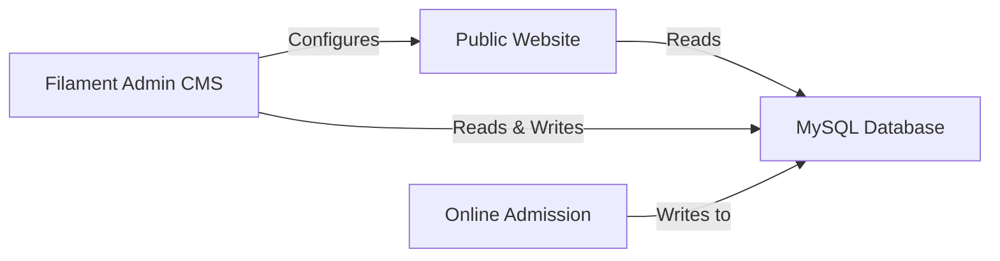
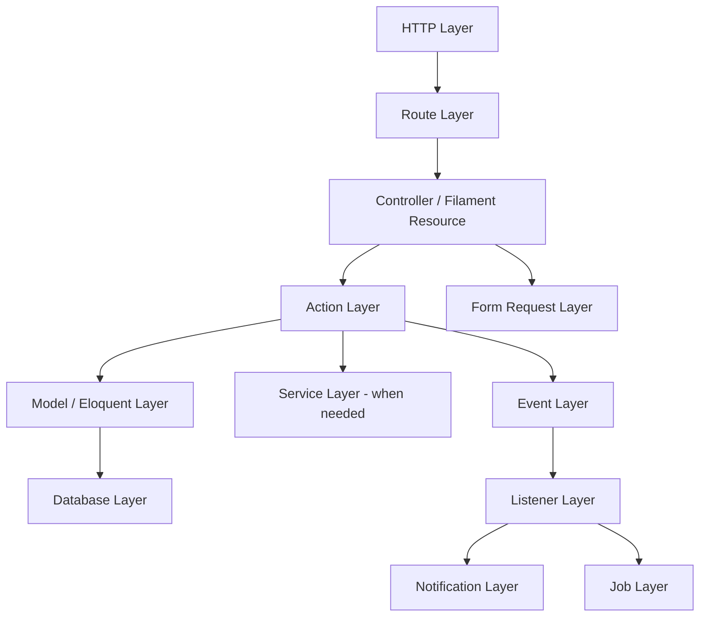
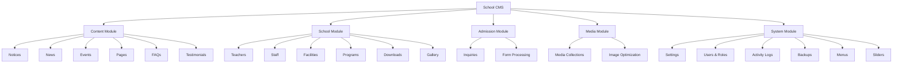
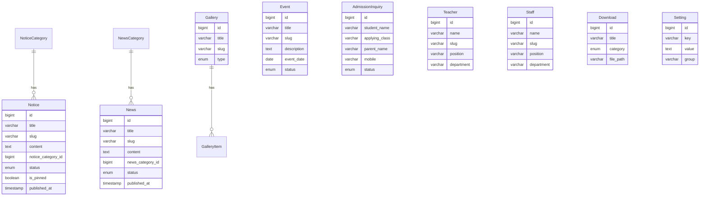
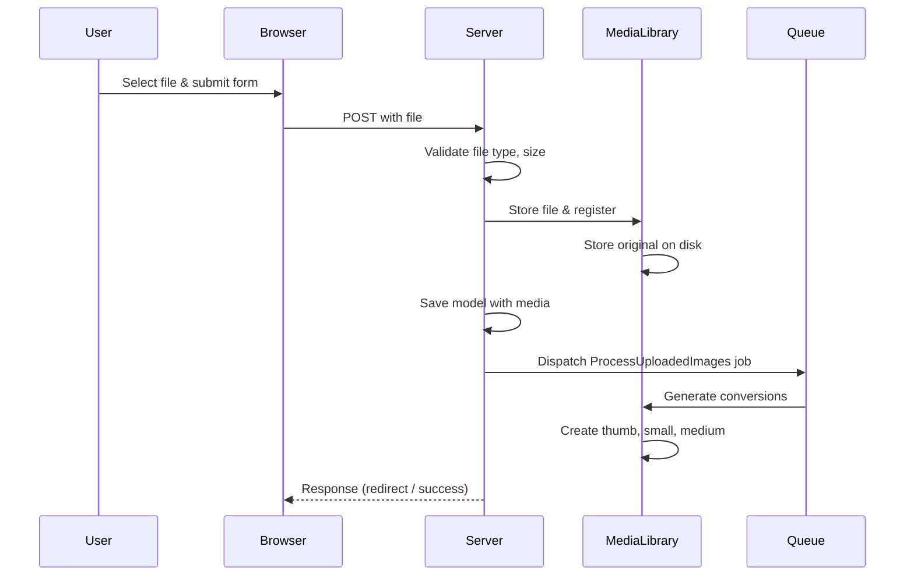

# Backend Architecture

**School Website CMS — Server-Side Architecture**

> Version 1.0
> Classification: Internal Architecture Document
> Prepared by: Laravel Architecture & Engineering

---

## Table of Contents

1. [System Overview](#system-overview)
2. [Architectural Philosophy](#architectural-philosophy)
3. [Technology Stack](#technology-stack)
4. [Application Layers](#application-layers)
5. [Domain Structure](#domain-structure)
6. [Feature Modules](#feature-modules)
7. [Folder Structure](#folder-structure)
8. [Database Design](#database-design)
9. [Relationships](#relationships)
10. [Enums](#enums)
11. [Models & Eloquent](#models--eloquent)
12. [Services](#services)
13. [Actions](#actions)
14. [Policies](#policies)
15. [Form Requests](#form-requests)
16. [DTOs](#dtos)
17. [Events & Listeners](#events--listeners)
18. [Jobs](#jobs)
19. [Notifications](#notifications)
20. [Traits & Helpers](#traits--helpers)
21. [Filament Architecture](#filament-architecture)
22. [Media Handling](#media-handling)
23. [File Upload Strategy](#file-upload-strategy)
24. [Search Strategy](#search-strategy)
25. [SEO Strategy](#seo-strategy)
26. [Caching Strategy](#caching-strategy)
27. [Validation Strategy](#validation-strategy)
28. [Authorization Strategy](#authorization-strategy)
29. [Error Handling](#error-handling)
30. [Logging Strategy](#logging-strategy)
31. [Backup Strategy](#backup-strategy)
32. [Security](#security)
33. [Performance Strategy](#performance-strategy)
34. [Code Standards](#code-standards)
35. [Naming Conventions](#naming-conventions)
36. [Development Rules](#development-rules)
37. [Deployment](#deployment)
38. [Future Scalability](#future-scalability)

---

## System Overview

The School Website CMS is a server-rendered web application with three interconnected subsystems:



| Subsystem | Responsibility | Rendering |
|-----------|---------------|-----------|
| **Public Website** | Display school information to visitors | Server-side (Blade) |
| **Filament Admin CMS** | Manage all content and settings | Server-side (Filament/Livewire) |
| **Online Admission Inquiry** | Collect prospective student inquiries | Server-side (Blade + Alpine.js) |

The public website is read-heavy and content-driven. The admin panel is write-heavy and workflow-driven. These two contexts have different performance profiles, different security requirements, and different user expectations. The architecture accounts for this separation.

---

## Architectural Philosophy

### Principles

1. **Convention over configuration.** Laravel and Filament provide sensible defaults. We follow them unless there is a documented reason not to. Custom abstractions are introduced only when the framework's defaults create a genuine maintenance problem.

2. **Fat models, thin controllers.** Business logic lives in models, actions, and services — not in controllers or Filament resources. Controllers and resources are HTTP-layer adapters that delegate immediately.

3. **Explicit over implicit.** Every relationship, every scope, every permission is defined explicitly. Magic methods, dynamic property access, and implicit behaviors are avoided.

4. **Fail loudly.** Errors are not silently swallowed. Exceptions are thrown. Logs are written. The application fails visibly rather than silently producing incorrect state.

5. **Simplicity scales.** A straightforward architecture maintained consistently by a team scales further than a "perfect" architecture that nobody understands. We choose the approach that is easiest to maintain in year three.

### What This Means in Practice

- We use Eloquent relationships directly, not repository abstractions, unless the data access pattern genuinely requires abstraction.
- We use Form Requests for validation, not inline validation in controllers.
- We use Actions for multi-step business logic, not service classes that accumulate unrelated methods.
- We use Enums for fixed sets of values, not string constants scattered across the codebase.
- We use Events for cross-cutting concerns (activity logging, notifications), not inline code in model methods.

---

## Technology Stack

| Layer | Technology | Version | Purpose |
|-------|-----------|---------|---------|
| Language | PHP | 8.3+ | Runtime |
| Framework | Laravel | 12.x / 13.x | Application framework |
| Admin Panel | Filament | 4.x | CMS administration |
| Frontend | Blade | — | Server-side templating |
| CSS | Tailwind CSS | 4.x | Utility-first styling |
| Interactivity | Alpine.js | 3.x | Client-side behavior |
| Database | MySQL | 8.0+ | Primary data store |
| File System | Local / S3 | — | Media and document storage |
| Permission | Spatie Laravel Permission | 6.x | Role and permission management |
| Shield | Filament Shield | 3.x | Filament permission integration |
| Media | Spatie Media Library | 11.x | File and image management |
| Activity | Spatie Activity Log | 4.x | Audit trail |
| Backup | Spatie Laravel Backup | 9.x | Database and file backups |
| Search | Laravel Scout | 11.x | Full-text search (optional) |
| Testing | PHPUnit / Pest | — | Automated testing |

### Why These Choices

**Filament v4** provides a complete admin panel framework built on Livewire and Tailwind. It eliminates the need to build CRUD interfaces, form handling, table rendering, and filter logic from scratch. For a CMS with 15+ content models, this saves hundreds of development hours.

**Spatie Media Library** handles the complexity of file uploads, multiple file collections, responsive image generation, and file deletion cascades. Building this from scratch would be error-prone and time-consuming.

**Spatie Permission + Filament Shield** provides a battle-tested permission system that integrates directly with Filament's resource and page authorization. Shield auto-generates permissions for Filament resources, reducing manual permission configuration.

**Alpine.js** provides just enough client-side interactivity (dropdowns, modals, form validation, filtering) without the overhead of a full JavaScript framework. The public site is server-rendered; Alpine enhances it, not drives it.

---

## Application Layers



### Layer Responsibilities

| Layer | Responsibility | Contains Business Logic? |
|-------|---------------|------------------------|
| **Routes** | Map URLs to controllers | No |
| **Controllers** | Handle HTTP request/response cycle | No |
| **Filament Resources** | Define admin CRUD interface | No |
| **Form Requests** | Validate incoming data | Validation rules only |
| **Actions** | Execute business logic | **Yes** |
| **Models** | Define data structure, relationships, scopes | **Yes** |
| **Services** | Provide cross-cutting utilities | Sometimes |
| **Events** | Signal that something happened | No |
| **Listeners** | React to events | **Yes** |
| **Jobs** | Execute async or deferred work | **Yes** |
| **Notifications** | Deliver messages | **Yes** |

### When to Use Services vs. Actions

**Actions** are used for single-use business logic: "Create a notice," "Process an admission inquiry," "Publish an event." They are called once from one place and do one thing.

**Services** are used for reusable utilities that multiple actions need: "Generate SEO slug," "Process uploaded image," "Build sitemap XML." They are stateless, have no side effects, and can be called from anywhere.

If you are unsure whether to create a Service or an Action, start with an Action. If you find yourself duplicating logic across multiple Actions, extract the shared logic into a Service.

---

## Domain Structure

The application is organized into feature modules that align with the school CMS domain. Each module encapsulates its own models, actions, policies, events, and Filament resources.



---

## Feature Modules

### Module: Content

| Component | Purpose |
|-----------|---------|
| `Notice` | School announcements, circulars, updates |
| `NoticeCategory` | Categorization for notices |
| `News` | News articles about school activities |
| `NewsCategory` | Categorization for news |
| `Event` | School events with dates and venues |
| `Page` | Static content pages (About, Vision, etc.) |
| `Faq` | Frequently asked questions |
| `Testimonial` | Student, parent, and alumni testimonials |

### Module: School

| Component | Purpose |
|-----------|---------|
| `Teacher` | Teaching staff profiles |
| `Staff` | Administrative staff profiles |
| `Facility` | School facilities information |
| `AcademicProgram` | Academic program listings |
| `Download` | Downloadable document resources |
| `Gallery` | Photo and video albums |

### Module: Admission

| Component | Purpose |
|-----------|---------|
| `AdmissionInquiry` | Prospective student admission forms |

### Module: Media

| Component | Purpose |
|-----------|---------|
| Media collections | Per-model file management via Spatie Media Library |
| Image processing | Responsive image generation and optimization |

### Module: System

| Component | Purpose |
|-----------|---------|
| `Setting` | Key-value website configuration |
| `Menu` | Navigation menu management |
| `Slider` | Homepage hero slider management |
| User management | Admin user accounts |
| Roles & Permissions | Spatie Permission integration |
| Activity Log | Spatie Activity Log integration |
| Backup | Spatie Laravel Backup integration |

---

## Folder Structure

```
app/
├── Actions/
│   ├── Admission/
│   │   └── ProcessInquiryAction.php
│   ├── Content/
│   │   ├── CreateNoticeAction.php
│   │   ├── PublishNewsAction.php
│   │   └── CreateEventAction.php
│   ├── Media/
│   │   ├── UploadMediaAction.php
│   │   └── ProcessImageAction.php
│   └── System/
│       ├── UpdateSettingAction.php
│       └── SyncMenuAction.php
├── Enums/
│   ├── NoticeStatus.php
│   ├── NewsStatus.php
│   ├── EventStatus.php
│   ├── AdmissionStatus.php
│   ├── UserRole.php
│   └── FacilityType.php
├── Events/
│   ├── NoticePublished.php
│   ├── NewsPublished.php
│   ├── EventCreated.php
│   ├── InquirySubmitted.php
│   └── SettingUpdated.php
├── Filament/
│   ├── Panels/
│   │   └── AdminPanelProvider.php
│   ├── Resources/
│   │   ├── NoticeResource.php
│   │   ├── NoticeCategoryResource.php
│   │   ├── NewsResource.php
│   │   ├── NewsCategoryResource.php
│   │   ├── EventResource.php
│   │   ├── PageResource.php
│   │   ├── TeacherResource.php
│   │   ├── StaffResource.php
│   │   ├── FacilityResource.php
│   │   ├── AcademicProgramResource.php
│   │   ├── DownloadResource.php
│   │   ├── GalleryResource.php
│   │   ├── AdmissionInquiryResource.php
│   │   ├── FaqResource.php
│   │   ├── TestimonialResource.php
│   │   ├── SettingResource.php
│   │   ├── SliderResource.php
│   │   ├── MenuResource.php
│   │   ├── UserResource.php
│   │   └── RoleResource.php
│   ├── Pages/
│   │   ├── Dashboard.php
│   │   ├── Settings/
│   │   │   ├── GeneralSettings.php
│   │   │   ├── SeoSettings.php
│   │   │   └── SocialSettings.php
│   │   └── FileManager.php
│   ├── Widgets/
│   │   ├── StatsOverview.php
│   │   ├── RecentActivity.php
│   │   ├── AdmissionChart.php
│   │   └── QuickActions.php
│   └── Forms/
│       └── Components/
│           └── RepeaterField.php
├── Http/
│   ├── Controllers/
│   │   ├── HomeController.php
│   │   ├── AboutController.php
│   │   ├── AcademicsController.php
│   │   ├── AdmissionsController.php
│   │   ├── NoticesController.php
│   │   ├── NewsController.php
│   │   ├── EventsController.php
│   │   ├── GalleryController.php
│   │   ├── TeachersController.php
│   │   ├── FacilitiesController.php
│   │   ├── DownloadsController.php
│   │   ├── ContactController.php
│   │   ├── FaqController.php
│   │   ├── InquiryController.php
│   │   └── SearchController.php
│   ├── Requests/
│   │   ├── InquiryRequest.php
│   │   └── ContactRequest.php
│   └── Middleware/
│       ├── PreventRequestsDuringMaintenance.php
│       └── TrimStrings.php
├── Listeners/
│   ├── LogActivity.php
│   ├── NotifyAdminOfInquiry.php
│   ├── SendInquiryConfirmation.php
│   ├── InvalidatePageCache.php
│   └── UpdateSitemapCache.php
├── Models/
│   ├── Notice.php
│   ├── NoticeCategory.php
│   ├── News.php
│   ├── NewsCategory.php
│   ├── Event.php
│   ├── Page.php
│   ├── Teacher.php
│   ├── Staff.php
│   ├── Facility.php
│   ├── AcademicProgram.php
│   ├── Download.php
│   ├── Gallery.php
│   ├── GalleryItem.php
│   ├── AdmissionInquiry.php
│   ├── Faq.php
│   ├── Testimonial.php
│   ├── Setting.php
│   ├── Slider.php
│   ├── Menu.php
│   ├── MenuItem.php
│   └── ActivityLog.php
├── Observers/
│   ├── NoticeObserver.php
│   ├── NewsObserver.php
│   └── PageObserver.php
├── Policies/
│   ├── NoticePolicy.php
│   ├── NewsPolicy.php
│   ├── EventPolicy.php
│   ├── PagePolicy.php
│   ├── TeacherPolicy.php
│   ├── FacilityPolicy.php
│   ├── AdmissionInquiryPolicy.php
│   ├── SettingPolicy.php
│   ├── UserPolicy.php
│   └── DownloadPolicy.php
├── Services/
│   ├── SeoService.php
│   ├── SlugService.php
│   ├── ImageService.php
│   ├── SearchService.php
│   ├── CacheService.php
│   └── SitemapService.php
├── Traits/
│   ├── HasSlug.php
│   ├── HasStatus.php
│   ├── HasMediaCollections.php
│   ├── IsSearchable.php
│   └── Cacheable.php
├── View/
│   ├── Components/
│   │   ├── Button.php
│   │   ├── Card.php
│   │   ├── Badge.php
│   │   └── SectionHeading.php
│   └── Composers/
│       ├── HeaderComposer.php
│       ├── FooterComposer.php
│       └── SidebarComposer.php
└── helpers.php

database/
├── migrations/
│   ├── 0001_01_01_000000_create_users_table.php
│   ├── 0001_01_01_000001_create_cache_table.php
│   ├── 0001_01_01_000002_create_jobs_table.php
│   ├── 2026_01_01_000010_create_pages_table.php
│   ├── 2026_01_01_000011_create_sliders_table.php
│   ├── 2026_01_01_000012_create_menus_table.php
│   ├── 2026_01_01_000013_create_menu_items_table.php
│   ├── 2026_01_01_000014_create_settings_table.php
│   ├── 2026_01_01_000020_create_notice_categories_table.php
│   ├── 2026_01_01_000021_create_notices_table.php
│   ├── 2026_01_01_000030_create_news_categories_table.php
│   ├── 2026_01_01_000031_create_news_table.php
│   ├── 2026_01_01_000040_create_events_table.php
│   ├── 2026_01_01_000050_create_teachers_table.php
│   ├── 2026_01_01_000051_create_staff_table.php
│   ├── 2026_01_01_000060_create_facilities_table.php
│   ├── 2026_01_01_000070_create_academic_programs_table.php
│   ├── 2026_01_01_000080_create_downloads_table.php
│   ├── 2026_01_01_000090_create_galleries_table.php
│   ├── 2026_01_01_000091_create_gallery_items_table.php
│   ├── 2026_01_01_000100_create_admission_inquiries_table.php
│   ├── 2026_01_01_000110_create_faqs_table.php
│   ├── 2026_01_01_000120_create_testimonials_table.php
│   ├── 2026_01_01_000900_create_activity_log_table.php
│   └── 2026_01_01_000910_add_media_columns_to_media_table.php
├── seeders/
│   ├── DatabaseSeeder.php
│   ├── RoleSeeder.php
│   ├── SettingSeeder.php
│   ├── PageSeeder.php
│   ├── NoticeCategorySeeder.php
│   └── FaqSeeder.php
└── factories/
    ├── NoticeFactory.php
    ├── NewsFactory.php
    ├── EventFactory.php
    ├── TeacherFactory.php
    └── AdmissionInquiryFactory.php

resources/
├── views/
│   ├── components/
│   │   ├── layout/
│   │   │   ├── app.blade.php
│   │   │   ├── header.blade.php
│   │   │   ├── footer.blade.php
│   │   │   ├── breadcrumbs.blade.php
│   │   │   └── mobile-nav.blade.php
│   │   ├── cards/
│   │   │   ├── notice-card.blade.php
│   │   │   ├── news-card.blade.php
│   │   │   ├── event-card.blade.php
│   │   │   ├── member-card.blade.php
│   │   │   ├── facility-card.blade.php
│   │   │   └── testimonial-card.blade.php
│   │   ├── forms/
│   │   │   ├── inquiry-form.blade.php
│   │   │   └── contact-form.blade.php
│   │   └── ui/
│   │       ├── button.blade.php
│   │       ├── badge.blade.php
│   │       ├── accordion.blade.php
│   │       ├── modal.blade.php
│   │       ├── skeleton.blade.php
│   │       ├── section-heading.blade.php
│   │       ├── filter-bar.blade.php
│   │       ├── pagination.blade.php
│   │       └── empty-state.blade.php
│   ├── layouts/
│   │   └── public.blade.php
│   ├── pages/
│   │   ├── home.blade.php
│   │   ├── about/
│   │   │   ├── index.blade.php
│   │   │   ├── history.blade.php
│   │   │   ├── vision-mission.blade.php
│   │   │   └── committee.blade.php
│   │   ├── academics/
│   │   │   ├── index.blade.php
│   │   │   └── calendar.blade.php
│   │   ├── admissions/
│   │   │   └── index.blade.php
│   │   ├── notices/
│   │   │   ├── index.blade.php
│   │   │   └── show.blade.php
│   │   ├── news/
│   │   │   ├── index.blade.php
│   │   │   └── show.blade.php
│   │   ├── events/
│   │   │   ├── index.blade.php
│   │   │   └── show.blade.php
│   │   ├── gallery/
│   │   │   ├── index.blade.php
│   │   │   └── album.blade.php
│   │   ├── teachers/
│   │   │   └── index.blade.php
│   │   ├── facilities/
│   │   │   └── index.blade.php
│   │   ├── downloads/
│   │   │   └── index.blade.php
│   │   ├── contact/
│   │   │   └── index.blade.php
│   │   ├── faq/
│   │   │   └── index.blade.php
│   │   ├── search/
│   │   │   └── index.blade.php
│   │   └── errors/
│   │       ├── 404.blade.php
│   │       └── 500.blade.php
│   └── emails/
│       └── inquiry-received.blade.php
├── css/
│   └── app.css
└── js/
    └── app.js

routes/
├── web.php
├── admin.php
└── console.php
```

### Why This Structure

The folder structure follows Laravel conventions with feature-based organization within each directory. This structure is chosen because:

1. **It is immediately navigable.** Any Laravel developer can open this project and find what they need within seconds.
2. **It scales horizontally.** Adding a new content type (e.g., "Alumni") means adding a model, migration, Filament resource, and controller — all in predictable locations.
3. **It separates public from admin.** Public controllers are in `Http/Controllers`. Filament resources are in `Filament/Resources`. There is no ambiguity about which layer serves which interface.
4. **It keeps actions at the top level.** Actions are not nested under models or controllers because they are used by both public controllers and Filament resources. They belong to the domain, not to a specific interface layer.

---

## Database Design

### Philosophy

1. **One table per entity.** Each model gets its own table with a clear primary key and timestamps.
2. **Foreign keys enforce relationships.** No orphaned records. Every `foreign_id` has a `constrained` clause with cascade or restrict behavior.
3. **Soft deletes on content models.** Notices, news, events, and pages use soft deletes to prevent accidental permanent data loss.
4. **No polymorphic relationships for core content.** Polymorphic relationships are used sparingly (activity log, media) because they complicate queries and make migrations harder to reason about.
5. **String slugs for URLs.** Every content type that has a public URL uses a unique slug column indexed for fast lookups.
6. **Status columns use enums.** Published/draft/archived states are stored as string columns backed by PHP enums.

### Core Tables

#### Pages

```sql
CREATE TABLE pages (
    id BIGINT UNSIGNED AUTO_INCREMENT PRIMARY KEY,
    title VARCHAR(255) NOT NULL,
    slug VARCHAR(255) NOT NULL UNIQUE,
    content LONGTEXT NULL,
    meta_title VARCHAR(255) NULL,
    meta_description TEXT NULL,
    og_image VARCHAR(255) NULL,
    is_published BOOLEAN DEFAULT FALSE,
    sort_order INT DEFAULT 0,
    created_at TIMESTAMP NULL,
    updated_at TIMESTAMP NULL,
    deleted_at TIMESTAMP NULL
);
```

#### Notices

```sql
CREATE TABLE notices (
    id BIGINT UNSIGNED AUTO_INCREMENT PRIMARY KEY,
    title VARCHAR(255) NOT NULL,
    slug VARCHAR(255) NOT NULL UNIQUE,
    content LONGTEXT NOT NULL,
    excerpt TEXT NULL,
    notice_category_id BIGINT UNSIGNED NOT NULL,
    status ENUM('draft', 'published') DEFAULT 'draft',
    is_pinned BOOLEAN DEFAULT FALSE,
    published_at TIMESTAMP NULL,
    meta_title VARCHAR(255) NULL,
    meta_description TEXT NULL,
    created_at TIMESTAMP NULL,
    updated_at TIMESTAMP NULL,
    deleted_at TIMESTAMP NULL,
    FOREIGN KEY (notice_category_id) REFERENCES notice_categories(id) ON DELETE RESTRICT
);
```

#### Notice Categories

```sql
CREATE TABLE notice_categories (
    id BIGINT UNSIGNED AUTO_INCREMENT PRIMARY KEY,
    name VARCHAR(255) NOT NULL,
    slug VARCHAR(255) NOT NULL UNIQUE,
    description TEXT NULL,
    sort_order INT DEFAULT 0,
    created_at TIMESTAMP NULL,
    updated_at TIMESTAMP NULL
);
```

#### News

```sql
CREATE TABLE news (
    id BIGINT UNSIGNED AUTO_INCREMENT PRIMARY KEY,
    title VARCHAR(255) NOT NULL,
    slug VARCHAR(255) NOT NULL UNIQUE,
    content LONGTEXT NOT NULL,
    excerpt TEXT NULL,
    news_category_id BIGINT UNSIGNED NOT NULL,
    status ENUM('draft', 'published') DEFAULT 'draft',
    published_at TIMESTAMP NULL,
    meta_title VARCHAR(255) NULL,
    meta_description TEXT NULL,
    og_image VARCHAR(255) NULL,
    created_at TIMESTAMP NULL,
    updated_at TIMESTAMP NULL,
    deleted_at TIMESTAMP NULL,
    FOREIGN KEY (news_category_id) REFERENCES news_categories(id) ON DELETE RESTRICT
);
```

#### News Categories

```sql
CREATE TABLE news_categories (
    id BIGINT UNSIGNED AUTO_INCREMENT PRIMARY KEY,
    name VARCHAR(255) NOT NULL,
    slug VARCHAR(255) NOT NULL UNIQUE,
    description TEXT NULL,
    sort_order INT DEFAULT 0,
    created_at TIMESTAMP NULL,
    updated_at TIMESTAMP NULL
);
```

#### Events

```sql
CREATE TABLE events (
    id BIGINT UNSIGNED AUTO_INCREMENT PRIMARY KEY,
    title VARCHAR(255) NOT NULL,
    slug VARCHAR(255) NOT NULL UNIQUE,
    description LONGTEXT NOT NULL,
    venue VARCHAR(255) NULL,
    event_date DATE NOT NULL,
    start_time TIME NULL,
    end_time TIME NULL,
    status ENUM('upcoming', 'ongoing', 'completed', 'cancelled') DEFAULT 'upcoming',
    meta_title VARCHAR(255) NULL,
    meta_description TEXT NULL,
    created_at TIMESTAMP NULL,
    updated_at TIMESTAMP NULL,
    deleted_at TIMESTAMP NULL
);
```

#### Teachers

```sql
CREATE TABLE teachers (
    id BIGINT UNSIGNED AUTO_INCREMENT PRIMARY KEY,
    name VARCHAR(255) NOT NULL,
    slug VARCHAR(255) NOT NULL UNIQUE,
    position VARCHAR(255) NOT NULL,
    department VARCHAR(255) NULL,
    qualification VARCHAR(255) NULL,
    experience VARCHAR(255) NULL,
    biography TEXT NULL,
    email VARCHAR(255) NULL,
    phone VARCHAR(50) NULL,
    sort_order INT DEFAULT 0,
    is_published BOOLEAN DEFAULT TRUE,
    created_at TIMESTAMP NULL,
    updated_at TIMESTAMP NULL,
    deleted_at TIMESTAMP NULL
);
```

#### Staff

```sql
CREATE TABLE staff (
    id BIGINT UNSIGNED AUTO_INCREMENT PRIMARY KEY,
    name VARCHAR(255) NOT NULL,
    slug VARCHAR(255) NOT NULL UNIQUE,
    position VARCHAR(255) NOT NULL,
    department VARCHAR(255) NULL,
    qualification VARCHAR(255) NULL,
    biography TEXT NULL,
    email VARCHAR(255) NULL,
    phone VARCHAR(50) NULL,
    sort_order INT DEFAULT 0,
    is_published BOOLEAN DEFAULT TRUE,
    created_at TIMESTAMP NULL,
    updated_at TIMESTAMP NULL,
    deleted_at TIMESTAMP NULL
);
```

#### Facilities

```sql
CREATE TABLE facilities (
    id BIGINT UNSIGNED AUTO_INCREMENT PRIMARY KEY,
    name VARCHAR(255) NOT NULL,
    slug VARCHAR(255) NOT NULL UNIQUE,
    description LONGTEXT NULL,
    features JSON NULL,
    type ENUM('library', 'computer_lab', 'science_lab', 'transportation', 'hostel', 'sports', 'other') DEFAULT 'other',
    sort_order INT DEFAULT 0,
    is_published BOOLEAN DEFAULT TRUE,
    created_at TIMESTAMP NULL,
    updated_at TIMESTAMP NULL,
    deleted_at TIMESTAMP NULL
);
```

#### Academic Programs

```sql
CREATE TABLE academic_programs (
    id BIGINT UNSIGNED AUTO_INCREMENT PRIMARY KEY,
    name VARCHAR(255) NOT NULL,
    slug VARCHAR(255) NOT NULL UNIQUE,
    description LONGTEXT NULL,
    level VARCHAR(100) NULL,
    duration VARCHAR(100) NULL,
    medium VARCHAR(100) NULL,
    features JSON NULL,
    sort_order INT DEFAULT 0,
    is_published BOOLEAN DEFAULT TRUE,
    created_at TIMESTAMP NULL,
    updated_at TIMESTAMP NULL,
    deleted_at TIMESTAMP NULL
);
```

#### Downloads

```sql
CREATE TABLE downloads (
    id BIGINT UNSIGNED AUTO_INCREMENT PRIMARY KEY,
    title VARCHAR(255) NOT NULL,
    description TEXT NULL,
    category ENUM('admission_form', 'prospectus', 'calendar', 'syllabus', 'other') DEFAULT 'other',
    file_path VARCHAR(255) NOT NULL,
    file_type VARCHAR(50) NULL,
    file_size INT UNSIGNED NULL,
    download_count INT UNSIGNED DEFAULT 0,
    is_published BOOLEAN DEFAULT TRUE,
    created_at TIMESTAMP NULL,
    updated_at TIMESTAMP NULL,
    deleted_at TIMESTAMP NULL
);
```

#### Galleries

```sql
CREATE TABLE galleries (
    id BIGINT UNSIGNED AUTO_INCREMENT PRIMARY KEY,
    title VARCHAR(255) NOT NULL,
    slug VARCHAR(255) NOT NULL UNIQUE,
    description TEXT NULL,
    type ENUM('photo', 'video') DEFAULT 'photo',
    event_date DATE NULL,
    sort_order INT DEFAULT 0,
    is_published BOOLEAN DEFAULT TRUE,
    created_at TIMESTAMP NULL,
    updated_at TIMESTAMP NULL,
    deleted_at TIMESTAMP NULL
);
```

#### Gallery Items

```sql
CREATE TABLE gallery_items (
    id BIGINT UNSIGNED AUTO_INCREMENT PRIMARY KEY,
    gallery_id BIGINT UNSIGNED NOT NULL,
    title VARCHAR(255) NULL,
    type ENUM('image', 'video') DEFAULT 'image',
    file_path VARCHAR(255) NOT NULL,
    video_url VARCHAR(500) NULL,
    caption TEXT NULL,
    sort_order INT DEFAULT 0,
    created_at TIMESTAMP NULL,
    updated_at TIMESTAMP NULL,
    FOREIGN KEY (gallery_id) REFERENCES galleries(id) ON DELETE CASCADE
);
```

#### Admission Inquiries

```sql
CREATE TABLE admission_inquiries (
    id BIGINT UNSIGNED AUTO_INCREMENT PRIMARY KEY,
    student_name VARCHAR(255) NOT NULL,
    applying_class VARCHAR(100) NOT NULL,
    parent_name VARCHAR(255) NOT NULL,
    mobile VARCHAR(50) NOT NULL,
    email VARCHAR(255) NULL,
    address TEXT NOT NULL,
    previous_school VARCHAR(255) NULL,
    message TEXT NULL,
    status ENUM('new', 'contacted', 'closed') DEFAULT 'new',
    notes TEXT NULL,
    created_at TIMESTAMP NULL,
    updated_at TIMESTAMP NULL,
    deleted_at TIMESTAMP NULL
);
```

#### FAQs

```sql
CREATE TABLE faqs (
    id BIGINT UNSIGNED AUTO_INCREMENT PRIMARY KEY,
    question VARCHAR(500) NOT NULL,
    answer LONGTEXT NOT NULL,
    category VARCHAR(100) NULL,
    sort_order INT DEFAULT 0,
    is_published BOOLEAN DEFAULT TRUE,
    created_at TIMESTAMP NULL,
    updated_at TIMESTAMP NULL
);
```

#### Testimonials

```sql
CREATE TABLE testimonials (
    id BIGINT UNSIGNED AUTO_INCREMENT PRIMARY KEY,
    name VARCHAR(255) NOT NULL,
    role VARCHAR(100) NOT NULL,
    content TEXT NOT NULL,
    type ENUM('student', 'parent', 'alumni') DEFAULT 'parent',
    is_published BOOLEAN DEFAULT TRUE,
    sort_order INT DEFAULT 0,
    created_at TIMESTAMP NULL,
    updated_at TIMESTAMP NULL
);
```

#### Settings

```sql
CREATE TABLE settings (
    id BIGINT UNSIGNED AUTO_INCREMENT PRIMARY KEY,
    `key` VARCHAR(255) NOT NULL UNIQUE,
    `value` LONGTEXT NULL,
    group VARCHAR(100) DEFAULT 'general',
    type ENUM('text', 'textarea', 'image', 'json', 'boolean') DEFAULT 'text',
    created_at TIMESTAMP NULL,
    updated_at TIMESTAMP NULL
);
```

#### Sliders

```sql
CREATE TABLE sliders (
    id BIGINT UNSIGNED AUTO_INCREMENT PRIMARY KEY,
    title VARCHAR(255) NOT NULL,
    subtitle TEXT NULL,
    link VARCHAR(500) NULL,
    button_text VARCHAR(100) NULL,
    sort_order INT DEFAULT 0,
    is_active BOOLEAN DEFAULT TRUE,
    created_at TIMESTAMP NULL,
    updated_at TIMESTAMP NULL
);
```

#### Menus & Menu Items

```sql
CREATE TABLE menus (
    id BIGINT UNSIGNED AUTO_INCREMENT PRIMARY KEY,
    name VARCHAR(255) NOT NULL,
    location VARCHAR(100) NOT NULL,
    created_at TIMESTAMP NULL,
    updated_at TIMESTAMP NULL
);

CREATE TABLE menu_items (
    id BIGINT UNSIGNED AUTO_INCREMENT PRIMARY KEY,
    menu_id BIGINT UNSIGNED NOT NULL,
    parent_id BIGINT UNSIGNED NULL,
    label VARCHAR(255) NOT NULL,
    url VARCHAR(500) NOT NULL,
    target VARCHAR(50) DEFAULT '_self',
    sort_order INT DEFAULT 0,
    is_active BOOLEAN DEFAULT TRUE,
    created_at TIMESTAMP NULL,
    updated_at TIMESTAMP NULL,
    FOREIGN KEY (menu_id) REFERENCES menus(id) ON DELETE CASCADE,
    FOREIGN KEY (parent_id) REFERENCES menu_items(id) ON DELETE CASCADE
);
```

### Pivot Tables

```sql
-- No complex pivots needed for this system.
-- Teachers and Staff do not need a polymorphic relation
-- because they share the same structure and could be merged
-- into a single `people` table if needed in the future.
```

### Index Strategy

| Table | Index | Type | Purpose |
|-------|-------|------|---------|
| notices | `slug` | Unique | URL lookup |
| notices | `status, published_at` | Composite | Published listing |
| notices | `notice_category_id` | Foreign | Category filtering |
| news | `slug` | Unique | URL lookup |
| news | `status, published_at` | Composite | Published listing |
| events | `slug` | Unique | URL lookup |
| events | `event_date, status` | Composite | Date-sorted listing |
| galleries | `slug` | Unique | URL lookup |
| admission_inquiries | `status` | Index | Status filtering |
| admission_inquiries | `created_at` | Index | Date sorting |
| settings | `key` | Unique | Key lookup |

---

## Relationships



### Model Relationship Definitions

**Notice**
```php
public function category(): BelongsTo
{
    return $this->belongsTo(NoticeCategory::class, 'notice_category_id');
}
```

**News**
```php
public function category(): BelongsTo
{
    return $this->belongsTo(NewsCategory::class, 'news_category_id');
}
```

**Gallery**
```php
public function items(): HasMany
{
    return $this->hasMany(GalleryItem::class);
}
```

**GalleryItem**
```php
public function gallery(): BelongsTo
{
    return $this->belongsTo(Gallery::class);
}
```

**MenuItem (self-referencing)**
```php
public function parent(): BelongsTo
{
    return $this->belongsTo(MenuItem::class, 'parent_id');
}

public function children(): HasMany
{
    return $this->hasMany(MenuItem::class, 'parent_id');
}
```

### Media Collections (Spatie Media Library)

The following models use Spatie Media Library collections:

| Model | Collection Names | Disk | Purpose |
|-------|-----------------|------|---------|
| `Slider` | `hero_image` | `public` | Hero background image |
| `News` | `featured_image` | `public` | Article featured image |
| `Teacher` | `photo` | `public` | Profile photo |
| `Staff` | `photo` | `public` | Profile photo |
| `Facility` | `images` | `public` | Facility photos (multiple) |
| `GalleryItem` | `file` | `public` | Image or video file |
| `Page` | `featured_image` | `public` | Page header image |
| `Setting` | `logo`, `favicon` | `public` | School branding |

---

## Enums

PHP 8.1+ enums replace string constants and provide type safety, IDE autocompletion, and explicit value mapping.

```php
<?php

namespace App\Enums;

enum NoticeStatus: string
{
    case Draft = 'draft';
    case Published = 'published';

    public function label(): string
    {
        return match($this) {
            self::Draft => 'Draft',
            self::Published => 'Published',
        };
    }
}

enum AdmissionStatus: string
{
    case New = 'new';
    case Contacted = 'contacted';
    case Closed = 'closed';

    public function label(): string
    {
        return match($this) {
            self::New => 'New',
            self::Contacted => 'Contacted',
            self::Closed => 'Closed',
        };
    }

    public function color(): string
    {
        return match($this) {
            self::New => 'info',
            self::Contacted => 'warning',
            self::Closed => 'success',
        };
    }
}

enum EventStatus: string
{
    case Upcoming = 'upcoming';
    case Ongoing = 'ongoing';
    case Completed = 'completed';
    case Cancelled = 'cancelled';
}

enum DownloadCategory: string
{
    case AdmissionForm = 'admission_form';
    case Prospectus = 'prospectus';
    case Calendar = 'calendar';
    case Syllabus = 'syllabus';
    case Other = 'other';

    public function label(): string
    {
        return str($this->value)->headline()->toString();
    }
}

enum FacilityType: string
{
    case Library = 'library';
    case ComputerLab = 'computer_lab';
    case ScienceLab = 'science_lab';
    case Transportation = 'transportation';
    case Hostel = 'hostel';
    case Sports = 'sports';
    case Other = 'other';
}

enum UserRole: string
{
    case SuperAdmin = 'super_admin';
    case Admin = 'admin';
    case ContentEditor = 'content_editor';
}
```

---

## Models & Eloquent

### Model Conventions

1. **Every model uses `HasFactory`.** This enables consistent test data generation.
2. **Every soft-deletable model uses `SoftDeletes`.** Content models (notices, news, events, pages, galleries, downloads, teachers, staff, facilities, programs) are soft-deletable. Configuration models (settings, categories) are not.
3. **Every model with a public URL uses the `HasSlug` trait.** This auto-generates a slug from the title on creation and ensures uniqueness.
4. **Every model with a status column uses the `HasStatus` trait.** This provides scope methods for querying published/draft content.
5. **Casts are explicit.** Enums are cast to their backing type. JSON columns are cast to `array`. Dates are cast to `date` or `datetime` as appropriate.

### Example Model

```php
<?php

namespace App\Models;

use App\Enums\NoticeStatus;
use App\Traits\HasSlug;
use App\Traits\HasStatus;
use Illuminate\Database\Eloquent\Factories\HasFactory;
use Illuminate\Database\Eloquent\Model;
use Illuminate\Database\Eloquent\Relations\BelongsTo;
use Illuminate\Database\Eloquent\SoftDeletes;
use Spatie\MediaLibrary\HasMedia;
use Spatie\MediaLibrary\InteractsWithMedia;

class Notice extends Model implements HasMedia
{
    use HasFactory, SoftDeletes, HasSlug, HasStatus, InteractsWithMedia;

    protected $fillable = [
        'title',
        'slug',
        'content',
        'excerpt',
        'notice_category_id',
        'status',
        'is_pinned',
        'published_at',
        'meta_title',
        'meta_description',
    ];

    protected $casts = [
        'status' => NoticeStatus::class,
        'is_pinned' => 'boolean',
        'published_at' => 'datetime',
    ];

    public function category(): BelongsTo
    {
        return $this->belongsTo(NoticeCategory::class, 'notice_category_id');
    }

    public function registerMediaCollections(): void
    {
        $this->addMediaCollection('attachments')
            ->acceptsMimeTypes(['application/pdf', 'image/jpeg', 'image/png']);
    }

    public function getRouteKeyName(): string
    {
        return 'slug';
    }
}
```

---

## Services

Services are stateless classes that provide reusable utilities. They do not hold state between calls. They do not dispatch events. They do not send notifications. They transform data.

### SeoService

```php
<?php

namespace App\Services;

class SeoService
{
    public function generateMetaTitle(string $title, string $schoolName): string
    {
        return "{$title} | {$schoolName}";
    }

    public function generateMetaDescription(string $content, int $length = 160): string
    {
        return Str::limit(strip_tags($content), $length);
    }

    public function generateSlug(string $title): string
    {
        return Str::slug($title);
    }
}
```

### SlugService

```php
<?php

namespace App\Services;

use Illuminate\Support\Str;

class SlugService
{
    public function makeUnique(string $value, string $table, ?int $ignoreId = null): string
    {
        $slug = Str::slug($value);
        $originalSlug = $slug;
        $counter = 1;

        while ($this->slugExists($slug, $table, $ignoreId)) {
            $slug = "{$originalSlug}-{$counter}";
            $counter++;
        }

        return $slug;
    }

    protected function slugExists(string $slug, string $table, ?int $ignoreId): bool
    {
        $query = \DB::table($table)->where('slug', $slug);

        if ($ignoreId) {
            $query->where('id', '!=', $ignoreId);
        }

        return $query->exists();
    }
}
```

### ImageService

```php
<?php

namespace App\Services;

use Spatie\MediaLibrary\MediaCollections\Models\Media;

class ImageService
{
    public function getResponsiveUrls(Media $media, array $conversions = []): array
    {
        return [
            'thumb' => $media->getUrl('thumb'),
            'small' => $media->getUrl('small'),
            'medium' => $media->getUrl('medium'),
            'large' => $media->getUrl('large'),
            'original' => $media->getUrl(),
        ];
    }

    public function getPlaceholderSvg(): string
    {
        return '<svg>...</svg>';
    }
}
```

### CacheService

```php
<?php

namespace App\Services;

use Illuminate\Support\Facades\Cache;

class CacheService
{
    public function remember(string $key, int $ttl, callable $callback): mixed
    {
        return Cache::remember($key, $ttl, $callback);
    }

    public function forget(string $key): bool
    {
        return Cache::forget($key);
    }

    public function forgetByPrefix(string $prefix): void
    {
        \Cache::tags([$prefix])->flush();
    }
}
```

### SearchService

```php
<?php

namespace App\Services;

use App\Models\{Notice, News, Event, Page};
use Illuminate\Support\Collection;

class SearchService
{
    public function search(string $query, int $limit = 10): Collection
    {
        if (empty(trim($query))) {
            return collect();
        }

        $results = collect();

        $results = $results->concat(
            Notice::where('status', 'published')
                ->where('title', 'LIKE', "%{$query}%")
                ->limit($limit)
                ->get()
                ->map(fn ($item) => ['type' => 'notice', 'model' => $item])
        );

        $results = $results->concat(
            News::where('status', 'published')
                ->where('title', 'LIKE', "%{$query}%")
                ->limit($limit)
                ->get()
                ->map(fn ($item) => ['type' => 'news', 'model' => $item])
        );

        $results = $results->concat(
            Event::where('event_date', '>=', now())
                ->where('title', 'LIKE', "%{$query}%")
                ->limit($limit)
                ->get()
                ->map(fn ($item) => ['type' => 'event', 'model' => $item])
        );

        return $results->take($limit);
    }
}
```

---

## Actions

Actions encapsulate a single business operation. They are called from controllers, Filament resources, or console commands. They are the primary location of business logic.

### Naming Convention

Actions are named with a verb-noun pattern: `{Verb}{Noun}Action`.

- `ProcessInquiryAction`
- `CreateNoticeAction`
- `PublishNewsAction`
- `UploadMediaAction`
- `UpdateSettingAction`

### Example: ProcessInquiryAction

```php
<?php

namespace App\Actions\Admission;

use App\Events\InquirySubmitted;
use App\Models\AdmissionInquiry;
use App\Http\Requests\InquiryRequest;

class ProcessInquiryAction
{
    public function execute(InquiryRequest $request): AdmissionInquiry
    {
        $inquiry = AdmissionInquiry::create($request->validated());

        event(new InquirySubmitted($inquiry));

        return $inquiry;
    }
}
```

### Example: PublishNewsAction

```php
<?php

namespace App\Actions\Content;

use App\Events\NewsPublished;
use App\Models\News;

class PublishNewsAction
{
    public function execute(News $news): News
    {
        $news->update([
            'status' => 'published',
            'published_at' => now(),
        ]);

        event(new NewsPublished($news));

        return $news;
    }
}
```

### Example: UpdateSettingAction

```php
<?php

namespace App\Actions\System;

use App\Events\SettingUpdated;
use App\Models\Setting;

class UpdateSettingAction
{
    public function execute(string $key, mixed $value, string $group = 'general'): Setting
    {
        $setting = Setting::updateOrCreate(
            ['key' => $key],
            ['value' => $value, 'group' => $group]
        );

        event(new SettingUpdated($setting));

        return $setting;
    }
}
```

---

## Policies

Policies define authorization rules for models. Every Filament resource and every public controller that modifies data has a corresponding policy.

### Authorization Rules

| Model | Super Admin | Admin | Content Editor | Public |
|-------|------------|-------|----------------|--------|
| Notice | Full | Full | Create, Edit, Delete own | Read published |
| News | Full | Full | Create, Edit, Delete own | Read published |
| Event | Full | Full | Create, Edit, Delete | Read |
| Page | Full | Full | Create, Edit | Read |
| Teacher | Full | Full | Create, Edit | Read published |
| Staff | Full | Full | Create, Edit | Read published |
| Facility | Full | Full | Create, Edit | Read published |
| AdmissionInquiry | Full | Full | Read, Update status | Create |
| Setting | Full | No | No | Read public |
| User | Full | No | No | No |
| Download | Full | Full | Create, Edit | Read published |
| Gallery | Full | Full | Create, Edit | Read published |

### Policy Example

```php
<?php

namespace App\Policies;

use App\Models\{Notice, User};

class NoticePolicy
{
    public function viewAny(User $user): bool
    {
        return true;
    }

    public function view(User $user, Notice $notice): bool
    {
        return $notice->status === 'published' || $user->hasRole('admin');
    }

    public function create(User $user): bool
    {
        return $user->hasAnyRole(['super_admin', 'admin', 'content_editor']);
    }

    public function update(User $user, Notice $notice): bool
    {
        if ($user->hasAnyRole(['super_admin', 'admin'])) {
            return true;
        }

        return $user->hasRole('content_editor');
    }

    public function delete(User $user, Notice $notice): bool
    {
        if ($user->hasAnyRole(['super_admin', 'admin'])) {
            return true;
        }

        return $user->hasRole('content_editor');
    }
}
```

---

## Form Requests

Form Requests encapsulate validation logic and keep controllers clean. Every form submission uses a dedicated Form Request class.

### Principles

1. **One Form Request per form.** Not per model. The `StoreNoticeRequest` and `UpdateNoticeRequest` may differ because update requests need to ignore the current model's unique values.
2. **Validation rules are explicit.** No inline rules in controllers.
3. **Custom messages are used for user-facing errors.** The `messages()` method returns human-readable error messages.
4. **Authorization is handled in the Form Request.** The `authorize()` method returns `true` if the user is permitted to perform the action.

### Example: InquiryRequest

```php
<?php

namespace App\Http\Requests;

use Illuminate\Foundation\Http\FormRequest;

class InquiryRequest extends FormRequest
{
    public function authorize(): bool
    {
        return true;
    }

    public function rules(): array
    {
        return [
            'student_name' => ['required', 'string', 'max:100'],
            'applying_class' => ['required', 'string', 'max:100'],
            'parent_name' => ['required', 'string', 'max:100'],
            'mobile' => ['required', 'string', 'max:50', 'regex:/^[+]?[\d\s\-()]+$/'],
            'email' => ['nullable', 'email', 'max:255'],
            'address' => ['required', 'string', 'max:500'],
            'previous_school' => ['nullable', 'string', 'max:200'],
            'message' => ['nullable', 'string', 'max:1000'],
        ];
    }

    public function messages(): array
    {
        return [
            'student_name.required' => 'Please enter the student\'s name.',
            'applying_class.required' => 'Please select the class you are applying for.',
            'mobile.required' => 'Please enter a contact phone number.',
            'mobile.regex' => 'Please enter a valid phone number.',
        ];
    }
}
```

---

## DTOs

Data Transfer Objects are used when an action or service needs to pass structured data between layers without relying on the request object or model directly.

### When to Use DTOs

- When passing data from a controller to an action (instead of passing the request object directly)
- When a service returns structured data that multiple consumers need
- When you need to type-hint a data structure explicitly

### When NOT to Use DTOs

- For simple CRUD operations where the model is created directly from request data
- When a Form Request already provides the necessary structure
- When the overhead of a DTO class outweighs its benefit

### Example: InquiryData DTO

```php
<?php

namespace App\DTOs;

readonly class InquiryData
{
    public function __construct(
        public string $studentName,
        public string $applyingClass,
        public string $parentName,
        public string $mobile,
        public ?string $email = null,
        public string $address = '',
        public ?string $previousSchool = null,
        public ?string $message = null,
    ) {}

    public static function fromRequest(InquiryRequest $request): self
    {
        return new self(
            studentName: $request->student_name,
            applyingClass: $request->applying_class,
            parentName: $request->parent_name,
            mobile: $request->mobile,
            email: $request->email,
            address: $request->address,
            previousSchool: $request->previous_school,
            message: $request->message,
        );
    }

    public function toArray(): array
    {
        return [
            'student_name' => $this->studentName,
            'applying_class' => $this->applyingClass,
            'parent_name' => $this->parentName,
            'mobile' => $this->mobile,
            'email' => $this->email,
            'address' => $this->address,
            'previous_school' => $this->previousSchool,
            'message' => $this->message,
        ];
    }
}
```

---

## Events & Listeners

Events decouple side effects from core business logic. When something significant happens in the system, an event is dispatched. Listeners react to events independently.

### Event-Listener Map

| Event | Listener | Purpose |
|-------|----------|---------|
| `NoticePublished` | `InvalidatePageCache` | Clear notice cache |
| `NoticePublished` | `UpdateSitemapCache` | Regenerate sitemap |
| `NewsPublished` | `InvalidatePageCache` | Clear news cache |
| `NewsPublished` | `UpdateSitemapCache` | Regenerate sitemap |
| `EventCreated` | `InvalidatePageCache` | Clear event cache |
| `InquirySubmitted` | `NotifyAdminOfInquiry` | Send admin notification |
| `InquirySubmitted` | `SendInquiryConfirmation` | Send user confirmation |
| `SettingUpdated` | `InvalidatePageCache` | Clear settings cache |
| `NoticePublished` | `LogActivity` | Log in activity feed |

### Event Example

```php
<?php

namespace App\Events;

use App\Models\AdmissionInquiry;
use Illuminate\Foundation\Events\Dispatchable;
use Illuminate\Queue\SerializesModels;

class InquirySubmitted
{
    use Dispatchable, SerializesModels;

    public function __construct(
        public AdmissionInquiry $inquiry
    ) {}
}
```

### Listener Example

```php
<?php

namespace App\Listeners;

use App\Events\InquirySubmitted;
use App\Notifications\InquiryNotification;

class NotifyAdminOfInquiry
{
    public function handle(InquirySubmitted $event): void
    {
        $admins = \App\Models\User::whereHas('roles', function ($query) {
            $query->whereIn('name', ['super_admin', 'admin']);
        })->get();

        foreach ($admins as $admin) {
            $admin->notify(new InquiryNotification($event->inquiry));
        }
    }
}
```

---

## Jobs

Jobs handle async or deferred work that should not block the HTTP response.

| Job | Trigger | Purpose |
|-----|---------|---------|
| `ProcessUploadedImages` | After media upload | Generate responsive image conversions |
| `GenerateSitemap` | After content change | Rebuild XML sitemap |
| `SendInquiryEmail` | After inquiry submission | Send confirmation email |
| `ExportAdmissionsToCsv` | Admin request | Generate CSV export |

### Job Example

```php
<?php

namespace App\Jobs;

use App\Models\AdmissionInquiry;
use Illuminate\Bus\Queueable;
use Illuminate\Contracts\Queue\ShouldQueue;
use Illuminate\Foundation\Bus\Dispatchable;
use Illuminate\Queue\InteractsWithQueue;
use Illuminate\Queue\SerializesModels;

class ExportAdmissionsToCsv implements ShouldQueue
{
    use Dispatchable, InteractsWithQueue, Queueable, SerializesModels;

    public function __construct(
        public string $status,
        public string $filePath
    ) {}

    public function handle(): void
    {
        $inquiries = AdmissionInquiry::where('status', $this->status)
            ->orderBy('created_at', 'desc')
            ->get();

        $csv = \League\Csv\Writer::createFromPath($this->filePath, 'w');
        $csv->insertOne(['Student Name', 'Class', 'Parent', 'Mobile', 'Email', 'Status', 'Date']);

        foreach ($inquiries as $inquiry) {
            $csv->insertOne([
                $inquiry->student_name,
                $inquiry->applying_class,
                $inquiry->parent_name,
                $inquiry->mobile,
                $inquiry->email ?? '',
                $inquiry->status,
                $inquiry->created_at->format('Y-m-d'),
            ]);
        }
    }
}
```

---

## Notifications

Notifications are used for system-generated messages. In this system, they are primarily used to notify administrators of new admission inquiries.

### Notification Types

| Notification | Channel | Recipients |
|-------------|---------|-----------|
| `InquiryNotification` | Database, Email | Super Admin, Admin |
| `InquiryConfirmation` | Email | Applicant (if email provided) |

### Notification Example

```php
<?php

namespace App\Notifications;

use App\Models\AdmissionInquiry;
use Illuminate\Bus\Queueable;
use Illuminate\Notifications\Messages\MailMessage;
use Illuminate\Notifications\Notification;

class InquiryNotification extends Notification
{
    use Queueable;

    public function __construct(
        public AdmissionInquiry $inquiry
    ) {}

    public function via(object $notifiable): array
    {
        return ['database', 'mail'];
    }

    public function toMail(object $notifiable): MailMessage
    {
        return (new MailMessage)
            ->subject('New Admission Inquiry')
            ->line("A new admission inquiry has been submitted.")
            ->line("Student: {$this->inquiry->student_name}")
            ->line("Class: {$this->inquiry->applying_class}")
            ->line("Parent: {$this->inquiry->parent_name}")
            ->line("Phone: {$this->inquiry->mobile}")
            ->action('View Inquiry', route('filament.admin.resources.admission-inquiries.show', $this->inquiry));
    }

    public function toArray(object $notifiable): array
    {
        return [
            'inquiry_id' => $this->inquiry->id,
            'student_name' => $this->inquiry->student_name,
            'applying_class' => $this->inquiry->applying_class,
        ];
    }
}
```

---

## Traits & Helpers

### HasSlug Trait

Auto-generates a unique slug from a specified attribute.

```php
<?php

namespace App\Traits;

use App\Services\SlugService;
use Illuminate\Database\Eloquent\Model;

trait HasSlug
{
    public static function bootHasSlug(): void
    {
        static::creating(function (Model $model) {
            if (empty($model->slug)) {
                $model->slug = app(SlugService::class)->makeUnique(
                    $model->title,
                    $model->getTable(),
                    $model->id
                );
            }
        });

        static::updating(function (Model $model) {
            if ($model->isDirty('title') && !$model->isDirty('slug')) {
                $model->slug = app(SlugService::class)->makeUnique(
                    $model->title,
                    $model->getTable(),
                    $model->id
                );
            }
        });
    }

    public function getRouteKeyName(): string
    {
        return 'slug';
    }
}
```

### HasStatus Trait

Provides scopes for status-based queries.

```php
<?php

namespace App\Traits;

trait HasStatus
{
    public function scopePublished($query)
    {
        return $query->where('status', 'published');
    }

    public function scopeDraft($query)
    {
        return $query->where('status', 'draft');
    }

    public function scopePublishedOrRecent($query, int $days = 30)
    {
        return $query->where('status', 'published')
            ->orWhere('published_at', '>=', now()->subDays($days));
    }

    public function isPublished(): bool
    {
        return $this->status === 'published';
    }

    public function isDraft(): bool
    {
        return $this->status === 'draft';
    }
}
```

### Cacheable Trait

Provides automatic cache management for models.

```php
<?php

namespace App\Traits;

use Illuminate\Support\Facades\Cache;

trait Cacheable
{
    public static function bootCacheable(): void
    {
        static::saved(function ($model) {
            Cache::forget(static::cacheKey($model));
        });

        static::deleted(function ($model) {
            Cache::forget(static::cacheKey($model));
        });
    }

    public static function cacheKey($model): string
    {
        return static::class . ':' . $model->getKey();
    }

    public static function cachedFind(int|string $key, int $ttl = 3600): ?static
    {
        $cacheKey = static::class . ':' . $key;

        return Cache::remember($cacheKey, $ttl, function () use ($key) {
            return static::find($key);
        });
    }
}
```

### Helpers

The `helpers.php` file provides global utility functions used throughout the application.

```php
<?php

if (!function_exists('school_setting')) {
    function school_setting(string $key, mixed $default = null): mixed
    {
        return Cache::remember("setting:{$key}", 3600, function () use ($key, $default) {
            $setting = \App\Models\Setting::where('key', $key)->first();
            return $setting?->value ?? $default;
        });
    }
}

if (!function_exists('format_file_size')) {
    function format_file_size(int $bytes): string
    {
        $units = ['B', 'KB', 'MB', 'GB'];
        $i = 0;
        while ($bytes >= 1024 && $i < count($units) - 1) {
            $bytes /= 1024;
            $i++;
        }
        return round($bytes, 1) . ' ' . $units[$i];
    }
}
```

---

## Filament Architecture

### Panel Configuration

The admin panel is configured as a single panel with the following properties:

```php
<?php

namespace App\Filament\Panels;

use Filament\Panel;
use Filament\PanelProvider;

class AdminPanelProvider extends PanelProvider
{
    public function panel(Panel $panel): Panel
    {
        return $panel
            ->id('admin')
            ->path('admin')
            ->login()
            ->brandName('School CMS')
            ->brandLogo(asset('images/logo.svg'))
            ->favicon(asset('images/favicon.ico'))
            ->colors([
                'primary' => FilamentColor::Hex('#1E3A8A'),
            ])
            ->navigationGroups([
                'Content',
                'School',
                'Admissions',
                'Media',
                'System',
            ])
            ->widgets([
                \App\Filament\Widgets\StatsOverview::class,
                \App\Filament\Widgets\RecentActivity::class,
                \App\Filament\Widgets\AdmissionChart::class,
                \App\Filament\Widgets\QuickActions::class,
            ])
            ->pages([
                \App\Filament\Pages\Dashboard::class,
                \App\Filament\Pages\Settings\GeneralSettings::class,
                \App\Filament\Pages\Settings\SeoSettings::class,
            ])
            ->plugins([
                \ShuvroRoy\FilamentSpatieLaravelBackup\FilamentSpatieLaravelBackupPlugin::make(),
                \BezhanShtil\FilamentShield\FilamentShieldPlugin::make(),
            ])
            ->sidebarCollapsibleOnDesktop();
    }
}
```

### Navigation Groups

| Group | Resources |
|-------|-----------|
| **Content** | Notices, Notice Categories, News, News Categories, Events, Pages, FAQs, Testimonials |
| **School** | Teachers, Staff, Facilities, Academic Programs, Downloads |
| **Admissions** | Admission Inquiries |
| **Media** | Galleries |
| **System** | Settings, Sliders, Menus, Users, Roles & Permissions |

### Resource Structure

Every Filament resource follows this structure:

```
Filament/Resources/
├── NoticeResource.php
├── NoticeResource/
│   ├── Pages/
│   │   ├── ListNotices.php
│   │   ├── CreateNotice.php
│   │   └── EditNotice.php
│   └── RelationManagers/
│       └── AttachmentsRelationManager.php
```

### Resource Example: NoticeResource

```php
<?php

namespace App\Filament\Resources;

use App\Filament\Resources\NoticeResource\Pages;
use App\Models\Notice;
use Filament\Forms;
use Filament\Forms\Form;
use Filament\Resources\Resource;
use Filament\Tables;
use Filament\Tables\Table;

class NoticeResource extends Resource
{
    protected static ?string $model = Notice::class;
    protected static ?string $navigationIcon = 'heroicon-o-bell';
    protected static ?string $navigationGroup = 'Content';
    protected static ?int $navigationSort = 1;

    public static function form(Form $form): Form
    {
        return $form->schema([
            Forms\Components\Section::make()->schema([
                Forms\Components\TextInput::make('title')
                    ->required()
                    ->maxLength(255)
                    ->live(onBlur: true)
                    ->afterStateUpdated(fn ($state, $set) =>
                        $set('slug', \Illuminate\Support\Str::slug($state))
                    ),

                Forms\Components\TextInput::make('slug')
                    ->required()
                    ->unique(ignoreRecord: true)
                    ->maxLength(255),

                Forms\Components\Select::make('notice_category_id')
                    ->relationship('category', 'name')
                    ->required()
                    ->searchable(),

                Forms\Components\Toggle::make('is_pinned')
                    ->label('Pin this notice'),

                Forms\Components\Select::make('status')
                    ->options([
                        'draft' => 'Draft',
                        'published' => 'Published',
                    ])
                    ->required()
                    ->default('draft'),
            ])->columns(2),

            Forms\Components\Section::make('Content')->schema([
                Forms\Components\RichEditor::make('content')
                    ->required()
                    ->columnSpanFull(),

                Forms\Components\Textarea::make('excerpt')
                    ->rows(3)
                    ->maxLength(500)
                    ->columnSpanFull(),
            ]),

            Forms\Components\Section::make('SEO')->schema([
                Forms\Components\TextInput::make('meta_title')
                    ->maxLength(255),
                Forms\Components\Textarea::make('meta_description')
                    ->rows(2)
                    ->maxLength(160),
            ])->collapsed(),

            Forms\Components\Section::make('Attachments')->schema([
                Forms\Components\FileUpload::make('attachments')
                    ->collection('attachments')
                    ->multiple()
                    ->acceptedFileTypes(['application/pdf', 'image/jpeg', 'image/png'])
                    ->maxSize(5120)
                    ->directory('notices/attachments'),
            ])->collapsible(),
        ]);
    }

    public static function table(Table $table): Table
    {
        return $table
            ->columns([
                Tables\Columns\TextColumn::make('title')
                    ->searchable()
                    ->sortable(),

                Tables\Columns\TextColumn::make('category.name')
                    ->sortable(),

                Tables\Columns\IconColumn::make('is_pinned')
                    ->boolean(),

                Tables\Columns\TextColumn::make('status')
                    ->badge()
                    ->color(fn (string $state): string =>
                        $state === 'published' ? 'success' : 'gray'
                    ),

                Tables\Columns\TextColumn::make('published_at')
                    ->dateTime()
                    ->sortable(),

                Tables\Columns\TextColumn::make('created_at')
                    ->dateTime()
                    ->sortable()
                    ->toggleable(isToggledHiddenByDefault: true),
            ])
            ->defaultSort('created_at', 'desc')
            ->filters([
                Tables\Filters\SelectFilter::make('status')
                    ->options([
                        'draft' => 'Draft',
                        'published' => 'Published',
                    ]),
                Tables\Filters\SelectFilter::make('notice_category_id')
                    ->relationship('category', 'name')
                    ->label('Category'),
            ])
            ->actions([
                Tables\Actions\EditAction::make(),
                Tables\Actions\DeleteAction::make(),
            ])
            ->bulkActions([
                Tables\Actions\BulkActionGroup::make([
                    Tables\Actions\DeleteBulkAction::make(),
                ]),
            ]);
    }

    public static function getPages(): array
    {
        return [
            'index' => Pages\ListNotices::route('/'),
            'create' => Pages\CreateNotice::route('/create'),
            'edit' => Pages\EditNotice::route('/{record}/edit'),
        ];
    }
}
```

### Dashboard Widgets

#### StatsOverview Widget

Displays key metrics in stat cards.

```php
<?php

namespace App\Filament\Widgets;

use App\Models\{Notice, News, Event, AdmissionInquiry, Gallery};
use Filament\Widgets\StatsOverviewWidget;
use Filament\Widgets\StatsOverviewWidget\Stat;

class StatsOverview extends StatsOverviewWidget
{
    protected function getStats(): array
    {
        return [
            Stat::make('Total Notices', Notice::count())
                ->description('Published: ' . Notice::where('status', 'published')->count())
                ->descriptionIcon('heroicon-m-bell')
                ->color('primary'),

            Stat::make('Total News', News::count())
                ->description('Published: ' . News::where('status', 'published')->count())
                ->descriptionIcon('heroicon-m-newspaper'),

            Stat::make('Total Events', Event::count())
                ->description('Upcoming: ' . Event::where('event_date', '>=', now())->count())
                ->descriptionIcon('heroicon-m-calendar')
                ->color('success'),

            Stat::make('Admission Inquiries', AdmissionInquiry::count())
                ->description('New: ' . AdmissionInquiry::where('status', 'new')->count())
                ->descriptionIcon('heroicon-m-user-plus')
                ->color('warning'),

            Stat::make('Gallery Items', Gallery::count())
                ->description('Albums')
                ->descriptionIcon('heroicon-m-photo'),
        ];
    }
}
```

### Filament Page Authorization

All Filament resources and pages use Filament Shield for permission management. Shield auto-generates permissions for each resource's CRUD operations. The `RolesSeeder` creates the three base roles and assigns appropriate permissions.

```php
// RolesSeeder.php
public function run(): void
{
    $superAdmin = Role::create(['name' => 'super_admin']);
    $superAdmin->givePermissionTo(Permission::all());

    $admin = Role::create(['name' => 'admin']);
    $admin->givePermissionTo([
        'view_notice', 'create_notice', 'edit_notice', 'delete_notice',
        'view_news', 'create_news', 'edit_news', 'delete_news',
        'view_event', 'create_event', 'edit_event', 'delete_event',
        // ... all content permissions
    ]);

    $contentEditor = Role::create(['name' => 'content_editor']);
    $contentEditor->givePermissionTo([
        'view_notice', 'create_notice', 'edit_notice', 'delete_notice',
        'view_news', 'create_news', 'edit_news', 'delete_news',
        'view_event', 'create_event', 'edit_event', 'delete_event',
        'view_page', 'create_page', 'edit_page',
        'view_teacher', 'create_teacher', 'edit_teacher',
        'view_staff', 'create_staff', 'edit_staff',
        'view_gallery', 'create_gallery', 'edit_gallery',
    ]);
}
```

---

## Media Handling

### Spatie Media Library Integration

Files are managed through Spatie Media Library. Each model that supports file uploads implements `HasMedia` and uses `InteractsWithMedia`.

### Collection Strategy

| Model | Collection | Accepts | Max Size | Disk |
|-------|-----------|---------|----------|------|
| Slider | `hero_image` | jpeg, png, webp | 5MB | public |
| News | `featured_image` | jpeg, png, webp | 3MB | public |
| Teacher | `photo` | jpeg, png, webp | 2MB | public |
| Staff | `photo` | jpeg, png, webp | 2MB | public |
| Facility | `images` | jpeg, png, webp | 3MB each | public |
| GalleryItem | `file` | jpeg, png, webp, mp4 | 10MB | public |
| Page | `featured_image` | jpeg, png, webp | 3MB | public |
| Notice | `attachments` | pdf, jpeg, png | 5MB each | public |
| Download | `file` | pdf, doc, docx, xls, xlsx | 10MB | private |

### Image Conversions

```php
// In AppServiceProvider.php
use Spatie\MediaLibrary\ImageGenerators\Filesystem\Image\BaseImageGenerator;

Media::conversionsUsing(fn (Media $media) => [
    'thumb' => fn (Image $image) => $image->fit(300, 300),
    'small' => fn (Image $image) => $image->fit(600, 400),
    'medium' => fn (Image $image) => $image->fit(1200, 800),
    'large' => fn (Image $image) => $image->fit(1920, 1080),
]);
```

---

## File Upload Strategy

### Upload Flow



### Validation Rules

| Content Type | Accepted MIME Types | Max Size | Required |
|-------------|--------------------|----------|----------|
| Images | `image/jpeg`, `image/png`, `image/webp` | 5MB | Varies |
| Documents | `application/pdf`, `application/msword` | 10MB | Varies |
| Videos | `video/mp4` | 50MB | Varies |

### Storage Configuration

```php
// config/filesystems.php
'disks' => [
    'public' => [
        'driver' => 'local',
        'root' => storage_path('app/public'),
        'url' => env('APP_URL') . '/storage',
        'visibility' => 'public',
    ],
    'private' => [
        'driver' => 'local',
        'root' => storage_path('app/private'),
        'visibility' => 'private',
    ],
],
```

---

## Search Strategy

### Implementation

Search is implemented as a **database LIKE query** system with optional upgrade path to Laravel Scout.

**Why LIKE queries instead of Scout:**
1. The content volume of a school website (hundreds of notices, news articles, events) does not justify the infrastructure overhead of Algolia, Meilisearch, or Typesense.
2. MySQL full-text search or LIKE queries perform adequately at this scale.
3. If the content volume grows significantly, the search service can be upgraded to use Laravel Scout with a driver swap — the interface remains the same.

### Search Scope

The search covers:
- Notices (title, content)
- News (title, content)
- Events (title, description)
- Pages (title, content)
- Teachers (name, position, department)
- Facilities (name, description)
- FAQs (question, answer)

### Search Result Structure

Each search result includes:
- Content type (Notice, News, Event, etc.)
- Title
- Excerpt (highlighted with `<mark>` tags)
- Date
- URL

---

## SEO Strategy

### Implementation

SEO is managed through a combination of database fields and automated generation.

### Per-Content SEO Fields

| Model | Fields |
|-------|--------|
| Page | `meta_title`, `meta_description`, `og_image` |
| Notice | `meta_title`, `meta_description` |
| News | `meta_title`, `meta_description`, `og_image` |
| Event | `meta_title`, `meta_description` |
| Gallery | `meta_title`, `meta_description` |

### Auto-Generation Rules

If `meta_title` is empty, it is generated as: `{Title} | {School Name}`
If `meta_description` is empty, it is generated from the first 160 characters of the content, stripped of HTML tags.

### Sitemap

A static XML sitemap is generated using `spatie/laravel-sitemap`. It includes:
- All published pages
- All published notices
- All published news articles
- All published events
- The FAQ page
- The Teachers page

The sitemap is regenerated whenever content is published or updated, triggered by an Observer on the relevant models.

---

## Caching Strategy

### What is Cached

| Content | Cache Key | TTL | Invalidation |
|---------|-----------|-----|-------------|
| Settings | `setting:{key}` | 1 hour | On update |
| Published Notices | `notices:published` | 15 minutes | On publish |
| Published News | `news:published` | 15 minutes | On publish |
| Upcoming Events | `events:upcoming` | 15 minutes | On create/update |
| Teachers | `teachers:all` | 1 hour | On any change |
| Facility List | `facilities:all` | 1 hour | On any change |
| Gallery Albums | `galleries:all` | 15 minutes | On any change |
| Menu Items | `menu:{location}` | 1 hour | On menu update |
| Sitemap XML | `sitemap:xml` | 24 hours | On content change |
| Search Results | `search:{query}` | 5 minutes | TTL-based only |

### Cache Invalidation

Cache is invalidated through event-listener pairs. When a model is saved or deleted, the relevant cache keys are cleared. This ensures stale content is never served.

### Why This Strategy

A school website has low traffic compared to social media or e-commerce. Aggressive caching is not necessary, but strategic caching prevents unnecessary database queries on repeated page loads. A 15-minute TTL for listing pages and a 1-hour TTL for configuration data provides a good balance between freshness and performance.

---

## Validation Strategy

### Layers

1. **Form Requests** — Validate incoming HTTP data before it reaches the controller.
2. **Model Rules** — Define database-level constraints (unique, required columns).
3. **Enum Casting** — Ensure status fields only accept valid values.
4. **Frontend Validation** — Alpine.js provides immediate feedback on forms (not a security measure, just UX).

### Rules

| Field Type | Validation Pattern |
|-----------|-------------------|
| Slug | `required\|string\|max:255\|unique:{table},slug,{ignore}` |
| Status | Enum cast on the model |
| Email | `nullable\|email\|max:255` |
| Phone | `required\|regex:/^[+]?[\d\s\-()]+$/`\|max:50` |
| File | `file\|mimes:jpg,png,webp,pdf\|max:5120` |
| Rich Text | `required\|string` (XSS is prevented by Blade's `{{ }}` escaping) |
| Date | `required\|date\|after_or_equal:today` (for future events) |

### Error Presentation

Validation errors are displayed inline below the relevant field. The error message uses a red text color (#DC2626) at 14px font size. A summary error message appears at the top of the form for screen readers.

---

## Authorization Strategy

### Roles

| Role | Description | Scope |
|------|-------------|-------|
| `super_admin` | Full system access | All resources, settings, users, backups |
| `admin` | Content and admission management | All content resources, admissions, settings (read-only) |
| `content_editor` | Content creation and editing | Notices, news, events, pages, gallery, teachers |

### Implementation

Authorization is implemented through three layers:

1. **Filament Shield** — Auto-generates permissions for Filament resources. The `shield:generate` command is run after adding new resources.
2. **Spatie Permission** — Manages role-permission assignments and provides `hasRole()` and `hasPermissionTo()` on the User model.
3. **Policies** — Handle authorization logic for non-Filament contexts (public controllers, API endpoints).

### Permission Naming Convention

Filament Shield generates permissions using the pattern: `{action}_{resource}`

Examples:
- `view_notice`
- `create_notice`
- `edit_notice`
- `delete_notice`
- `view_any_notice`

These permissions are mapped to roles in the `RolesSeeder`.

---

## Error Handling

### Application-Level Errors

| Error | HTTP Code | Handling |
|-------|-----------|----------|
| Model not found | 404 | Render `errors/404.blade.php` |
| Validation error | 422 | Redirect back with errors |
| Unauthorized | 403 | Render `errors/403.blade.php` |
| Server error | 500 | Render `errors/500.blade.php`, log full exception |
| Maintenance mode | 503 | Render `errors/503.blade.php` |

### Exception Handling

All uncaught exceptions are logged with full context:
- Request URL and method
- User ID (if authenticated)
- Request body (sanitized, no passwords)
- Stack trace
- Exception class and message

```php
// In bootstrap/app.php
->withExceptions(function (Exceptions $exceptions) {
    $exceptions->renderable(function (NotFoundHttpException $e, Request $request) {
        if ($request->is('api/*')) {
            return response()->json(['error' => 'Not found'], 404);
        }
        return response()->view('errors.404', [], 404);
    });
})
```

---

## Logging Strategy

### Channels

| Channel | Purpose | Retention |
|---------|---------|-----------|
| `stack` | Default, writes to all channels | — |
| `daily` | Application errors and info | 30 days |
| `emergency` | Critical system failures | 90 days |

### What is Logged

| Event | Level | Channel |
|-------|-------|---------|
| User login | `info` | daily |
| User logout | `info` | daily |
| Admission inquiry received | `info` | daily |
| Content published | `info` | daily |
| Settings updated | `info` | daily |
| Validation failure | `warning` | daily |
| Unauthorized access attempt | `warning` | daily |
| Uncaught exception | `error` | daily |
| Database connection failure | `critical` | emergency |

### Activity Log (Spatie)

Every significant action in the admin panel is logged through Spatie Activity Log:

| Action | Model | Performed By |
|--------|-------|-------------|
| Create | Any | Current user |
| Update | Any | Current user |
| Delete | Any | Current user |
| Publish | Notice, News | Current user |
| Status change | AdmissionInquiry | Current user |

Activity logs are viewable in the admin panel through a dedicated Activity Log page.

---

## Backup Strategy

### Implementation

Backups are managed through `spatie/laravel-backup`.

### Configuration

| Setting | Value |
|---------|-------|
| Database backup | Daily at 2:00 AM |
| File backup | Daily at 2:00 AM |
| Backup storage | S3 (production), local (staging) |
| Retention | 30 daily, 12 monthly |
| Notification | Email to Super Admin on failure |

### What is Backed Up

| Content | Included |
|---------|----------|
| MySQL database | Yes |
| Storage files (public disk) | Yes |
| Storage files (private disk) | Yes |
| .env file | No (security) |
| Vendor directory | No (reinstallable) |

### Restore Procedure

1. Download backup from S3
2. Extract database dump
3. Import database: `mysql -u user -p database_name < backup.sql`
4. Copy file backups to `storage/app/public`
5. Regenerate cache: `php artisan cache:clear`
6. Regenerate sitemap: `php artisan sitemap:generate`

---

## Security

### Application Security

| Concern | Implementation |
|---------|---------------|
| XSS prevention | Blade `{{ }}` auto-escaping, no raw `{!! !!}` without sanitization |
| CSRF protection | Laravel CSRF tokens on all forms |
| SQL injection | Eloquent parameterized queries, no raw SQL with user input |
| Authentication | Laravel Breeze or Fortify (session-based) |
| Password hashing | bcrypt (default) |
| Rate limiting | 60 requests per minute per IP on forms |
| File upload validation | MIME type checking, size limits, disallow executable files |
| Session management | Laravel session with secure cookies |
| Headers | CSP headers via middleware |
| HTTPS | Enforced in production via redirect middleware |

### Filament Security

| Concern | Implementation |
|---------|---------------|
| Panel access | Requires authentication |
| Resource access | Filament Shield permissions |
| Data isolation | Admin users only access admin panel |
| CSRF | Built into Livewire |
| XSS | Livewire auto-escaping |

### Public Site Security

| Concern | Implementation |
|---------|---------------|
| Form submissions | CSRF token + honeypot field (optional) |
| Rate limiting | 10 inquiries per IP per hour |
| Input validation | Server-side validation on all inputs |
| Output encoding | Blade auto-escaping |

---

## Performance Strategy

### Database Performance

1. **Eager loading.** All listing pages use `with()` to eager load relationships. No N+1 queries.
2. **Indexing.** All foreign keys, slugs, status columns, and date columns are indexed.
3. **Query optimization.** Listing pages use `select()` to load only needed columns.
4. **Pagination.** All listing pages are paginated (10-15 items per page). No `get()` without `limit()`.

### Application Performance

1. **Server-side rendering.** No client-side rendering. Pages are fully formed HTML.
2. **Minimal JavaScript.** Only Alpine.js (15KB gzipped) on the public site.
3. **Image optimization.** Responsive images generated by Spatie Media Library. WebP format preferred.
4. **Asset bundling.** Tailwind CSS purges unused classes. CSS is under 20KB gzipped.
5. **Caching.** Strategic caching for listing pages and settings (see Caching Strategy section).

### Performance Targets

| Metric | Target | Measurement |
|--------|--------|-------------|
| Time to First Byte | < 200ms | Lighthouse |
| First Contentful Paint | < 1.5s | Lighthouse |
| Largest Contentful Paint | < 2.5s | Lighthouse |
| Total Blocking Time | < 200ms | Lighthouse |
| Cumulative Layout Shift | < 0.1 | Lighthouse |
| Page weight | < 500KB total | DevTools |

---

## Code Standards

### PHP Standards

1. **PSR-12.** All PHP code follows the PSR-12 coding standard.
2. **Strict types.** Every PHP file begins with `declare(strict_types=1);`.
3. **Type hints.** All method parameters and return types are declared.
4. **No `dd()` in committed code.** Use `logger()` or `Log::info()` for debugging.
5. **No commented-out code.** Delete it. Version control preserves history.

### Blade Standards

1. **Components over includes.** Use `@include` only when the included file needs no external data. Use `<x-component>` when the included file receives data.
2. **No business logic in Blade.** Controllers and View Composers prepare data. Blade renders it.
3. **Tailwind classes only.** No inline `style` attributes. No custom CSS classes.
4. **Alpine.js for interactivity.** No inline JavaScript. All client behavior is in `x-data` components.

### Git Standards

1. **Conventional commits.** `feat:`, `fix:`, `refactor:`, `docs:`, `test:`, `chore:`.
2. **One logical change per commit.** Do not bundle unrelated changes.
3. **No commits to main without review.** All changes go through a branch and pull request.

---

## Naming Conventions

### Database

| Element | Convention | Example |
|---------|-----------|---------|
| Table names | Plural, snake_case | `notice_categories` |
| Column names | Singular, snake_case | `notice_category_id` |
| Foreign keys | `{model}_id` | `notice_category_id` |
| Primary key | `id` | `id` |
| Timestamps | `created_at`, `updated_at` | Standard Laravel |
| Soft deletes | `deleted_at` | Standard Laravel |
| Boolean columns | `is_` prefix | `is_published`, `is_pinned` |

### PHP

| Element | Convention | Example |
|---------|-----------|---------|
| Classes | PascalCase | `NoticeCategory` |
| Models | Singular, PascalCase | `Notice` |
| Controllers | PascalCase, `Controller` suffix | `NoticesController` |
| Actions | PascalCase, `Action` suffix | `CreateNoticeAction` |
| Services | PascalCase, `Service` suffix | `SeoService` |
| Policies | PascalCase, `Policy` suffix | `NoticePolicy` |
| Events | Past-tense, PascalCase | `NoticePublished` |
| Listeners | PascalCase, `Listener` suffix | `LogActivity` |
| Jobs | PascalCase | `ExportAdmissionsToCsv` |
| Enums | PascalCase | `NoticeStatus` |
| Traits | PascalCase | `HasSlug` |

### Filament

| Element | Convention | Example |
|---------|-----------|---------|
| Resources | PascalCase, `Resource` suffix | `NoticeResource` |
| Pages | PascalCase, descriptive | `GeneralSettings` |
| Widgets | PascalCase, `Widget` suffix | `StatsOverview` |

---

## Development Rules

### Rule 1: No Logic in Controllers

Controllers are HTTP adapters. They receive a request, validate it through a Form Request, delegate to an Action or Service, and return a response. If you find yourself writing `if` statements or database queries in a controller, extract the logic.

### Rule 2: No Logic in Blade

Blade templates render data. They do not query databases, make API calls, or perform business logic. Use View Composers to prepare data that multiple views need.

### Rule 3: Use Form Requests Always

Every form submission — from the public inquiry form to the Filament resource form — uses a dedicated Form Request. There are no exceptions.

### Rule 4: Test the Happy Path First

When building a new feature, write the test for the successful flow first, then handle error cases. This ensures the feature works correctly before edge cases are considered.

### Rule 5: Soft-Delete Content, Hard-Delete Configuration

Content models (notices, news, events) are soft-deleted because accidental deletion of published content is catastrophic. Configuration models (settings, categories) are hard-deleted because they are simple and recreatable.

### Rule 6: Cache Strategically

Do not cache everything. Do not cache nothing. Cache expensive queries that are read frequently and change infrequently. Invalidate caches on write operations.

### Rule 7: Enum for Fixed Values

If a column has a fixed set of possible values, use a PHP Enum. Do not use string constants, config arrays, or magic strings.

### Rule 8: Migrations are Immutable

Once a migration is run in production, it is never modified. Create a new migration to change the database schema.

---

## Deployment

### Environment

| Environment | Purpose | URL |
|------------|---------|-----|
| Local | Development | `localhost:8000` |
| Staging | Pre-production testing | `staging.schoolcms.example.com` |
| Production | Live website | `schoolcms.example.com` |

### Deployment Process

1. Merge pull request to `main`
2. CI pipeline runs tests
3. Deploy to staging automatically
4. Manual verification on staging
5. Promote to production

### Server Requirements

| Requirement | Version |
|------------|---------|
| PHP | 8.3+ |
| MySQL | 8.0+ |
| Web Server | Nginx or Apache |
| Node.js | 18+ (build time only) |
| Composer | 2.x |
| Memory | 512MB minimum |
| Storage | 5GB minimum |

### Post-Deploy Steps

```bash
php artisan migrate --force
php artisan config:cache
php artisan route:cache
php artisan view:cache
php artisan filament:assets
php artisan shield:generate --all
php artisan storage:link
```

---

## Future Scalability

### Anticipated Growth

| Scenario | Impact | Response |
|----------|--------|----------|
| 10x content volume (10,000+ notices/news) | Search performance degrades | Add Laravel Scout with Meilisearch |
| Multi-school support | Data isolation needed | Add `school_id` column to all tables, implement tenancy |
| API for mobile app | API endpoints needed | Add Laravel Sanctum, build API routes |
| Multi-language support | Content in multiple languages | Add `locale` column, use `spatie/laravel-translatable` |
| Higher traffic (100K+ daily) | Server load increases | Add CDN, Redis cache, queue workers |

### Architecture Boundaries

The current architecture is designed to accommodate these changes without a rewrite:

1. **Service layer** can be extended to support new content types without modifying existing code.
2. **Actions** are isolated per domain, making it safe to add new actions without affecting existing ones.
3. **Event-driven side effects** mean new behaviors can be added by adding listeners, not modifying existing code.
4. **Enum-based status** makes it straightforward to add new statuses to existing models.
5. **Media Library abstraction** allows switching from local storage to S3 without code changes.

### What NOT to Scale

This system is not designed to become a School Management System. Adding attendance tracking, examination management, fee collection, or student record management would require a fundamentally different architecture. Those features belong in a separate application that may integrate with this CMS through an API, but should not be added to this codebase.

---

This document defines the complete backend architecture for the School Website CMS. All architectural decisions are made with the goal of long-term maintainability, team scalability, and code clarity. When making implementation decisions not covered in this document, refer to the architectural philosophy: **convention over configuration, fat models thin controllers, explicit over implicit, and fail loudly.**
