# Frontend Architecture & Design System

**School Website CMS — Public-Facing Interface**

> Version 1.0
> Classification: Internal Architecture Document
> Prepared by: Product Design & Frontend Architecture

---

## Table of Contents

1. [Design Philosophy](#design-philosophy)
2. [Product Vision](#product-vision)
3. [Target Audience](#target-audience)
4. [Visual Identity](#visual-identity)
5. [Brand Personality](#brand-personality)
6. [UX Goals](#ux-goals)
7. [UI Principles](#ui-principles)
8. [Information Architecture](#information-architecture)
9. [Navigation Structure](#navigation-structure)
10. [Page Architecture](#page-architecture)
11. [Responsive Strategy](#responsive-strategy)
12. [Component Library](#component-library)
13. [Design Tokens](#design-tokens)
14. [Typography System](#typography-system)
15. [Color System](#color-system)
16. [Spacing System](#spacing-system)
17. [Grid System](#grid-system)
18. [Iconography](#iconography)
19. [Photography & Illustration](#photography--illustration)
20. [Animation Principles](#animation-principles)
21. [State Patterns](#state-patterns)
22. [Accessibility](#accessibility)
23. [Performance Strategy](#performance-strategy)
24. [SEO Architecture](#seo-architecture)
25. [Naming Conventions](#naming-conventions)
26. [Tailwind CSS v4 Theme Strategy](#tailwind-css-v4-theme-strategy)

---

## Design Philosophy

The School Website CMS exists to serve one purpose: **present institutional information with clarity, trust, and professionalism**.

This is not a marketing platform. It is not a SaaS product. It is not a social network. It is the digital front door of an educational institution. Every pixel, every interaction, and every layout decision must reinforce the credibility of the school it represents.

### Core Beliefs

**Information precedes decoration.** Every element on screen must justify its existence by helping a visitor find what they need or understand what the school offers. If an element exists purely for visual flair, it is removed.

**Timelessness over trendiness.** The design must remain visually relevant for five to seven years without a redesign. This means avoiding glassmorphism, neumorphism, oversized typography stunts, brutalist layouts, or any pattern tied to a specific design era. We follow the visual language of established university websites: Stanford, MIT, Oxford, and the University of Melbourne.

**Calm authority.** The interface should feel like walking into a well-organized school reception — clean, orderly, and quietly confident. Not loud, not flashy, not trying too hard.

**Accessibility is structural, not decorative.** WCAG AA compliance is not a feature checkbox. It is embedded in every component, every color choice, and every interaction pattern from the beginning.

---

## Product Vision

### What We Are Building

A public-facing school website that:

1. Presents the school's identity, academics, and activities with professional clarity
2. Allows prospective families to submit admission inquiries online
3. Gives administrators full control over content through a Filament-based CMS
4. Performs exceptionally well on all devices and network conditions
5. Ranks well on search engines through semantic HTML and structured data

### What We Are Not Building

This is explicitly **not** a School Management System. We do not handle attendance, examinations, fee collection, student records, parent portals, teacher dashboards, or learning management. These are separate products that may integrate in the future but are outside this system's boundary.

### Success Criteria

| Metric | Target |
|--------|--------|
| Lighthouse Performance | 90+ |
| Lighthouse Accessibility | 95+ |
| Lighthouse SEO | 100 |
| First Contentful Paint | < 1.5s on 3G |
| Total Blocking Time | < 200ms |
| Cumulative Layout Shift | < 0.1 |
| Mobile Usability | 100% |
| WCAG AA Compliance | Full |

---

## Target Audience

Understanding who visits a school website determines every design decision.

### Primary Visitors

| Visitor | Goal | Behavior |
|---------|------|----------|
| **Prospective Parents** | Evaluate the school for their child | Browse academics, look at photos, check admission process, submit inquiry |
| **Current Parents** | Find notices, events, contact information | Quick visits, often on mobile, need fast access to specific information |
| **Prospective Students** | Understand programs and campus life | Explore gallery, events, academics |

### Secondary Visitors

| Visitor | Goal | Behavior |
|---------|------|----------|
| **Community Members** | Find school events and news | Occasional visits, usually from search engines |
| **School Staff** | Reference official content | Bookmark specific pages, prefer fast loading |
| **Media/Partners** | Find contact info, school background | Brief visits to About and Contact pages |

### Design Implications

- **Parents are the primary audience.** The site must immediately communicate trust, professionalism, and academic quality within 3 seconds of landing.
- **Mobile is the primary device.** Over 60% of school website traffic comes from phones. Every page must be designed mobile-first.
- **Visitors are goal-oriented.** They are not browsing for entertainment. They want to find specific information quickly. Navigation must be obvious and content must be scannable.
- **Emotional context matters.** A parent choosing a school for their child is making an emotional decision supported by rational information. The design must feel trustworthy before it presents facts.

---

## Visual Identity

### Design Language

The visual language draws from three sources:

1. **Academic institutions** — Clean hierarchy, generous whitespace, confident typography
2. **Premium SaaS dashboards** — Functional clarity, organized data presentation, purposeful color usage
3. **Print editorial design** — Strong typographic hierarchy, structured grids, deliberate pacing

### What This Looks Like

- Large, confident headings in a professional sans-serif
- Generous whitespace between sections (96px desktop, 64px tablet, 40px mobile)
- Cards with subtle borders and minimal shadow — never floating, never glass-like
- Color used sparingly for meaning: blue for identity, green for positive states, gold for achievements
- Photography that shows real school environments, not stock images of children smiling at whiteboards
- Navigation that is always visible, always predictable, never hidden behind novelty patterns

### What This Does Not Look Like

- Gradient-heavy hero sections
- Full-screen video backgrounds
- Parallax scrolling effects
- Card grids with hover zoom effects
- Neon or vibrant accent colors
- Dark mode (not in Version 1)
- Animated counters or typing effects
- Popup modals on page load
- Cookie banners that obscure content (use a minimal footer bar instead)

---

## Brand Personality

If this website were a person, it would be:

| Trait | Expression |
|-------|------------|
| **Knowledgeable** | Content is well-organized and comprehensive |
| **Trustworthy** | Clean design, no manipulation, transparent information |
| **Approachable** | Warm photography, clear language, easy navigation |
| **Professional** | Consistent spacing, proper typography, no visual errors |
| **Stable** | Timeless design patterns, predictable interactions |
| **Calm** | Restrained color use, minimal animation, plenty of whitespace |

---

## UX Goals

### For Every Page

1. **Identify** — The visitor immediately knows where they are and what the page is about
2. **Orient** — The visitor understands what other information is available nearby
3. **Act** — The visitor has a clear next step, whether reading more, submitting a form, or navigating elsewhere

### Site-Wide UX Requirements

| Requirement | Implementation |
|-------------|----------------|
| Find any page within 3 clicks | Shallow navigation hierarchy, max 3 levels deep |
| Read any notice in 10 seconds | Prominent notice cards with dates and categories |
| Submit an admission inquiry in 60 seconds | Short form, visible on Admissions page, max 7 fields |
| Find contact information on any page | Footer contains phone, email, address on every page |
| Navigate on any device without zooming | Responsive design with proper touch targets |
| Understand page content without reading body text | Strong headings, card labels, visual hierarchy |

---

## UI Principles

### 1. Consistent Component Behavior

Every button of the same type behaves identically. Every card of the same type is structured identically. Users should never have to "learn" how a component works on a new page.

### 2. Progressive Disclosure

Show essential information first. Allow users to drill into details when they choose. For example, the Events page shows upcoming events as cards. Clicking a card reveals full event details including description, venue, and gallery.

### 3. Forgiving Interactions

Forms validate on submission with clear error messages near the relevant field. Destructive actions in the admin panel require confirmation. The public site has no destructive actions.

### 4. Content-First Layout

The navigation provides context. The page heading provides orientation. The content provides value. The footer provides escape routes. This order is never violated.

### 5. Respectful Attention

The site never demands attention through animation, popups, or visual tricks. It presents information calmly and lets the visitor decide what to engage with.

---

## Information Architecture

### Site Map

```
School Website
├── Home
├── About
│   ├── School History
│   ├── Vision & Mission
│   ├── Principal's Message
│   ├── Chairman's Message
│   ├── School Committee
│   └── Organization Structure
├── Academics
│   ├── Academic Programs
│   ├── Curriculum
│   ├── Class Levels
│   └── Academic Calendar
├── Admissions
│   ├── Admission Information
│   ├── Admission Process
│   ├── Eligibility Criteria
│   ├── Required Documents
│   ├── Fee Information
│   ├── Admission Dates
│   └── Apply Online (Inquiry Form)
├── Notices
│   ├── Notice Categories (filter)
│   └── Individual Notice Detail
├── News
│   ├── News Categories (filter)
│   └── Individual News Detail
├── Events
│   ├── Upcoming Events
│   ├── Past Events
│   └── Event Detail
├── Gallery
│   ├── Photo Albums
│   ├── Album Detail
│   └── Videos
├── Teachers & Staff
│   ├── Teacher Profiles
│   ├── Staff Profiles
│   └── Department View
├── Facilities
│   ├── Library
│   ├── Computer Laboratory
│   ├── Science Laboratory
│   ├── Transportation
│   ├── Hostel
│   ├── Sports
│   └── Other Facilities
├── Downloads
│   ├── Admission Forms
│   ├── Prospectus
│   ├── Academic Calendar
│   ├── Syllabus
│   └── Other Documents
├── Contact
│   ├── Contact Form
│   ├── School Address & Map
│   └── Social Media Links
└── FAQ
```

### Depth Constraints

The site architecture enforces a maximum depth of **3 levels**. This means:

- Level 1: Primary navigation items (Home, About, Academics, etc.)
- Level 2: Sub-sections within primary items (About > Vision & Mission)
- Level 3: Detail pages (News > Category > Article)

No page requires more than two clicks from the homepage to reach. This constraint shapes the entire information architecture.

---

## Navigation Structure

### Desktop Navigation

The header uses a horizontal navigation pattern common to institutional websites:

```
┌─────────────────────────────────────────────────────────────────┐
│  [Logo]   Home  About  Academics  Admissions  News  ...  [CTA] │
└─────────────────────────────────────────────────────────────────┘
```

**Behavior:**
- Sticky on scroll (fixed position, white background, subtle bottom border)
- Height: 72px on desktop
- Logo on the left, navigation links centered, "Apply Now" CTA button on the right
- Dropdown menus appear on hover for items with children (About, Academics, Facilities)
- Dropdowns use a mega-menu pattern with grouped links and optional description text
- Active page is indicated by a bottom border accent (2px, Academic Blue)
- The CTA button ("Apply Now") links to the Admissions inquiry form

**Why this pattern:** Institutional visitors expect horizontal navigation. Hidden mobile-style hamburgers on desktop reduce discoverability and lower engagement. The sticky behavior ensures navigation is always available on long pages.

### Mobile Navigation

On screens below 1024px width, the horizontal navigation collapses into a hamburger icon on the right side of the header.

```
┌──────────────────────────────┐
│  [Logo]              [☰]    │
└──────────────────────────────┘
```

**Behavior:**
- Tapping the hamburger opens a full-screen overlay (white background, no transparency)
- Navigation links are listed vertically with clear hierarchy
- Expandable sections use accordion behavior with smooth height transitions
- A prominent "Apply Now" CTA is placed at the bottom of the mobile menu
- The menu closes when a link is tapped or when the close icon is tapped
- Body scroll is locked while the menu is open
- The header remains visible at the top

**Why this pattern:** Full-screen overlays provide the best mobile navigation experience because they eliminate the need to remember where content is in a collapsed menu. The vertical layout accommodates long navigation labels without truncation.

### Breadcrumbs

Breadcrumbs appear on all pages except the homepage:

```
Home > About > Vision & Mission
```

- Displayed below the page header, above the content
- Use a chevron separator (›)
- The current page is not a link (displayed in muted text color)
- On mobile, breadcrumbs truncate with an ellipsis if they exceed available width

---

## Page Hierarchy

```mermaid
graph TD
    Home --> About
    Home --> Academics
    Home --> Admissions
    Home --> Notices
    Home --> News
    Home --> Events
    Home --> Gallery
    Home --> Teachers
    Home --> Facilities
    Home --> Downloads
    Home --> Contact
    Home --> FAQ

    About --> History
    About --> VisionMission
    About --> PrincipalMessage
    About --> ChairmanMessage
    About --> Committee
    About --> OrgStructure

    Academics --> Programs
    Academics --> Curriculum
    Academics --> ClassLevels
    Academics --> Calendar

    Admissions --> Info
    Admissions --> Process
    Admissions --> Eligibility
    Admissions --> Documents
    Admissions --> Fees
    Admissions --> Dates
    Admissions --> ApplyOnline

    Notices --> NoticeList
    NoticeList --> NoticeDetail

    News --> NewsList
    NewsList --> NewsDetail

    Events --> UpcomingEvents
    Events --> PastEvents
    Events --> EventDetail

    Gallery --> PhotoAlbums
    Gallery --> Videos
    PhotoAlbums --> AlbumDetail

    Teachers --> TeacherProfiles
    Teachers --> StaffProfiles
    Teachers --> DepartmentView

    Facilities --> FacilityPages

    Downloads --> DownloadList
```

---

## Page Architecture

Every page follows a shared structural pattern. This section defines that pattern and then details each page's specific layout, components, user goal, and flow.

### Shared Page Structure

Every public page shares this skeleton:

```html
<body>
  <Header />          <!-- Sticky, 72px, logo + nav + CTA -->
  <Breadcrumbs />     <!-- All pages except Home -->
  <PageHeader />      <!-- Title + optional subtitle -->
  <PageContent />     <!-- Page-specific content -->
  <Footer />          <!-- 3-column layout, always present -->
</body>
```

The `<PageHeader />` provides a consistent visual anchor across all pages. It consists of:

- **Page Title**: H1, 48px on desktop, 32px on mobile, Academic Blue text
- **Subtitle**: Optional description text, 18px, muted color
- Background: `#F8FAFC` (light gray) with a bottom border

This header occupies the full viewport width and provides 96px of vertical padding on desktop (64px tablet, 40px mobile) above and below the content.

---

### Homepage

**Purpose:** The homepage is the school's digital front page. It must immediately communicate who the school is, what it offers, and what a visitor should do next.

**User Goal:** A prospective parent visits to quickly evaluate whether this school is worth investigating further. A current parent visits to check the latest notices and events.

**Layout:**

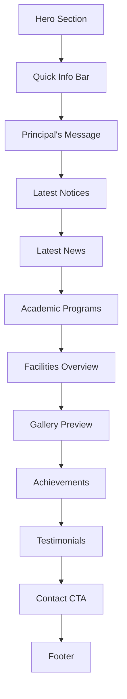

**Section Details:**

**Hero Section**
- Full-width background: large authentic school photograph (landscape, 16:9)
- Overlay: semi-transparent dark layer (opacity 0.4) to ensure text readability
- Content: School name (H1), tagline (H2), and two CTA buttons ("Learn More" secondary, "Apply Now" primary)
- Height: 80vh on desktop, 60vh on mobile
- The hero image is set via the CMS admin panel (Spatie Media Library)
- No video backgrounds. Video backgrounds increase load time, cause accessibility issues with auto-play, and provide negligible engagement benefit on institutional websites

**Quick Info Bar**
- A horizontal bar immediately below the hero
- Contains 3-4 key statistics or quick facts (e.g., "Established 1985", "500+ Students", "50+ Teachers", "100% Pass Rate")
- Background: Academic Blue, white text
- Layout: 4-column grid on desktop, 2x2 on mobile
- Each item: icon (Lucide, stroke) + number (bold, 28px) + label (14px)
- Purpose: Immediately communicates scale and credibility

**Principal's Message**
- Two-column layout on desktop: photo (left), text (right)
- Single column on mobile: photo above text
- Photo: circular crop, 200px diameter, with a subtle border
- Name and title below the quote
- "Read Full Message" link to the full About page
- Background: white

**Latest Notices**
- Section heading with "View All Notices" link
- 3-column card grid (2 on tablet, 1 on mobile)
- Each card: date badge, category tag, title, excerpt (2 lines max)
- The most recent notice is optionally pinned with a distinct badge
- Background: `#F8FAFC`

**Latest News**
- Same card grid pattern as notices
- Each card: featured image (16:9 ratio), date, category, title, excerpt
- Background: white

**Academic Programs**
- 3 or 4-column card grid
- Each card: icon, program name, brief description
- Cards link to the respective Academics sub-page
- Background: `#F8FAFC`

**Facilities Overview**
- Grid of facility cards with icon and name
- Links to the Facilities page
- Background: white

**Gallery Preview**
- Horizontal scrollable row of 4-5 recent photos
- Each photo: rounded corners (20px radius), landscape ratio
- "View Full Gallery" link
- Background: `#F8FAFC`

**Achievements**
- Single row with 3-4 achievement cards
- Each card: gold icon, achievement title, description
- Background: white

**Testimonials**
- Carousel or static row of 2-3 testimonial cards
- Each card: quote text, name, role (Student/Parent/Alumni), photo (small, circular)
- Background: `#F8FAFC`

**Contact CTA**
- Full-width section with Academic Blue background
- Centered text: "Get in Touch"
- Phone number, email address, and "Contact Us" button
- Background: Academic Blue, white text

**Components Used:**
- `HeroSection`, `QuickInfoBar`, `ContentCard`, `ImageCard`, `ButtonPrimary`, `ButtonSecondary`, `SectionHeading`, `TestimonialCard`, `ContactBanner`

---

### About Page

**Purpose:** Present the school's history, leadership, values, and organizational structure in a way that builds trust and demonstrates institutional depth.

**User Goal:** A prospective parent evaluates whether the school's values, leadership, and history align with what they want for their child.

**Layout:**

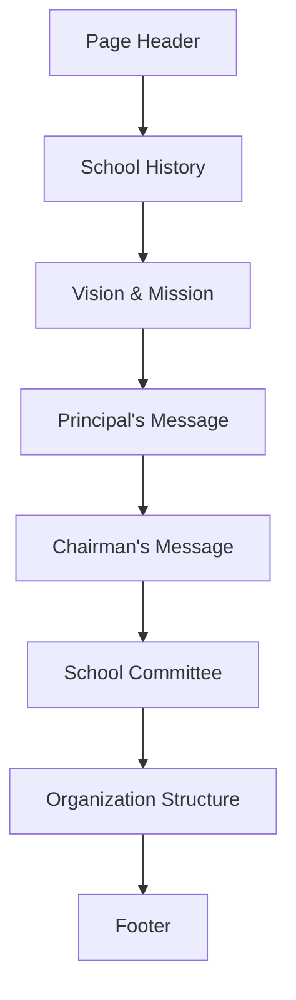

**Section Details:**

**Page Header**
- Title: "About Our School"
- Subtitle: "Discover our story, our values, and the people who lead us"
- Background: `#F8FAFC`

**School History**
- Two-column on desktop: timeline (left), featured image (right)
- Single column on mobile
- Timeline: vertical line with milestone dots, each milestone has a year and description
- Maximum 8-10 milestones to maintain readability
- The featured image is managed via CMS

**Vision & Mission**
- Two-column layout on desktop
- Vision card (left): icon, "Our Vision", vision statement text
- Mission card (right): icon, "Our Mission", mission statement text
- Cards: white background, subtle border, 16px radius, generous padding
- Below these cards, the objectives are listed as a numbered list with icon markers

**Principal's Message**
- Full-width quote-style layout
- Large quotation mark graphic (decorative, opacity 0.1)
- Quote text in italic, larger font size (20px)
- Photo and name below the quote
- Background: `#F8FAFC`

**Chairman's Message**
- Same layout as Principal's Message but with alternating alignment (text left, photo right on desktop)

**School Committee**
- Grid of committee member cards (3 columns desktop, 2 tablet, 1 mobile)
- Each card: photo (square with rounded corners), name, position, brief bio
- Background: white

**Organization Structure**
- Hierarchical org chart displayed as a structured tree
- Desktop: full tree layout
- Mobile: simplified list view with indentation levels
- Background: `#F8FAFC`

**Components Used:**
- `PageHeader`, `Timeline`, `QuoteBlock`, `MemberCard`, `OrgChart`, `SectionHeading`

---

### Academics Page

**Purpose:** Present academic programs, curriculum details, class levels, and the academic calendar in a structured format that parents can quickly navigate.

**User Goal:** A parent wants to understand what academic programs the school offers, what curriculum is followed, and when key academic dates are.

**Layout:**

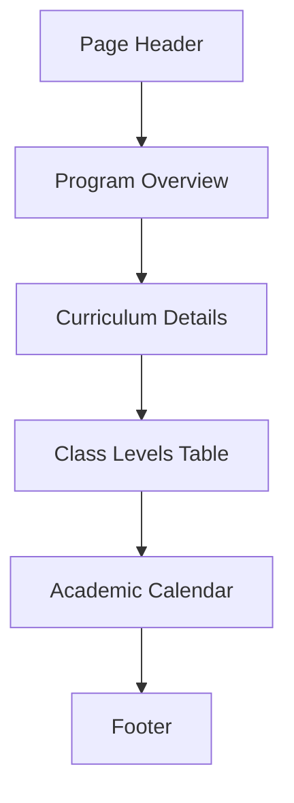

**Section Details:**

**Program Overview**
- Grid of program cards (3 columns desktop, 1 mobile)
- Each card: icon, program name, description, "Learn More" link
- Cards use consistent height with flex layout

**Curriculum Details**
- Two-column: content (left), sidebar summary (right)
- Content area: rich text describing curriculum approach
- Sidebar: key facts in a card format (board affiliation, medium of instruction, assessment pattern)
- On mobile: sidebar moves below the main content

**Class Levels Table**
- Structured table displaying class/grade levels
- Columns: Level, Age Range, Key Subjects, Assessment Type
- Table uses alternating row backgrounds for readability
- On mobile: table converts to card-based layout

**Academic Calendar**
- Month-by-month view or list view
- Each entry: date, event name, category (color-coded)
- Filterable by term/semester
- Download as PDF option

**Components Used:**
- `PageHeader`, `ProgramCard`, `DataTable`, `CalendarList`, `SidebarCard`, `SectionHeading`

---

### Admissions Page

**Purpose:** Provide comprehensive admission information and enable prospective families to submit an inquiry through a streamlined online form.

**User Goal:** A prospective parent wants to understand the admission process, required documents, fees, and deadlines — and optionally submit an inquiry immediately.

**Layout:**

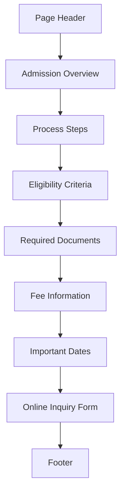

**Section Details:**

**Admission Overview**
- Brief paragraph explaining the admission philosophy
- Key dates highlighted in a callout card (background: Academic Blue tint)

**Process Steps**
- Horizontal step flow on desktop, vertical on mobile
- 4-5 steps maximum (e.g., "Submit Inquiry" → "Schedule Visit" → "Submit Documents" → "Interview" → "Enrollment")
- Each step: number badge, title, brief description
- Connected by a subtle line between steps

**Eligibility Criteria**
- Card-based layout with clear age/grade requirements
- Simple, scannable format

**Required Documents**
- Checklist-style layout with checkbox icons
- Grouped by category (Student Documents, Parent Documents)

**Fee Information**
- Structured table or card layout
- Clear breakdown of fee components
- Note about fee changes and payment methods

**Important Dates**
- Timeline or table showing key admission dates
- Past dates are visually muted

**Online Inquiry Form**
- This is the primary conversion point of the Admissions page
- Positioned at the bottom of the page after all information has been presented
- Full-width card layout with Academic Blue top border

**Form Fields:**

| Field | Type | Required | Notes |
|-------|------|----------|-------|
| Student Name | Text | Yes | Max 100 chars |
| Applying Class/Grade | Select | Yes | Populated from CMS |
| Parent/Guardian Name | Text | Yes | Max 100 chars |
| Mobile Number | Tel | Yes | Validated format |
| Email Address | Email | No | Validated format |
| Address | Textarea | Yes | Max 500 chars |
| Previous School | Text | No | Max 200 chars |
| Message | Textarea | No | Max 1000 chars |

**Form Behavior:**
- Validation occurs on submit with inline error messages
- Error messages appear below each field in red text (14px)
- Successful submission shows a confirmation card: "Thank you! We will contact you shortly."
- No page reload on submission (Alpine.js handles the request)
- The form submission sends a notification to the admin panel

**Components Used:**
- `PageHeader`, `StepFlow`, `ChecklistCard`, `DataTable`, `InquiryForm`, `DateCard`, `CalloutBox`, `SectionHeading`

---

### Notices Page

**Purpose:** Allow visitors to browse, filter, and read school notices efficiently. Notices are time-sensitive communications that require quick access.

**User Goal:** A current parent or student wants to find the latest school notice. A prospective parent wants to see what kind of communications the school publishes.

**Layout:**

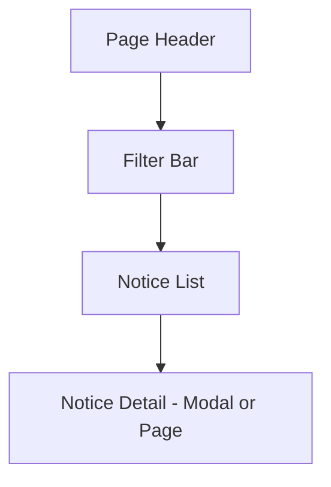

**Section Details:**

**Page Header**
- Title: "Notices"
- Subtitle: "Stay informed with the latest announcements from the school"

**Filter Bar**
- Horizontal bar below the page header
- Contains: search input, category dropdown, date range (optional)
- Filters update the list without page reload (Alpine.js)
- Active filters are displayed as removable tags below the filter bar

**Notice List**
- Vertical list layout (not grid) — notices are text-heavy and read top-to-bottom
- Each notice card:
  - Date badge (day + month, stacked vertically)
  - Category tag (colored background)
  - Title (bold, 18px)
  - Excerpt (2 lines, muted text)
  - "Pin" badge for important notices (displayed at the top)
- Pagination: 10 items per page
- Background: `#F8FAFC`

**Notice Detail**
- Can be rendered as a full page or an expandable section within the list
- Full page is preferred for SEO (each notice gets its own URL)
- Contains: title, date, category, full content (rich text), optional PDF attachment
- "Download PDF" button when a PDF is attached
- "Back to Notices" link
- Related notices sidebar

**Components Used:**
- `PageHeader`, `FilterBar`, `NoticeCard`, `Pagination`, `SearchInput`, `CategoryTag`, `DateBadge`

---

### News Page

**Purpose:** Showcase school activities, achievements, and updates through news articles with rich media content.

**User Goal:** A visitor wants to read about recent school activities and achievements.

**Layout:**

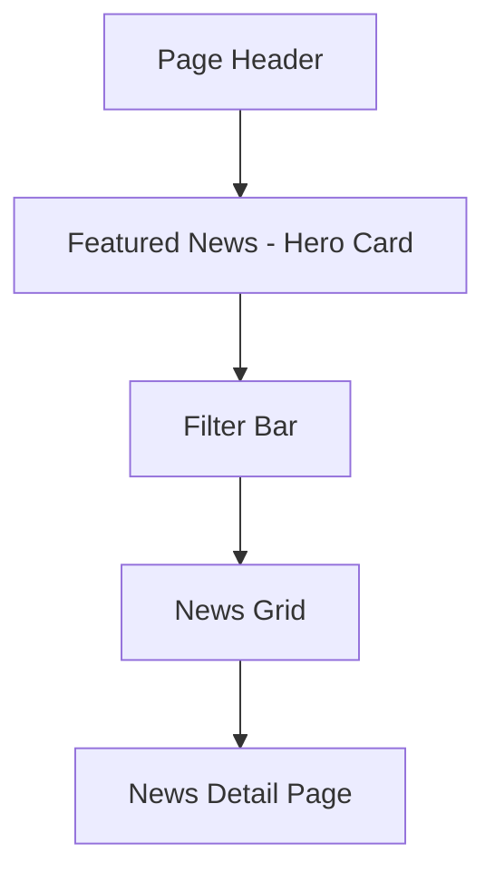

**Section Details:**

**Featured News**
- The most recent or editorially selected news article is displayed as a large hero card
- Full-width, two-column: image (left 60%), content (right 40%)
- Single column on mobile: image on top
- Title (H2), date, category, excerpt, "Read More" button
- Background: white

**Filter Bar**
- Same pattern as Notices: search, category filter, date filter
- Horizontal layout on desktop, stacked on mobile

**News Grid**
- 3-column grid on desktop, 2 on tablet, 1 on mobile
- Each card:
  - Featured image (16:9 ratio)
  - Category tag
  - Title (H3, 18px)
  - Excerpt (3 lines)
  - Date (muted, small text)
- Background: `#F8FAFC`

**News Detail Page**
- Full article layout with proper reading width (768px max, centered)
- Featured image at the top (full width)
- Article title (H1)
- Meta information: date, author, category
- Body content: rich text with proper typography
- Social sharing buttons (minimal: Facebook, Twitter, WhatsApp)
- Related news sidebar or bottom section
- Breadcrumbs for navigation

**Components Used:**
- `PageHeader`, `HeroCard`, `NewsCard`, `FilterBar`, `ArticleLayout`, `ShareButtons`, `SectionHeading`

---

### Events Page

**Purpose:** Display upcoming and past school events, allowing visitors to stay informed about school activities.

**User Goal:** A parent or student wants to know what events are happening soon or what happened at past events.

**Layout:**

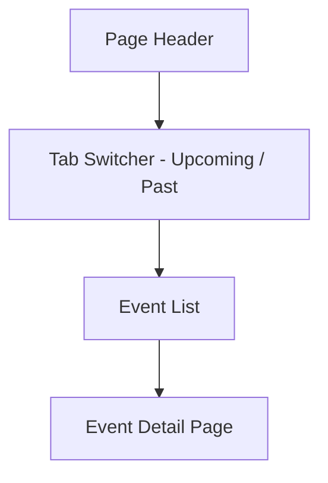

**Section Details:**

**Tab Switcher**
- Two tabs: "Upcoming Events" and "Past Events"
- Default tab: Upcoming Events
- Tabs use a simple underline indicator (not filled buttons)
- The underline is Academic Blue, 2px

**Event List**
- Vertical card layout, not grid — events have date context that benefits from linear reading
- Each event card:
  - Date badge (left side, large format: day number + month abbreviation)
  - Event title (H3)
  - Time and venue
  - Brief description (2 lines)
  - "View Details" link
- Upcoming events are sorted by date ascending
- Past events are sorted by date descending
- Background: alternating white and `#F8FAFC` per card

**Event Detail Page**
- Full-width layout
- Event title (H1)
- Date, time, venue displayed in a structured meta section
- Full event description (rich text)
- Event gallery (if available): photo grid
- "Back to Events" link
- Related events section

**Components Used:**
- `PageHeader`, `TabSwitcher`, `EventCard`, `DateBadge`, `MetaRow`, `ImageGrid`

---

### Gallery Page

**Purpose:** Display the school's visual presence through photo albums and videos.

**User Goal:** A prospective parent wants to see the school's campus, activities, and environment. A current parent wants to find photos from recent events.

**Layout:**

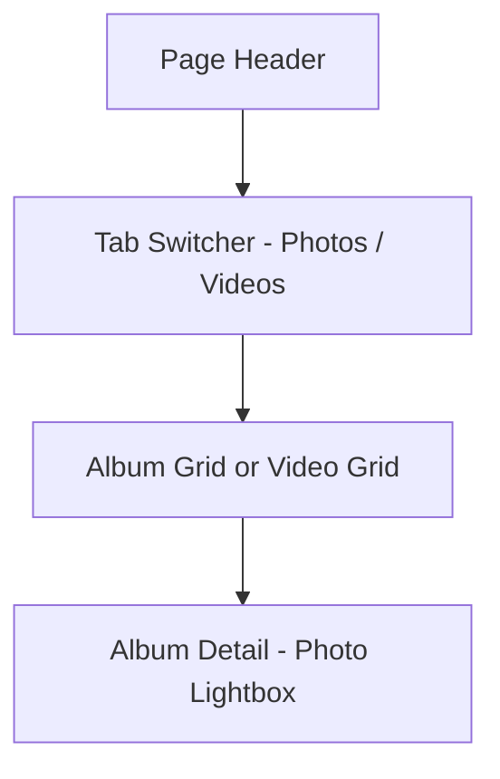

**Section Details:**

**Tab Switcher**
- Two tabs: "Photo Albums" and "Videos"
- Same underline pattern as Events

**Album Grid**
- 3-column grid on desktop, 2 on tablet, 1 on mobile
- Each album card:
  - Cover image (square or 4:3 ratio)
  - Album title
  - Photo count badge
  - Date
- Hover effect: slight scale on the image only (1.02x, 200ms)
- Background: `#F8FAFC`

**Album Detail**
- Album title and metadata at the top
- Photo grid: masonry-style or uniform grid (uniform preferred for consistency)
- Clicking a photo opens a lightbox overlay
- Lightbox: full-screen with photo, navigation arrows, close button, photo counter
- Keyboard navigation in lightbox (left/right arrows, escape to close)

**Video Grid**
- Same grid pattern as albums
- Each video card: thumbnail with play button overlay, title, duration
- Videos open in a modal player (not external redirect) for YouTube/Vimeo embeds
- Background: white

**Components Used:**
- `PageHeader`, `TabSwitcher`, `AlbumCard`, `VideoCard`, `PhotoGrid`, `Lightbox`, `VideoModal`

---

### Teachers & Staff Page

**Purpose:** Introduce the school's teaching staff and administrative personnel, building trust through transparency about who leads the institution.

**User Goal:** A prospective parent wants to see the qualifications and experience of the school's teachers.

**Layout:**

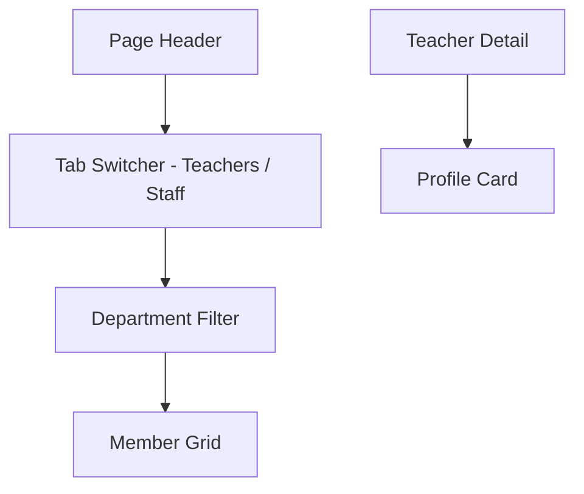

**Section Details:**

**Tab Switcher**
- Two tabs: "Teaching Staff" and "Administrative Staff"

**Department Filter**
- Horizontal filter: pill-style buttons for each department
- "All" selected by default
- Filtering is instant (Alpine.js)

**Member Grid**
- 4-column grid on desktop, 3 on tablet, 2 on mobile
- Each member card:
  - Photo (square, 1:1 ratio, rounded corners 16px)
  - Name (bold, 16px)
  - Position/Title (muted text)
  - Department tag
- Cards have consistent height using flex layout
- No hover animations — the design is calm and professional
- Background: `#F8FAFC`

**Teacher Detail (Modal or Expandable)**
- Photo, name, position, department
- Qualifications
- Years of experience
- Brief biography
- This can be a modal overlay or a dedicated page depending on content volume

**Components Used:**
- `PageHeader`, `TabSwitcher`, `FilterPills`, `MemberCard`, `ProfileModal`

---

### Facilities Page

**Purpose:** Showcase the school's physical infrastructure and resources.

**User Goal:** A parent wants to understand what facilities are available for their child.

**Layout:**

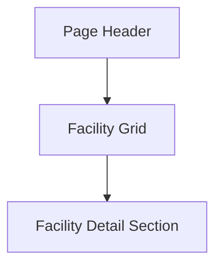

**Section Details:**

**Facility Grid**
- 2-column layout on desktop, 1 on mobile
- Each facility is presented as a large horizontal card:
  - Image on one side (50% width), content on the other
  - Alternating alignment (image-left, image-right) for visual rhythm
  - Facility name (H2), description, key features list
- Background: alternating white and `#F8FAFC` per facility

**Facilities include:**
- Library
- Computer Laboratory
- Science Laboratory
- Transportation
- Hostel
- Sports
- Other Facilities (managed via CMS)

**Components Used:**
- `PageHeader`, `FacilityCard`, `FeatureList`, `SectionHeading`

---

### Downloads Page

**Purpose:** Provide a centralized location for downloadable resources such as forms, prospectuses, and academic documents.

**User Goal:** A parent or student wants to download specific documents (admission forms, academic calendar, syllabus).

**Layout:**

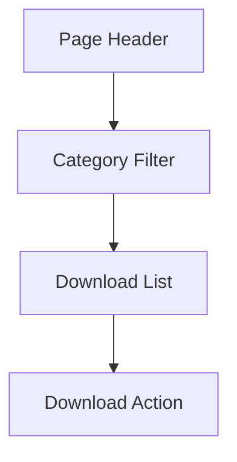

**Section Details:**

**Category Filter**
- Horizontal tabs or pill buttons: All, Admission Forms, Prospectus, Calendar, Syllabus, Other

**Download List**
- Table layout with columns: Document Name, Category, File Type, Size, Date Added, Download
- On mobile: each row becomes a card
- Each row has a download button (icon + "Download" text)
- File type is indicated by an icon (PDF, DOC, etc.)
- Background: `#F8FAFC`

**Components Used:**
- `PageHeader`, `FilterTabs`, `DownloadTable`, `DownloadButton`

---

### Contact Page

**Purpose:** Enable visitors to reach the school through multiple channels and find essential contact information.

**User Goal:** A parent wants to send a message to the school or find the school's phone number, email, or physical address.

**Layout:**

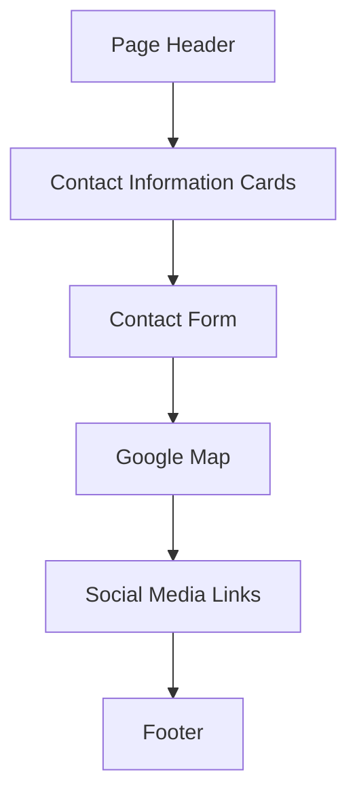

**Section Details:**

**Contact Information Cards**
- 3-column grid on desktop, 1 on mobile
- Card 1: Address — icon + full address
- Card 2: Phone — icon + phone numbers
- Card 3: Email — icon + email addresses
- Each card: white background, border, rounded corners, icon in Academic Blue

**Contact Form**
- Two-column on desktop: form (left), map (right)
- Single column on mobile

**Form Fields:**

| Field | Type | Required |
|-------|------|----------|
| Full Name | Text | Yes |
| Email Address | Email | Yes |
| Subject | Text | Yes |
| Message | Textarea | Yes |

**Form Behavior:**
- Same validation pattern as the Admission Inquiry form
- Successful submission shows confirmation message
- No page reload

**Google Map**
- Embedded Google Map showing school location
- Full-width on mobile, contained within the right column on desktop
- Lazy-loaded to improve performance

**Social Media Links**
- Row of social media icons (Facebook, Twitter/X, Instagram, YouTube, WhatsApp)
- Icons only, consistent color (muted by default, Academic Blue on hover)

**Components Used:**
- `PageHeader`, `ContactCard`, `ContactForm`, `MapEmbed`, `SocialLinks`

---

### FAQ Page

**Purpose:** Answer common questions to reduce the number of repetitive inquiries and help visitors find information independently.

**User Goal:** A prospective parent has specific questions about the school and wants quick answers.

**Layout:**

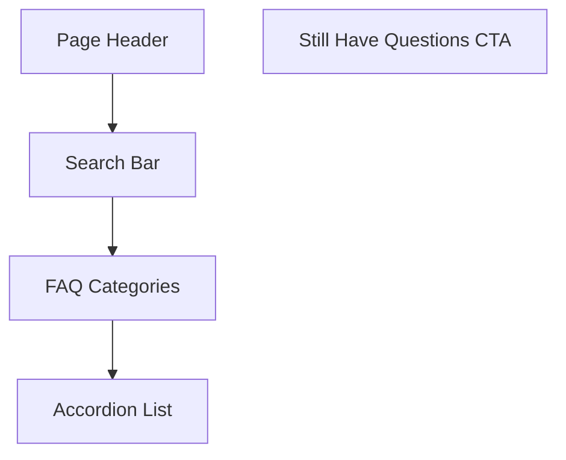

**Section Details:**

**Search Bar**
- Full-width search input below the page header
- Real-time filtering as the user types (Alpine.js)
- Placeholder: "Search for a question..."

**FAQ Categories**
- Horizontal pill buttons: All, Admissions, Academics, Fees, General
- Selecting a category filters the accordion list

**Accordion List**
- Each FAQ item:
  - Question text as the accordion header
  - Chevron icon on the right indicating expand/collapse state
  - Answer text revealed on click with smooth height transition
  - Only one item expanded at a time (optional: allow multiple)
- Background: alternating white and `#F8FAFC` per item

**Still Have Questions CTA**
- Below the FAQ list
- "Didn't find your answer? Contact us."
- Button linking to the Contact page

**Components Used:**
- `PageHeader`, `SearchInput`, `FilterPills`, `Accordion`, `CtaBanner`

---

### Footer Layout

**Purpose:** Provide consistent site-wide navigation, contact information, and legal links on every page.

**Structure:**

```
┌─────────────────────────────────────────────────────────────────┐
│  School Info      Quick Links         Contact                  │
│  ─────────────    ─────────────       ─────────────            │
│  [Logo]           Home                Address                   │
│  Brief text       About               Phone                     │
│                   Academics           Email                     │
│                   Admissions          Working Hours             │
│                   News                                               │
│                   Events                                            │
│                   Contact                                           │
├─────────────────────────────────────────────────────────────────┤
│  [Facebook] [Twitter] [Instagram] [YouTube]                     │
├─────────────────────────────────────────────────────────────────┤
│  © 2026 School Name. All rights reserved.                       │
│  Privacy Policy  |  Terms & Conditions                          │
└─────────────────────────────────────────────────────────────────┘
```

**Behavior:**
- Background: `#0F172A` (dark slate), white text
- Three columns on desktop, stacked on mobile
- Logo in the footer is the same as the header
- Social media icons are stroke-style Lucide icons
- Bottom bar separated by a subtle border
- Footer is always present on every page
- Height is approximately 300-350px depending on content

---

## Responsive Strategy

### Breakpoints

| Breakpoint | Width | Columns | Navigation | Typography |
|-----------|-------|---------|------------|------------|
| Mobile | 0 – 639px | 4 | Hamburger overlay | Scaled down |
| Tablet | 640 – 1023px | 8 | Hamburger overlay | Intermediate |
| Desktop | 1024 – 1439px | 12 | Full horizontal nav | Full size |
| Large Desktop | 1440px+ | 12 | Full horizontal nav | Full size, max-width container |

### Layout Constraints

| Property | Mobile | Tablet | Desktop | Large Desktop |
|----------|--------|--------|---------|---------------|
| Container width | 100% - 40px padding | 100% - 48px padding | 1280px max | 1280px max |
| Section padding (vertical) | 40px | 64px | 96px | 96px |
| Grid gap | 16px | 20px | 24px | 24px |
| Header height | 64px | 64px | 72px | 72px |

### Content Adaptation Rules

1. **Grids collapse vertically.** A 3-column desktop grid becomes 2 on tablet and 1 on mobile. This is handled through Tailwind responsive classes, not JavaScript.
2. **Tables become cards.** Data tables convert to stacked card layouts on mobile. This is a structural change, not a horizontal scroll.
3. **Sidebars move below content.** Two-column layouts with sidebars convert to single column with the sidebar below the main content on mobile.
4. **Navigation simplifies.** Horizontal nav becomes a full-screen hamburger overlay.
5. **Images scale proportionally.** All images use `object-fit: cover` or `object-fit: contain` with proper aspect ratios maintained.
6. **Touch targets are enforced.** All interactive elements are minimum 44px × 44px on mobile.

---

## Component Library

### Design Principles for Components

1. **Single responsibility.** Each component does one thing well.
2. **Composition over configuration.** Complex components are built by composing simpler ones, not by adding dozens of props.
3. **Accessible by default.** Every component meets WCAG AA requirements without additional configuration.
4. **Responsive without JavaScript.** Component responsiveness is handled through CSS and Tailwind classes, not JavaScript window width detection.

### Button System

| Button | Background | Text | Border | Shadow | Use Case |
|--------|-----------|------|--------|--------|----------|
| Primary | Academic Blue (#1E3A8A) | White | None | Small | Main CTAs, form submissions |
| Secondary | White | Academic Blue | 1px Academic Blue | None | Secondary actions, "Learn More" |
| Ghost | Transparent | Academic Blue | None | None | Tertiary actions, navigation |
| Danger | Red (#DC2626) | White | None | Small | Destructive actions (admin only) |
| Success | Green (#16A34A) | White | None | Small | Positive actions |
| Disabled | Gray (#E2E8F0) | Gray (#94A3B8) | None | None | Unavailable actions |

**Sizes:**

| Size | Height | Padding (horizontal) | Font Size | Border Radius |
|------|--------|---------------------|-----------|---------------|
| Large | 48px | 32px | 16px | 12px |
| Medium | 40px | 24px | 14px | 12px |
| Small | 36px | 16px | 13px | 10px |

**Hover Behavior:**
- Primary: background darkens by 10% (darken via CSS color-mix or opacity overlay)
- Secondary: background fills with Academic Blue, text becomes white (300ms transition)
- Ghost: background fills with very light blue tint
- All buttons have a `transition: all 150ms ease` applied

**Focus States:**
- 2px outline, Academic Blue, 2px offset
- Visible on keyboard focus only (`:focus-visible`)

### Card System

Cards are the primary content container throughout the site.

**Standard Card:**

| Property | Value |
|----------|-------|
| Background | White (#FFFFFF) |
| Border | 1px solid #E2E8F0 |
| Border Radius | 16px |
| Padding | 24px (all sides) |
| Shadow | None by default |
| Hover Shadow | Small (0 1px 3px rgba(0,0,0,0.06)) — optional |

**Card Types:**

| Type | Variation | Use |
|------|-----------|-----|
| Content Card | Standard | Notices, news, general content |
| Image Card | Image top, content below | News with featured image |
| Stat Card | Number + label + icon | Quick Info Bar on homepage |
| Member Card | Photo + name + role | Teachers & Staff |
| Facility Card | Horizontal layout, image + text | Facilities page |
| Testimonial Card | Quote + attribution | Testimonials section |

**Content Hierarchy Within Cards:**
1. Visual element (image, icon, or date badge) — draws the eye
2. Title — tells the visitor what this card is about
3. Meta information (date, category, author) — provides context
4. Excerpt or description — provides enough information to decide whether to click
5. Action link — provides the next step

### Form Design

**Input Fields:**

| Property | Value |
|----------|-------|
| Height | 48px |
| Border | 1px solid #E2E8F0 |
| Border Radius | 10px |
| Padding | 12px horizontal, 0 vertical |
| Font Size | 16px (prevents zoom on iOS) |
| Background | White |
| Focus Border | Academic Blue (#1E3A8A) |
| Focus Ring | 2px Academic Blue, 2px offset |
| Error Border | Red (#DC2626) |
| Error Message | 14px, Red, below the input |
| Label | 14px, weight 500, 6px below label, above input |
| Helper Text | 13px, muted color, below input |

**Textarea:**
- Same styling as input
- Minimum height: 120px
- Resizable vertically only

**Select:**
- Custom-styled using a `<select>` element or Alpine.js dropdown
- Same styling as input
- Chevron icon on the right

**Form Layout:**
- Fields are stacked vertically with 20px gap
- Two-column layout on desktop for simple fields (name + email on the same row)
- Full-width on mobile
- Submit button is full-width on mobile, auto-width on desktop
- Form sections are separated by 32px vertical spacing

### Table Design

**Desktop:**

| Property | Value |
|----------|-------|
| Header Background | #F8FAFC |
| Header Font | 13px, weight 600, uppercase |
| Row Background | White |
| Alternating Row | #F8FAFC |
| Border | 1px solid #E2E8F0 |
| Cell Padding | 16px horizontal, 12px vertical |
| Row Hover | Background slightly darkens |

**Mobile:**
- Tables convert to card layouts
- Each row becomes a card with label-value pairs
- This conversion is handled at the Blade template level, not through CSS overflow

### Modal Design

**Properties:**

| Property | Value |
|----------|-------|
| Overlay | Black, 50% opacity |
| Modal Background | White |
| Border Radius | 16px |
| Max Width | 560px (small), 720px (medium), 960px (large) |
| Padding | 32px |
| Close Button | Top-right, X icon |
| Animation | Fade in + slight scale (150ms) |

**Behavior:**
- Opens centered on screen
- Body scroll is locked
- Closes on overlay click, close button click, or Escape key
- Focus is trapped within the modal when open
- Focus returns to the trigger element when closed

---

## State Patterns

### Empty States

When a section has no content to display, the empty state must provide context and optionally guide the user.

**Structure:**
- Icon (large, muted color, 64px)
- Heading: "No [Content Type] Available" (18px, weight 600)
- Description: Brief explanation of why the section is empty (14px, muted)
- Optional: Action button if the user can do something (e.g., "Go back to all news")

**Example:**
When no notices match a filter:
```
[Icon: FileText]
"No notices found"
"We couldn't find any notices matching your search. Try adjusting your filters."
[Button: "Clear Filters"]
```

### Error States

**404 Page:**
- Simple, centered layout
- Large "404" text (72px, muted)
- "Page Not Found" heading
- Brief explanation
- "Go to Homepage" button
- No complex illustrations

**500 / Server Error:**
- Same simple layout
- "Something went wrong" heading
- "We're working on fixing this. Please try again later."
- "Go to Homepage" button

**Form Submission Error:**
- Inline error messages below each relevant field
- A general error message at the top of the form: "Please correct the errors below."
- No page reload — errors are displayed dynamically

### Loading States

**Skeleton Screens:**
- Used for content that loads asynchronously (news grid, gallery, etc.)
- Skeleton shapes match the content they replace (rectangles for images, lines for text)
- Background: `#E2E8F0` with a subtle shimmer animation (fade in/out, 1.5s loop)
- Skeleton screens are displayed immediately and replaced when content loads

**Full-Page Loading:**
- Not used. The page structure loads immediately with skeleton content.

**Button Loading:**
- On form submission, the submit button shows a spinner icon and becomes disabled
- Text changes from "Submit" to "Submitting..." with a rotating icon

---

## Search Experience

### Site-Wide Search

- Accessible via a search icon in the header navigation
- On desktop: clicking the icon reveals a search input within the header (full width, overlaying the navigation)
- On mobile: the search icon navigates to a dedicated search page
- Search results are filtered across all content types: notices, news, events, pages
- Results display as a list with content type badge, title, excerpt, and date
- Results are paginated (10 per page)
- No results state: "No results found for '[query]'. Try different keywords."

### Content-Type Search

Individual listing pages (Notices, News) have their own filter bar with search functionality. These are local filters that operate within the content type.

---

## Accessibility

### Requirements

| Standard | Level | Target |
|----------|-------|--------|
| WCAG | AA | Full compliance |
| Section 508 | Compliant | All pages |
| Keyboard Navigation | Full | All interactive elements |
| Screen Reader | Tested | VoiceOver (macOS), NVDA (Windows) |

### Implementation Rules

1. **Semantic HTML throughout.** Use `<header>`, `<nav>`, `<main>`, `<article>`, `<section>`, `<aside>`, `<footer>` — not `<div>` for everything.
2. **Heading hierarchy is strict.** Every page has exactly one H1. Headings descend in order (H1 → H2 → H3). No skipped levels.
3. **All images have alt text.** Decorative images use `alt=""`. Informative images have descriptive alt text.
4. **All form inputs have labels.** Labels are associated with inputs using `for`/`id`. Placeholder text is never used as a label replacement.
5. **Color is never the only indicator.** Status indicators use color + text or color + icon. For example, a pinned notice uses a badge text ("Pinned") in addition to the visual accent.
6. **Focus is always visible.** Interactive elements have a visible focus ring on keyboard navigation. Focus styles are never removed with `outline: none` without a replacement.
7. **ARIA attributes are used correctly.** Interactive components use appropriate ARIA roles (`role="dialog"`, `aria-expanded`, `aria-current="page"`, etc.).
8. **Skip navigation link.** A "Skip to main content" link is the first element in the DOM, visually hidden until focused.
9. **Touch targets are 44px minimum.** All clickable elements meet the minimum size requirement on mobile.
10. **Reduced motion is respected.** All animations are wrapped in `@media (prefers-reduced-motion: reduce)` which disables transitions.

---

## Typography System

### Font Stack

```css
font-family: 'Inter', system-ui, -apple-system, 'Segoe UI', Roboto, sans-serif;
```

**Why Inter:** Inter is specifically designed for screen readability at small sizes. It has a large x-height, open counters, and clear letterforms that perform well on both high-DPI and standard displays. It is the most widely used font in modern web applications and does not feel dated.

### Type Scale

| Name | Desktop | Tablet | Mobile | Weight | Line Height | Usage |
|------|---------|--------|--------|--------|-------------|-------|
| Display | 56px | 44px | 36px | 700 | 1.1 | Homepage hero only |
| H1 | 48px | 36px | 32px | 700 | 1.15 | Page titles |
| H2 | 36px | 28px | 24px | 700 | 1.2 | Section headings |
| H3 | 24px | 20px | 18px | 600 | 1.3 | Card headings, subsection titles |
| H4 | 18px | 16px | 16px | 600 | 1.4 | Minor headings |
| Body Large | 18px | 17px | 16px | 400 | 1.7 | Lead paragraphs, introductions |
| Body | 16px | 16px | 16px | 400 | 1.7 | Standard body text |
| Small | 14px | 14px | 13px | 400 | 1.6 | Secondary information, dates |
| Caption | 12px | 12px | 12px | 500 | 1.4 | Labels, badges, metadata |

### Typography Rules

1. **Maximum reading width is 768px.** Body text never exceeds this width because longer lines reduce readability.
2. **Line height scales with font size.** Larger text has tighter line height (1.15 for H1), smaller text has more generous line height (1.7 for body).
3. **Font weight has meaning.** Bold (700) is reserved for headings. Semibold (600) is for subheadings and card titles. Medium (500) is for labels and captions. Regular (400) is for body text.
4. **Text color hierarchy is enforced.** Primary text (#0F172A) for headings and body. Secondary text (#475569) for descriptions and supporting content. Muted text (#64748B) for dates, metadata, and captions.
5. **Paragraph spacing is 16px.** Between paragraphs, 16px of vertical space is maintained.
6. **Lists use 8px item spacing.** Bullet and numbered lists have 8px between items.

---

## Color System

### Primary Palette

| Token | Hex | RGB | Usage |
|-------|-----|-----|-------|
| `blue-900` | #1E3A8A | 30, 58, 138 | Primary brand color, navbar, primary buttons, links, icons |
| `blue-800` | #1E40AF | 30, 64, 175 | Primary hover state |
| `blue-700` | #1D4ED8 | 29, 78, 216 | Primary active state |
| `green-600` | #16A34A | 22, 163, 74 | Success states, admissions, positive indicators |
| `gold-500` | #D4A017 | 212, 160, 23 | Awards, achievements, highlights (use sparingly) |

### Neutral Palette

| Token | Hex | Usage |
|-------|-----|-------|
| `slate-900` | #0F172A | Primary text, footer background |
| `slate-700` | #334155 | Secondary headings |
| `slate-600` | #475569 | Secondary text, descriptions |
| `slate-500` | #64748B | Muted text, metadata, captions |
| `slate-300` | #CBD5E1 | Borders, dividers |
| `slate-200` | #E2E8F0 | Input borders, card borders |
| `slate-100` | #F1F5F9 | Alternate section backgrounds |
| `slate-50` | #F8FAFC | Light section backgrounds |
| `white` | #FFFFFF | Card backgrounds, primary backgrounds |

### Semantic Colors

| Token | Hex | Usage |
|-------|-----|-------|
| `error` | #DC2626 | Form validation errors, destructive actions |
| `success` | #16A34A | Form success states, positive confirmations |
| `warning` | #D97706 | Caution indicators |
| `info` | #2563EB | Informational callouts |

### Color Usage Rules

1. **Academic Blue is the dominant brand color.** It appears in the header, primary buttons, links, and section accents. It should never be used for large background areas except the header and specific CTA sections.
2. **Gold is used sparingly.** It appears only for achievement-related content and small highlights. Never use gold for buttons, backgrounds, or large areas.
3. **Green is reserved for success.** It appears in positive feedback, admission-related sections, and statistics. It is never used for navigation or headings.
4. **Section backgrounds alternate.** Content sections alternate between white and `#F8FAFC`. This creates visual separation without borders.
5. **Text contrast always meets WCAG AA.** Primary text on white background: 15.4:1 ratio. Secondary text on white: 7.5:1. Muted text on white: 5.1:1.

---

## Spacing System

### Base Unit: 8px

All spacing values are multiples of the 8px base unit. This creates visual consistency across the entire interface.

| Token | Value | Usage |
|-------|-------|-------|
| `space-1` | 4px | Tight internal padding (badge text) |
| `space-2` | 8px | Small gaps, icon-to-text spacing |
| `space-3` | 12px | Compact component padding |
| `space-4` | 16px | Standard gaps, paragraph spacing |
| `space-5` | 20px | Form field gaps |
| `space-6` | 24px | Card padding, grid gap |
| `space-8` | 32px | Component internal spacing |
| `space-10` | 40px | Mobile section padding |
| `space-12` | 48px | Large component spacing |
| `space-16` | 64px | Tablet section padding |
| `space-24` | 96px | Desktop section padding |

### Spacing Rules

1. **Vertical rhythm is consistent.** Headings are followed by 24px of space. Paragraphs are separated by 16px. Sections are separated by 96px (desktop), 64px (tablet), 40px (mobile).
2. **Internal padding scales with component size.** Small components (badges, tags) use 8-12px. Medium components (cards, inputs) use 16-24px. Large components (sections, modals) use 32-48px.
3. **No arbitrary values.** Every spacing value on the page maps to a token. If a value does not exist in the system, it is not used.

---

## Grid System

### Configuration

| Property | Mobile | Tablet | Desktop |
|----------|--------|--------|---------|
| Columns | 4 | 8 | 12 |
| Gutter | 16px | 20px | 24px |
| Margin | 20px | 24px | Auto (centered, max 1280px) |

### Usage

- **Full-width sections:** Background colors and full-bleed images span the entire viewport width. Content within these sections is constrained to the grid.
- **Content areas:** Maximum reading width is 768px, centered within the grid. This applies to body text, article content, and long-form reading.
- **Card grids:** Cards align to the grid columns. A 3-column card grid on desktop uses 4 columns per card (span 4 each). A 2-column layout uses 6 columns each.
- **Sidebar layouts:** Main content spans 8 columns, sidebar spans 4 columns on desktop. On mobile, both stack to full width.

### Container Classes

```html
<!-- Full width section -->
<section class="w-full">

<!-- Constrained container -->
<div class="mx-auto max-w-7xl px-4 sm:px-6 lg:px-8">

<!-- Reading width container -->
<div class="mx-auto max-w-3xl">

<!-- Narrow container (forms, modals) -->
<div class="mx-auto max-w-xl">
```

---

## Iconography

### Library: Lucide Icons

Lucide provides a consistent set of stroke-based icons that align with the professional, minimal design language.

### Rules

1. **Stroke only.** Never use filled icons. All icons use `stroke-width: 1.5` or `stroke-width: 2`.
2. **Consistent sizing.** Icons within text are 16px. Icons in buttons are 20px. Standalone icons are 24px. Large decorative icons are 32px or 48px.
3. **Consistent color.** Icons inherit the color of their parent text element. Do not apply separate colors to icons within the same context.
4. **No mixing.** Lucide is the only icon library. Do not import Font Awesome, Heroicons, or any other icon set.
5. **Accessible.** Icons that convey meaning have `aria-hidden="true"` when decorative, or are accompanied by visible text. Icon-only buttons have `aria-label`.

### Common Icon Mapping

| Context | Icon |
|---------|------|
| Home | `home` |
| About | `info` |
| Academics | `graduation-cap` |
| Admissions | `user-plus` |
| Notices | `bell` |
| News | `newspaper` |
| Events | `calendar` |
| Gallery | `image` |
| Teachers | `users` |
| Facilities | `building` |
| Downloads | `download` |
| Contact | `mail` |
| FAQ | `help-circle` |
| Search | `search` |
| Close | `x` |
| Menu | `menu` |
| Arrow Right | `arrow-right` |
| Arrow Left | `arrow-left` |
| Chevron Down | `chevron-down` |
| External Link | `external-link` |

---

## Photography & Illustration

### Photography Guidelines

1. **Real school photography only.** Stock photos of generic school scenes are not used. The CMS allows administrators to upload real photos from their school.
2. **Landscape orientation preferred.** 16:9 for hero images and feature images. 4:3 for gallery thumbnails. 1:1 for teacher/staff portraits.
3. **Optimized for web.** All images are served in WebP format with JPEG fallback. Maximum width is 1920px for hero images, 1200px for content images, 600px for thumbnails.
4. **Authentic representation.** Photos should show real students, real classrooms, and real school activities. Avoid staged or overly polished photography.
5. **Color tone.** Photos should be naturally lit and color-corrected. Avoid heavy filters or color grading.

### Illustration Guidelines

**No illustrations.** Version 1 does not include custom illustrations, cartoons, or AI-generated graphics. The design relies entirely on photography, icons, and typography for visual interest.

---

## Animation Principles

### Philosophy

Animation exists to improve usability, not to decorate. Every animation must answer the question: "Does this help the user understand what is happening?"

### Allowed Animations

| Animation | Duration | Easing | Usage |
|-----------|----------|--------|-------|
| Fade In | 150-200ms | ease-in-out | Page content appearing, modal opening |
| Fade Out | 100-150ms | ease-in | Modal closing, dropdown hiding |
| Slide Down | 200ms | ease-out | Accordion expanding, dropdown opening |
| Slide Up | 150ms | ease-in | Accordion collapsing |
| Scale | 150ms | ease-out | Modal entrance (0.95 → 1.0) |
| Hover Transform | 150ms | ease | Button color change, link underline |

### Forbidden Animations

- Bouncing
- Rotating
- Flashing or blinking
- Infinite looping animations
- Parallax scrolling
- Typing effects
- Counter animations
- 3D transforms
- Complex path animations

### Reduced Motion

```css
@media (prefers-reduced-motion: reduce) {
  *, *::before, *::after {
    animation-duration: 0.01ms !important;
    transition-duration: 0.01ms !important;
  }
}
```

All animations are disabled for users who have enabled reduced motion in their operating system settings.

---

## Performance Strategy

### Image Optimization

| Image Type | Format | Max Width | Quality | Loading |
|-----------|--------|-----------|---------|---------|
| Hero | WebP | 1920px | 80 | Eager |
| Content | WebP | 1200px | 80 | Lazy |
| Thumbnail | WebP | 600px | 75 | Lazy |
| Avatar | WebP | 300px | 80 | Lazy |

**Implementation:** Images are processed server-side using Spatie Media Library's responsive image generation. Multiple disk versions are created automatically.

### CSS Strategy

- **Tailwind CSS v4** generates only the CSS classes used in the templates
- **No custom CSS framework.** Tailwind handles all styling
- **Critical CSS is inlined** for above-the-fold content
- **Non-critical CSS loads asynchronously**

### JavaScript Strategy

- **Alpine.js** handles all interactive behavior (dropdowns, modals, forms, filtering)
- **No heavy JavaScript frameworks.** React, Vue, or similar are not loaded on the public site
- **Alpine.js is loaded from CDN** and is approximately 15KB gzipped
- **No JavaScript animation libraries.** All animations use CSS transitions
- **Deferred loading.** Scripts use `defer` attribute

### Font Loading

```html
<link rel="preconnect" href="https://fonts.googleapis.com">
<link rel="preconnect" href="https://fonts.gstatic.com" crossorigin>
<link rel="preload" href="https://fonts.googleapis.com/css2?family=Inter:wght@400;500;600;700&display=swap" as="style">
```

- Inter is preloaded
- `font-display: swap` ensures text is visible immediately with a system font fallback
- Only required weights are loaded (400, 500, 600, 700)

### Caching

- Static assets (CSS, JS, images) are served with `Cache-Control: public, max-age=31536000, immutable` with fingerprinted filenames
- HTML pages use `Cache-Control: public, max-age=300, s-maxage=3600` with CDN invalidation capability
- API responses (search, filters) use `Cache-Control: private, no-cache`

---

## SEO Architecture

### HTML Structure

Every page follows this SEO-optimized structure:

```html
<!DOCTYPE html>
<html lang="en">
<head>
    <meta charset="UTF-8">
    <meta name="viewport" content="width=device-width, initial-scale=1.0">
    <title>{Page Title} | {School Name}</title>
    <meta name="description" content="{Page-specific description, max 160 chars}">

    <!-- Open Graph -->
    <meta property="og:title" content="{Page Title}">
    <meta property="og:description" content="{Description}">
    <meta property="og:image" content="{Featured image URL}">
    <meta property="og:type" content="website">

    <!-- Twitter Card -->
    <meta name="twitter:card" content="summary_large_image">

    <!-- Canonical -->
    <link rel="canonical" href="{Absolute URL}">
</head>
```

### Semantic HTML

- **One H1 per page.** The page title.
- **Logical heading hierarchy.** H1 → H2 → H3, never skipped.
- **Structured data.** JSON-LD schema for School, Events, and FAQ pages.
- **Breadcrumb navigation** with BreadcrumbList schema.
- **Clean URLs.** `/notices/latest-exam-schedule` not `/notices?id=42`.

### Page-Level SEO

| Page | Schema Type | Unique SEO Elements |
|------|-------------|---------------------|
| Homepage | School | School name, address, logo, social profiles |
| About | Organization | History, mission statement |
| Admissions | WebPage | Admission process, deadlines |
| Notices | ItemList | Recent notices with dates |
| News | ItemList | Recent articles |
| Events | Event | Event dates, locations |
| FAQ | FAQPage | Question-answer pairs |
| Contact | LocalBusiness | Address, phone, hours |

### Technical SEO

- **XML Sitemap** generated automatically and updated on content changes
- **robots.txt** allows crawling of all public pages
- **Clean URL structure** with slugs for all content types
- **Internal linking** through related content sections on detail pages
- **Page load speed** under 2 seconds on 3G networks

---

## Naming Conventions

### CSS Classes (Tailwind)

All classes follow Tailwind CSS conventions. No custom class names are created unless absolutely necessary for component-level abstractions.

### Blade Components

```
components/
├── layout/
│   ├── header.blade.php
│   ├── footer.blade.php
│   ├── breadcrumbs.blade.php
│   └── mobile-nav.blade.php
├── sections/
│   ├── hero.blade.php
│   ├── quick-info.blade.php
│   └── contact-cta.blade.php
├── cards/
│   ├── notice-card.blade.php
│   ├── news-card.blade.php
│   └── member-card.blade.php
├── forms/
│   ├── inquiry-form.blade.php
│   └── contact-form.blade.php
├── ui/
│   ├── button.blade.php
│   ├── badge.blade.php
│   ├── accordion.blade.php
│   ├── modal.blade.php
│   └── skeleton.blade.php
└── partials/
    ├── section-heading.blade.php
    ├── filter-bar.blade.php
    └── pagination.blade.php
```

### Alpine.js Components

Alpine.js components use `x-data` with descriptive camelCase function names:

```html
<div x-data="mobileNav()">
<div x-data="noticeFilter()">
<div x-data="inquiryForm()">
<div x-data="photoLightbox()">
```

---

## Tailwind CSS v4 Theme Strategy

### Configuration

The Tailwind theme extends the default configuration with project-specific design tokens. All tokens are defined in the CSS file using Tailwind v4's CSS-first configuration:

```css
@import "tailwindcss";

@theme {
    --color-primary: #1E3A8A;
    --color-primary-hover: #1E40AF;
    --color-primary-active: #1D4ED8;

    --color-secondary: #16A34A;
    --color-accent: #D4A017;

    --color-surface: #FFFFFF;
    --color-surface-alt: #F8FAFC;
    --color-surface-section: #F1F5F9;

    --color-text-primary: #0F172A;
    --color-text-secondary: #475569;
    --color-text-muted: #64748B;

    --color-border: #E2E8F0;
    --color-border-focus: #1E3A8A;

    --color-error: #DC2626;
    --color-success: #16A34A;
    --color-warning: #D97706;

    --font-sans: 'Inter', system-ui, -apple-system, 'Segoe UI', Roboto, sans-serif;

    --breakpoint-sm: 640px;
    --breakpoint-md: 768px;
    --breakpoint-lg: 1024px;
    --breakpoint-xl: 1440px;

    --radius-card: 16px;
    --radius-button: 12px;
    --radius-input: 10px;
    --radius-image: 20px;
    --radius-badge: 8px;

    --shadow-card: 0 1px 3px rgba(0, 0, 0, 0.06);
    --shadow-dropdown: 0 4px 12px rgba(0, 0, 0, 0.08);
    --shadow-modal: 0 12px 40px rgba(0, 0, 0, 0.12);

    --spacing-section-desktop: 96px;
    --spacing-section-tablet: 64px;
    --spacing-section-mobile: 40px;
}
```

### Usage in Templates

```html
<!-- Before: arbitrary values everywhere -->
<div class="bg-[#1E3A8A] text-white px-6 py-24 rounded-[16px]">

<!-- After: semantic tokens -->
<div class="bg-primary text-white px-6 py-24 rounded-card">
```

### Naming Convention for Custom Utilities

If custom utilities are needed beyond the theme (rare), they follow this pattern:

```
school-{property}-{variant}
```

Examples: `school-section-padding`, `school-card-border`. These should be extremely rare — the theme tokens should cover 99% of use cases.

---

## Micro Interactions

### Button Hover

- **Duration:** 150ms
- **Effect:** Background color transitions to hover state
- **Cursor:** Changes to pointer on hover

### Link Hover

- **Duration:** 150ms
- **Effect:** Underline appears (using `text-decoration-thickness` and `text-underline-offset`)
- **Color:** Text color transitions to Academic Blue

### Card Hover (Optional)

- **Duration:** 200ms
- **Effect:** Subtle shadow appears (`shadow-card`)
- **Scope:** Only on cards that are clickable
- **Not on:** Static content cards, display-only cards

### Accordion

- **Duration:** 200ms
- **Effect:** Content area height transitions smoothly
- **Easing:** ease-out
- **Chevron:** Rotates 180° on open

### Modal

- **Open:** Overlay fades in (150ms), content scales from 0.95 to 1.0 (150ms)
- **Close:** Content scales from 1.0 to 0.95 (100ms), overlay fades out (100ms)

### Form Validation

- **Error appearance:** Red border transitions in (100ms), error text fades in (100ms)
- **Error resolution:** Red border transitions out when the user corrects the field

### Scroll Behavior

- **Smooth scrolling** for anchor links (`scroll-behavior: smooth`)
- **No parallax.** No scroll-triggered animations. Content is static and readable.

---

## Content Hierarchy

### Page-Level Hierarchy

Every page follows this content priority order:

1. **Navigation** — "Where can I go from here?"
2. **Page Title** — "What page am I on?"
3. **Page Description** — "What is this page about?"
4. **Primary Content** — "What information am I looking for?"
5. **Related Content** — "What else should I know?"
6. **Call to Action** — "What should I do next?"
7. **Footer** — "How do I contact the school?"

### Visual Hierarchy Enforcement

- **Heading sizes** create clear visual levels. H1 is unmistakably the most important text on the page.
- **Color weight** reinforces hierarchy. Darker text is more important than lighter text.
- **Spacing** separates content groups. Larger gaps indicate major section breaks.
- **Alignment** creates reading flow. Left-aligned text is the default. Center alignment is reserved for hero sections and CTAs.

---

## SEO-Friendly Layout Patterns

### Content Rendering

All content pages use server-side rendering through Blade templates. There are no client-side rendered pages on the public site. This ensures:

- Search engine crawlers receive fully rendered HTML
- Social media crawlers receive complete Open Graph tags
- Page load is instant (no JavaScript hydration delay)

### URL Structure

| Content Type | URL Pattern |
|-------------|-------------|
| Page | `/{slug}` (e.g., `/about`, `/contact`) |
| Notice | `/notices/{slug}` |
| News | `/news/{slug}` |
| Event | `/events/{slug}` |
| Gallery Album | `/gallery/{album-slug}` |
| Admission Inquiry | `/admissions#apply` (anchor on same page) |

### Structured Data

JSON-LD is embedded in the page `<head>` or at the end of `<main>`:

- **School Schema** on the homepage
- **BreadcrumbList Schema** on all pages except homepage
- **Event Schema** on individual event pages
- **FAQPage Schema** on the FAQ page
- **Article Schema** on individual news articles
- **ImageGallery Schema** on gallery pages

---

This document defines the complete frontend architecture for the School Website CMS. Any design or implementation decision not explicitly covered here should be made in alignment with the principles established in this document. When in doubt, refer to the design philosophy: **information precedes decoration, and the design must be timeless.**
